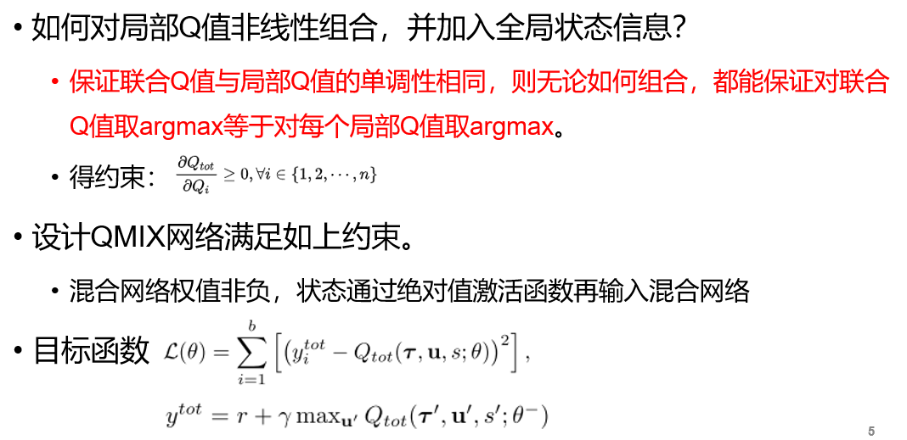
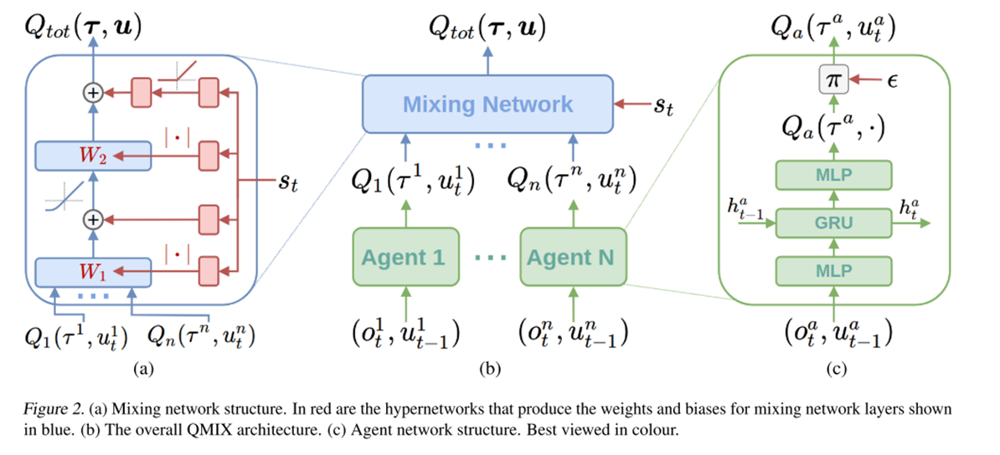

# 1.1 协作MARL: QMIX

论文及翻译:[3 Qatten](./paper_MARL/Qatten.md)

## Motivation

使用集中式学习分布式执行框架, 本质还是值函数逼近算法; 

考虑只通过全局的奖励信息R指导学习

* 只适合协作式的POMDP问题
* 考虑如何通过局部值函数构造联合值函数, 借由全局状态信息提升算法
* 考虑保证联合值函数与局部值函数单调性相同
* VDN $$\rightarrow$$ QMIX $$\rightarrow$$ Qatten

**如何学习联合Q值函数**?

**如何从联合Q函数提取好的分布式策略**?

## 基本概念

**算法演变**

1. IQL（independent Q-learning）
  + 简单地给每个智能体执行一个Q-learning; 
2. DRQN：用RNN替换DQN的CNN，解POMDP问题；
3. VDN(value decomposition networks)
  + 
  + 行动策略通过对每个$$Q^i$$ 求argmax得到; 
  + VDN直接对局部Q函数求和, 没有利用状态信息, 且是线性表示.

## QMIX算法

