# 1.2 协作MARL: QTRAN

论文及翻译:[QTRAN](./paper_MARL/QTRAN.md)

## 1 Motivation

我们已经知道了去中心化方法可扩展性好, 但是存在不稳定的问题, 而中心化方法可以解决非稳定性问题, 但是随智能体数量增加, 算法复杂度爆炸式增长. 基于值分解方法的中心化训练去中心化执行算法可以同时结合上述两者的优点, 且复杂性可以控制. 典型的就是VDN、QMIX算法和Qatten、QTRAN算法等.

值分解方法定义为, 当联合Q值取得得最优动作时, 每一个个体的Q值也得到最优动作, 即下述的IGM(Individual-Global-Max)

||
|:-:|
||

即, **当$$[Q_i]$$对$$Q_{jt}$$满足IGM时, 可以说$$[Q_i]$$是$$Q_{jt}$$的值分解.**

为了使$$[Q_i]$$和$$Q_{jt}$$满足IGM, VDN算法使用加性约束, QMIX算法使用单调性约束. 但这两个算法中显得过度约束, 限制了智能体的种类.

QTRAN算法设计了一个转换函数, 把原始联合Q值函数$$Q_{jt}$$变为$$Q_{jt}'$$, 使其与$$Q_{jt}$$具有相同的最优动作, 并解除加性/单调性约束, 其中使用了一个状态值函数更正部分观察带来的偏差.

## 2 算法原理

| 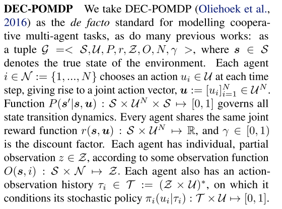 |
| :------------------------------: |
|       Figure 1. DEC-POMDP        |

QTRAN算法包括三个部分: 联合动作值网络、个体动作值网络、状态网络, 每个部分都有各自的loss函数进行训练.

同时论文作者设计了两种QTRAN算法: QTRAN-base和QTRAN-alt. 这两种算法的区别在于如何构造非最优动作Q值的转换函数、收敛速度和稳定性.

|        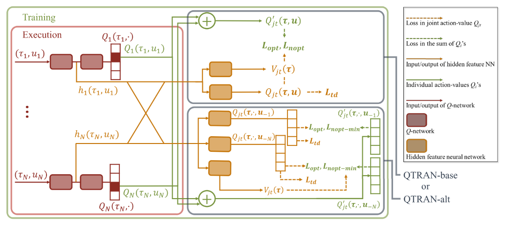         |
| :---------------------------------------------: |
| Figure 1. QTRAN-base and QTRAN-alt Architecture |

### 2.1 QTRAN-base

定义$$\bar{\mu}_i=argmax_{\mu_i}Q_i(\tau_i, \mu_i)$$表示最优动作, $$\bar{\mathbf{u}}=[\bar{\mu}_i]_{i=1}^{N}$$; 令$$\mathbf{Q}=[Q_i]\in \mathbb{R}^N$$, 即$$Q_i, i = 1, ..., N$$的列向量.

**定理1** 给出$$[Q_i]$$满足**IGM**的充分条件.

| 一个可分的联合Q值函数$$Q_{jt}(\mathbf{t}, \mathbf{u})$$, 可以被$$[Q_i(\tau_i, \mu_i)]$$分解, 当 |
| :---------------------------------------------------------------------------------------------- |
| 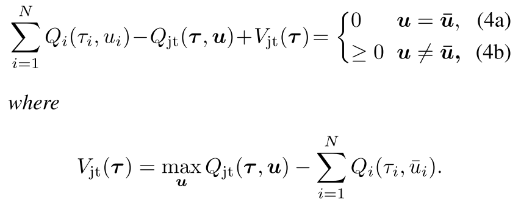                                                                |

把上面的公式展开就能理解他的意思, 

* 当$$\mathbf{U}$$是最优联合动作时, 公式左边等于0(4a), 那么$$[Q_i]$$是$$Q_{jt}$$的分解; 
* 当$$\mathbf{U}$$不是最优联合动作时, 同样的理解, $$(\max Q_{jt} - Q_{jt}) - (\sum Q_i( ; \bar{u_i}) - \sum Q_i(u_i)) > 0 $$.

#### 变换函数

作者的思路就是构造一个变换的**加性联合Q值函数**, 

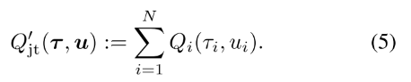

通过加性结构, $$[Q_i]$$满足$$Q'_{jt}$$的IGM, 那么它就是$$Q'_{jt}$$的分解个体Q值函数. 因为$$argmax_{\mathbf{u}}Q_{jt}(\mathbf{t}, \mathbf{u})= argmax_{\mathbf{u}}Q'_{jt}(\mathbf{t}, \mathbf{u})$$, 找到$$[Q_i]$$满足(4)就是$$Q'_{jt}(\mathbf{t}, \mathbf{u})$$的分解.

函数$$V_{jt}(\mathbf{t})$$用来修正中心化联合Q函数$$Q_{jt}$$和$$[Q_i]$$的和的偏差. 偏差是智能体部分观察带来的. 如果加入了全局观察, $$V_{jt}$$可以设为0.

#### 网络结构和作用

|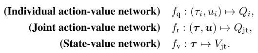|
|:-:|
||

**个体Q网络**, 每个智能体i的Q值加和得$$Q'_{jt}$$; 

**联合Q网络**: 逼近$$Q_{jt}$$, 输入为选择的动作, 输出为该动作得Q值.

* 首先使用所有个体Q网络采样的动作向量来更新联合Q网络. 因为联合动作空间$$\mathcal{U}^N$$, 找到最优联合动作复杂度很高, 而每个个体的最优动作取argmax就行, 是线性的.
* 第二, 联合Q网络共享个体网络低层的参数, 联合Q网络把个体网络隐层特征加和整合$$\sum_i h_{Q, i}(\tau_i, u_i)$$, 其来自于$$h_i(\tau_i, u_i)=[h_{Q, i}(\tau_i, u_i), h_{V, i}(\tau_i)]$$.(**使用此参数共享样本效率高, 可进行可扩展的训练, 但会牺牲表达能力.**)

**状态值网络**: 计算标量状态价值, 类似与dueling网络的$$V(s)$$.

* 用来在计算argmax时匹配$$Q_{jt}$$和$$Q'_{jt}+V_{jt}$$. 没有V, 部分观察可能限制$$Q'_{jt}$$的表达复杂性; 
* 给定$$\mathbf{t}$$, 状态值独立于选择的动作, 因此对动作选择没有贡献, 所以使用公式(4)代替.
* 输入也是个体网络隐特征的组合$$\sum_i h_{V, i}(\tau_i)$$

#### 损失函数

|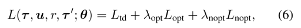|
|:-:|
|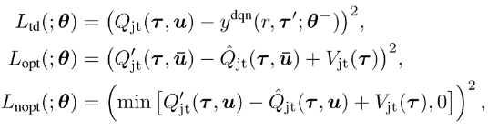|
|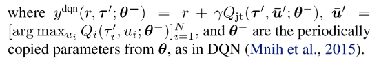|

其中

* $$r$$是在观察$$\tau$$执行动作$$u$$转移到$$\tau '$$的奖励.
* $$L_{td}$$学习$$Q_{jt}$$, 通过最小化TD误差估计真实Q值; 
* $$L_{opt}$$和$$L_{nopt}$$为了在把$$Q_{jt}$$分解为$$[Q_i]$$时满足条件(4).
* $$L_{nopt}$$用来在每一步检查样例中选择的动作是否满足(4b), $$L_{opt}$$检查最优局部动作是否满足(4a).
* 根据网络对样本中动作满足(4a)或(4b)的程度定义损失, 实现(4); 但是验证(4a)需要太多样本, 因为最优动作很少, 需要大量采样.
* 因为目标是学习$$Q'_{jt}$$和$$V_{jt}$$分解给定的$$Q_{jt}$$, 本文在学习$$L_{opt}$$和$$L_{nopt}$$时通过固定$$Q_{jt}$$稳定学习.

### 2.2 QTRAN-alt

使用一种反事实方法, 前述定理1通过(4a)强化IGM, 通过(4b)确定个体Q值$$[Q_i]$$和状态值$$V_{jt}$$如何跟踪$$Q_{jt}$$, 控制构造函数地稳定性.(4b)过于稀疏导致不能构造正确的分解形式, 也就是说, (4b)对于非最优动作施加了坏的影响, 反过来影响稳定性和收敛速度. 关键在于如何在非最优动作处应强化什么条件.

**定理2**

| 定理1及其必要条件通过替换(4b)为(7)成立: |
| :--------------------------------------- |
| 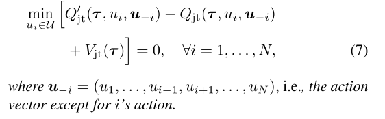         |

条件(7)在遵循定理1的同时令至少一个动作为0, 条件比(4b)更强.(4b)要求对任意$$\tau$$, $$Q_{jt}(\mathbf{t, u})-V_{jt}(\mathbf{t}) \le Q'_{jt}(\mathbf{t, u}) \le Q'_{jt}(\mathbf{t}, \bar{\mathbf{u}}) $$, 此时可能存在$$Q'_{jt}(\mathbf{t}, {\mathbf{u}})$$和$$Q'_{jt}(\mathbf{t}, \bar{\mathbf{u}})$$相近, 但是$$Q_{jt}(\mathbf{t, u})$$比$$Q_{jt}(\mathbf{t}, \mathbf{\bar{u}})$$小很多. 带来不稳定.

条件(7)限制了上述问题, 加宽了$$Q_{jt}(\mathbf{t, u})$$和$$Q_{jt}(\mathbf{t}, \mathbf{\bar{u}})$$之间的gap.

QTRAN-alt网络只用一次前向, 就可以计算所有i的$$Q_{jt}(\mathbf{t, \cdot}, \mathbf{u}_{-i})$$和$$Q'_{jt}(\mathbf{t, \cdot}, \mathbf{u}_{-i})$$.

因此, 每个智能体都有一个反事实联合网络, 给定其他智能体的动作, 其对于每个可能动作的输出为$$Q_{jt}(\mathbf{t, \cdot}, \mathbf{u}_{-i})$$. 从其他智能体得到$$h_{v, i}(\tau_i)$$和合并隐特征$$\sum_{j \ne i} h_{Q, j}(\tau_j, u_j) $$.

最后, 对于所有智能体, $$Q'_{jt}(\mathbf{t}, \cdot, \mathbf{u}_{-i}) = Q_i(\tau_i, \cdot) + \sum_{j \ne i}Q_j(\tau_j, u_j) $$. 通过损失函数用$$L_{nopt-min}$$代替$$L_{nopt}$$实现:

|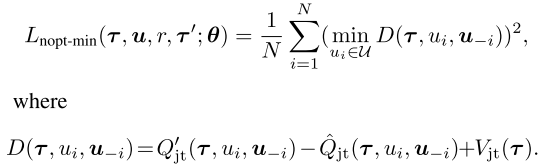|
|:-:|
||

## 3 伪代码

|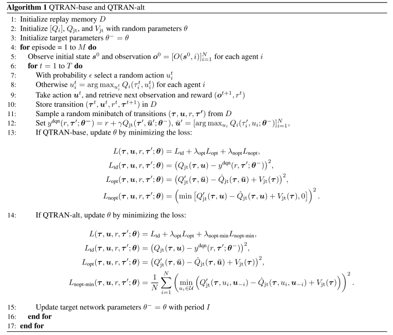|
|:-:|
||
