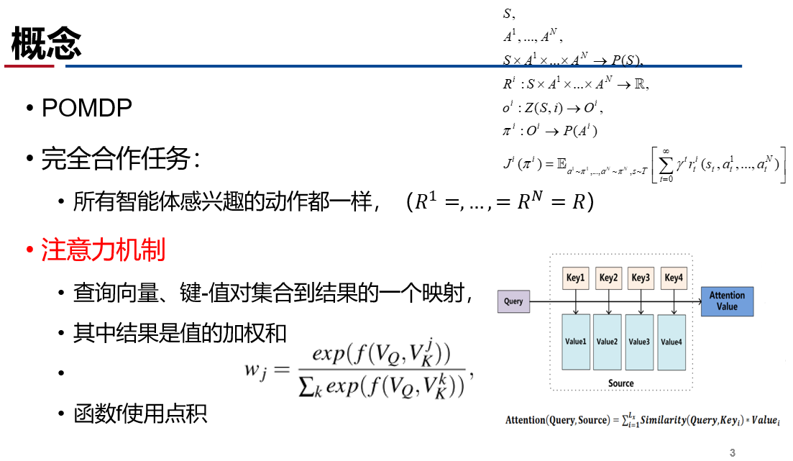
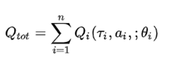
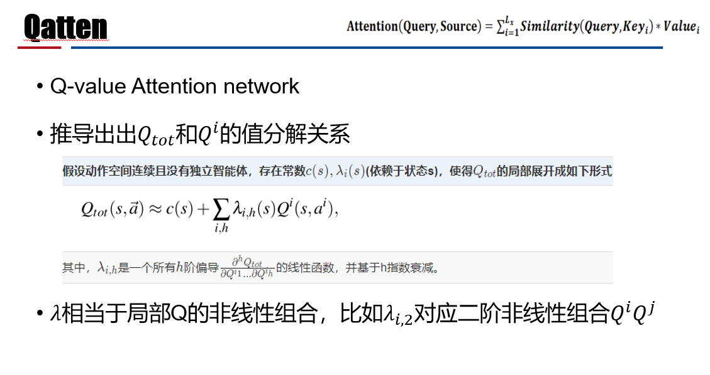
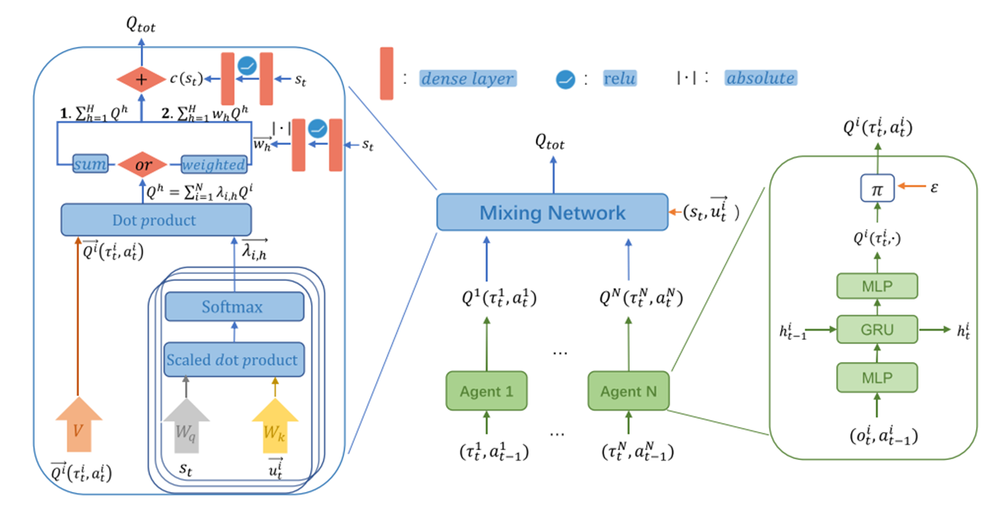
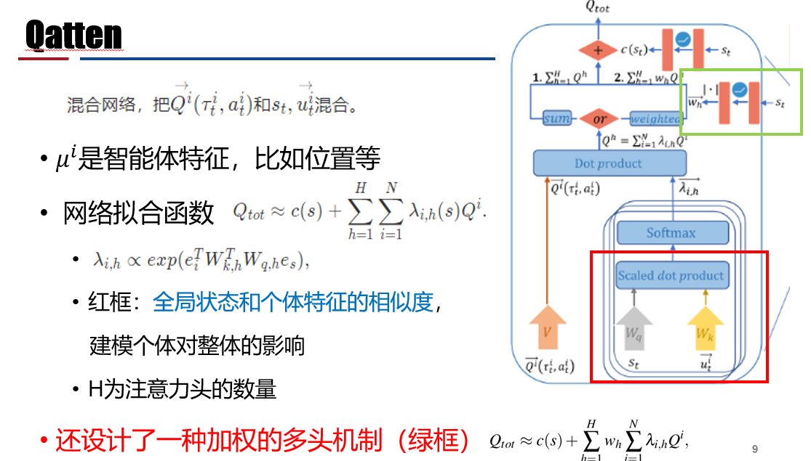

# 1.3 协作MARL：Qatten (Q-value Attention network

论文及翻译：[3 Qatten](./paper_MARL/Qatten.md)

## Motivation

使用集中式学习分布式执行框架，本质还是值函数逼近算法；

考虑只通过全局的奖励信息R指导学习
- 只适合协作式的POMDP问题
- 考虑如何通过局部值函数构造联合值函数，借由全局状态信息提升算法
- 考虑保证联合值函数与局部值函数单调性相同
- VDN $$\rightarrow$$ QMIX $$\rightarrow$$ Qatten

**如何学习联合Q值函数**？

**如何从联合Q函数提取好的分布式策略**？

## 基本概念

**算法演变**

1. IQL（independent Q-learning）
     - 简单地给每个智能体执行一个Q-learning；
2. DRQN：用RNN替换DQN的CNN，解POMDP问题；
3. VDN（value decomposition networks）
     - 
     - 行动策略通过对每个𝑄^𝑖 求ragmax得到；
     - VDN直接对局部Q函数求和，没有利用状态信息，且是线性表示。

## 算法框架

**实验**

- 环境：星际争霸2挑战环境，（easy , hard, super hard）
- baseline：COMA、VDN、QMIX、QTRAN
- 总训练步数约为200万；经验缓冲池：5000回合数据。
- GPU:RTX2080，
- 训练：8小时至18小时。

## 讨论

- 用多头注意力机制进行值分解，考虑了个体对整体的影响；
- 这个实验中H=4，智能体多了不稳，H增大计算复杂度升高
- 这个系列的算法都是基于值函数

