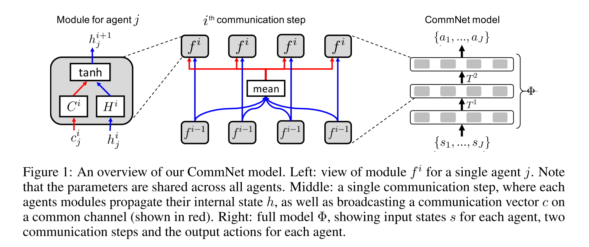
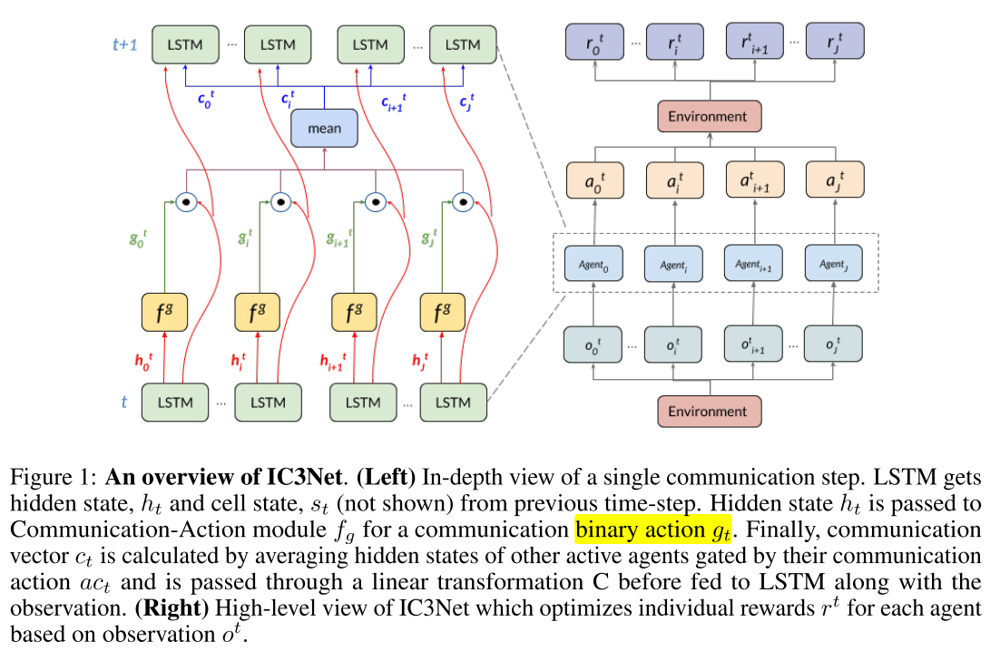
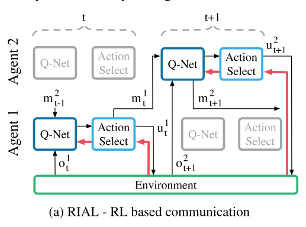
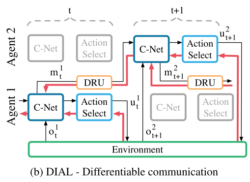
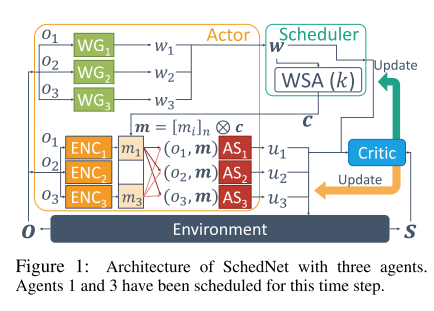
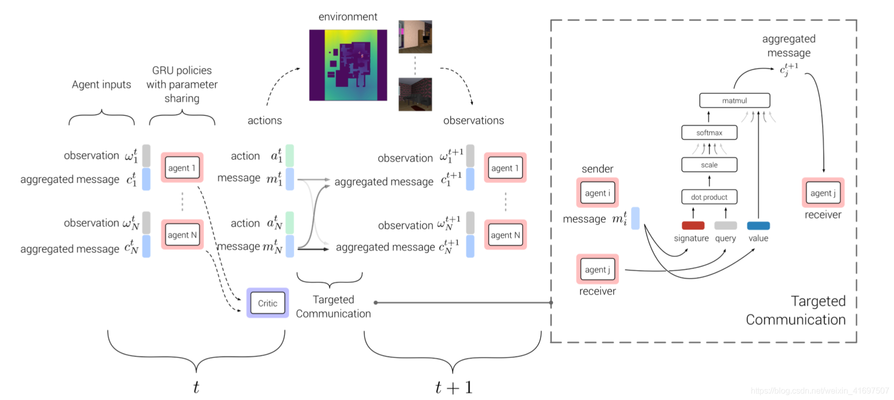
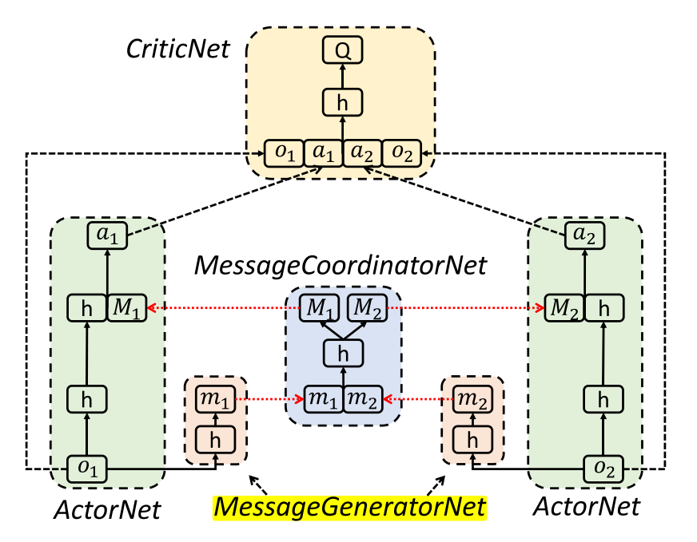
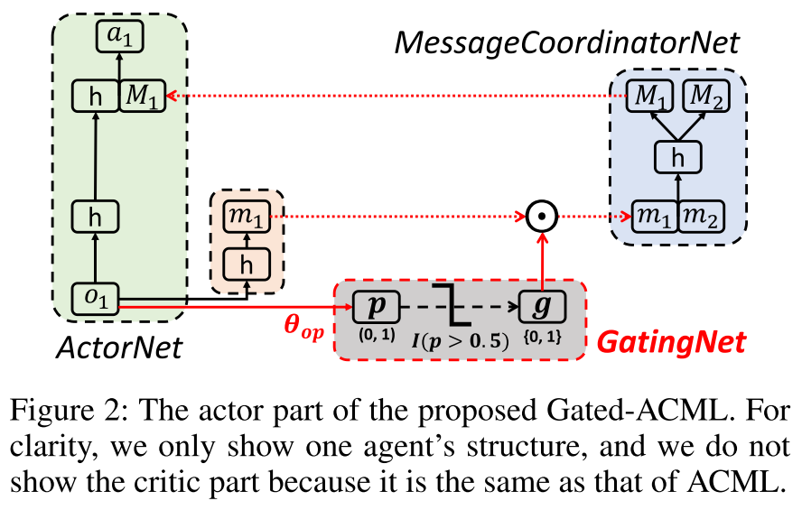
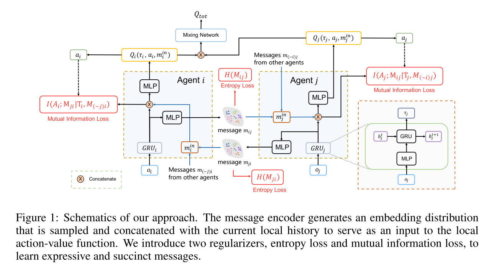
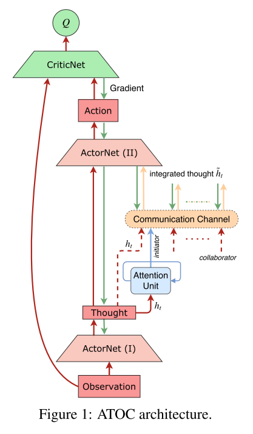

# MARL

## 1. MA沟通算法总结

|       |    算法名称    |                                                                                                                                 总结                                                                                                                                  |               结构               |                                                              补充                                                               |
| :---: | :------------: | :-------------------------------------------------------------------------------------------------------------------------------------------------------------------------------------------------------------------------------------------------------------------: | :------------------------------: | :-----------------------------------------------------------------------------------------------------------------------------: |
|   1   |    commNet     |                                                                                             学习连续通信的信道, 反向传播训练. 使用简单的平均方法, 把消息发送给所有智能体.                                                                                              |  |                                          使用CNN, 可以加入跳连, 能不能使用更深的网络?                                           |
|   2   |     IC3Net     |                                                                                             使用连续通信向量, 可以进行BP训练; 离散的门控信号, 使用一个softmax层变成可训的.                                                                                             |  |     使用门控机制学习何时通信, 使用个体奖励解决信用分配问题, 这儿的g作为门控信号, 可以控制智能体是否与其他人交流(自己视角下)      |
|   3   |      RIAL      |                                                                  将DRQN和independent Q-learning结合, 将网络分成$$Q_u^a$$和$$Q_m^a$$两个部分, 分别表示环境动作和交流动作的Q值. 这样输出只需要$$U+M$$.                                                                   |  |       单个智能体端到端可训; $$Q_u^a$$和$$Q_m^a$$都是用DQN训练, 非集中式训练; 在训练时关闭经验池, 避免不稳定性; 共享网络参数       |
|   4   |      DIAL      | 在集中学习过程中, 通信动作被一个智能体网络的输出和另一个智能体网络的输入之间的直接连接所取代. 因此, 当任务限制通信到离散消息时, 在学习过程中, 智能体可以自由地彼此发送值消息. 由于这些消息的功能与任何其他网络激活一样, 梯度可以沿着通道返回, 从而允许跨智能体端到端反向传播. |  | 跨智能体梯度可BP, C-Net输出Q值和消息m, 消息是实数, 绕过动作选择器, 通过discretise/regularise unit(DRU)直接输出给其他智能体的C-Net |
|   5   |    SchedNet    |                                                                                                        CTDE架构, 使用两个部分, 解决权重学习时, WSA不能微分的问题                                                                                                         |  |                                                       使用外部的Q来训练w                                                        |
|   6   |     TarMAC     |                                                                                            AC架构, CTDE训练架构, 使用签名软注意力机制实现点到点沟通, 使用多轮通信训练权重c.                                                                                             |  |        任意两个智能体之间都有权重c, 整个框架可微分, 消息向量通过反向传播学习. 消息接收方的视角, 使用Attention选择接受内容.        |
|   7   |      ACML      |                                                                                     每个智能体使用单独的ActorNet和MessageGeneratorNet, 使用共享CriticNet和MessageCoordinatorNet.                                                                                      |  |                                 整体消息协调网络类似于commNet的通信信道, Critic网络与MADDPG相同                                 |
|   8   |   Gated-ACML   |                                                                                                     每个智能体加入一个gatingNet生成门控信号, 门控网络单独进行训练                                                                                                     |  |                                        类似于坐标上升法, 训练某个智能体时, 固定其他智能体                                        |
|   9   | 近似值函数分解 |                                                                                                 引入消息空间, 使用外部Q函数引导, 使用两个信息论的正则化参数剪枝消息, |  |                                                     使用信息论, 学习消息剪枝                                                     |
|  10   |      ATOC      |                                        AC架构, DDPG算法, CTDE训练, 包含策略网络, Q网络, 注意力单元和一个交流信道; 每个T步选择一次分组, 在这T步里小组内保持不变.attention使用RNN, 交流信道使用双向LSTM, 可以过滤无用消息.                                         |  |      解决何时通信, 和谁通信的问题. 通过一个双向LSTM分组进行通信, 一个智能体可以分到多个组里. 发送方视角选择是否发送消息.       |
