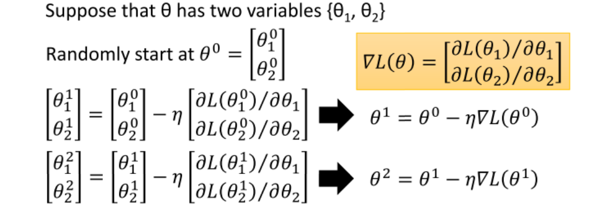
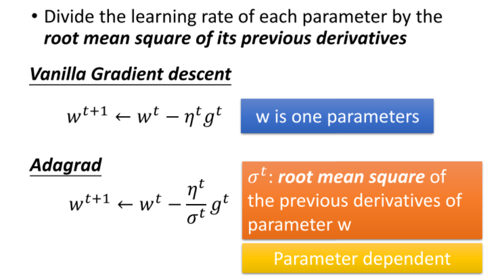
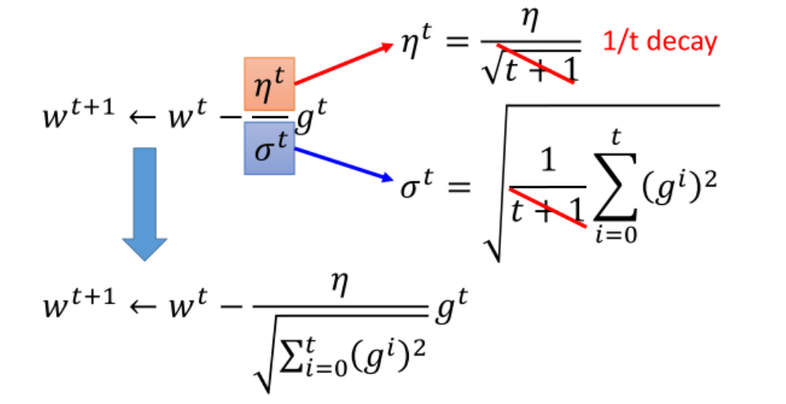
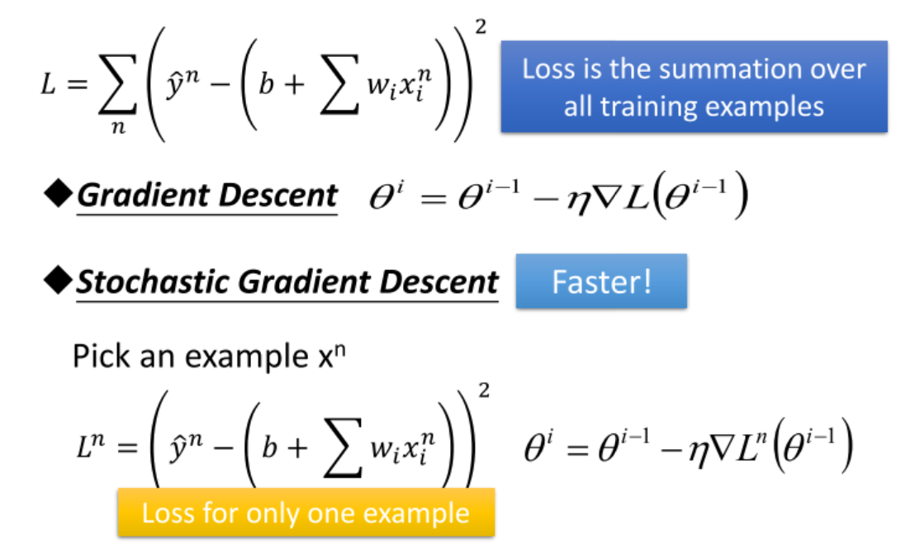
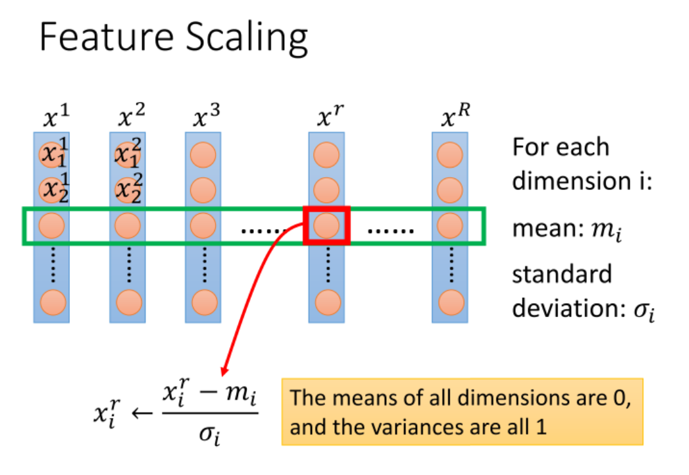
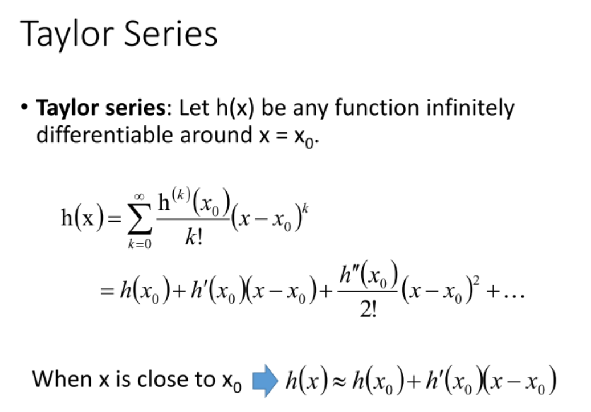
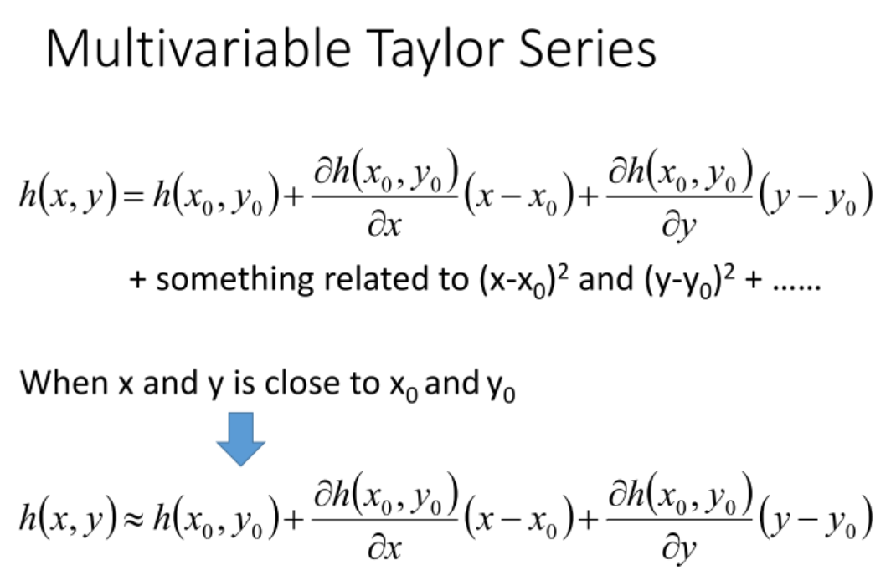
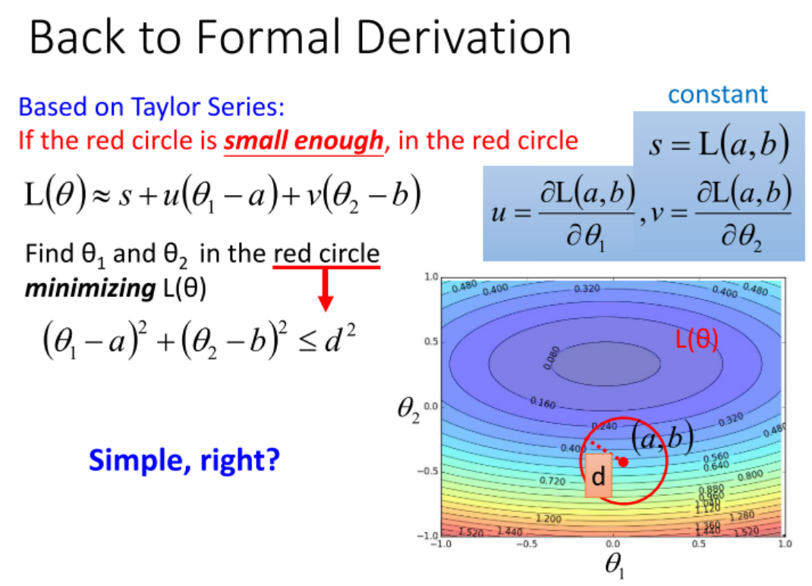
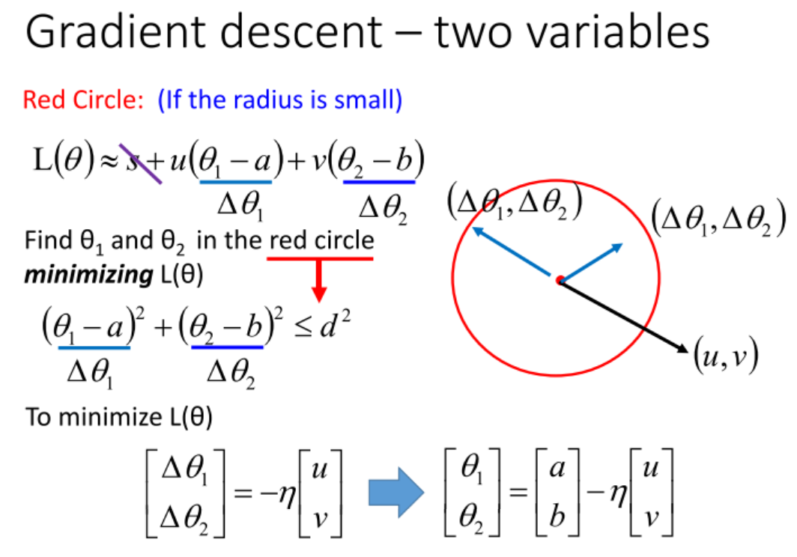

# 2 李宏毅ML-Optimization

Gradient Descent/ SGD

## 概述

* 首先复习: Gradient是Loss的等高线的法线方向; 
* 接下来是关于梯度下降的技巧, 一是"小心地调正学习率", 有没有方法自动地调学习率呢? Adaptive Learning Rates是一个基础的方法. 但还不够好.
* 一个更复杂的、典型的方法是Adagrad, 介绍了其简单的推导与公式的理解.
  + Adagrad就是将不同参数的learning rate分开考虑的一种算法, 对于某个参数, 迭代到后面速度会越来越慢, 当然这只是adaptive算法中最基础的.
* Stochastic Gradient Descent; 
* Feature Scaling; 
* Gradient Descent为何有效? 以及本身存在局部最优的算法. 
  + 考虑泰勒展开, 在数学上可以推导出, 最优的下降方向就是求梯度. 不考虑二阶及以上梯度, 因为这样带来的时间效率得不偿失.
  + 此外, Gradient Descent有可能陷入局部最优.

## 章节

<b>基本GD</b>

  

<b>为不同参数设置不同的学习率; </b>

  

<b>SGD</b>

<b>Feature Scaling, 为了防止不同特征量级不同影响梯度下降的方向.</b>

<b>梯度下降法的数学原理: 泰勒展式.</b>

