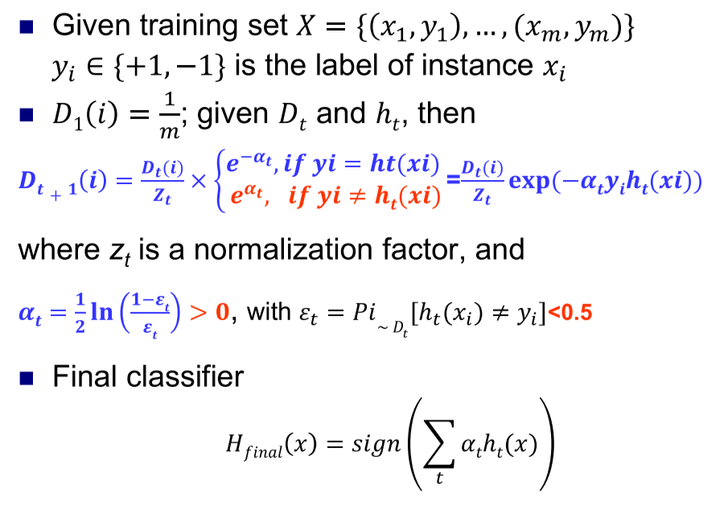
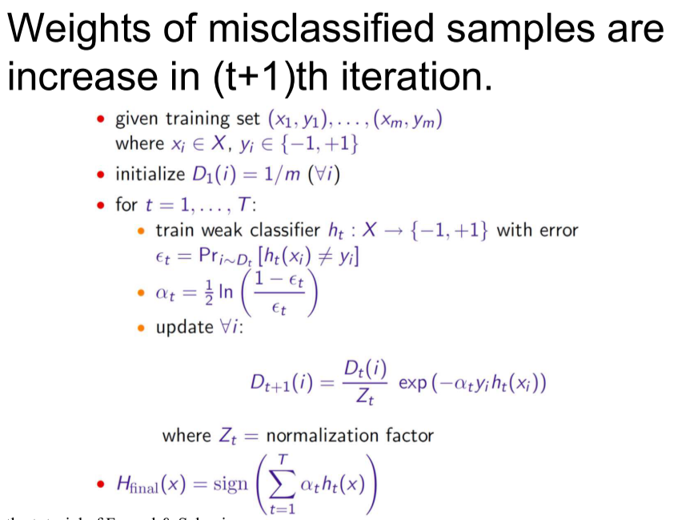

# 0 ML-集成学习

## GBDT和随机森林

1. 相同点：

   - 都是由多棵树组成; 
   - 最终的结果都是由多棵树一起决定

2. GBDT和随机森林的不同点:

   - 组成随机森林的树可以是分类树, 也可以是回归树; 而GBDT只由回归树组成; 
   - 组成随机森林的树可以并行生成; 而GBDT只能是串行生成; 
   - 对于最终的输出结果而言, 随机森林采用多数投票等; 而GBDT则是将所有结果累加起来, 或者加权累加起来; 
   - 随机森林对异常值不敏感, GBDT对异常值非常敏感; 
   - 随机森林对训练集一视同仁, GBDT是基于权值的弱分类器的集成; 
   - 随机森林是通过减少模型方差提高性能, GBDT是通过减少模型偏差提高性能.

## AdaBoost

