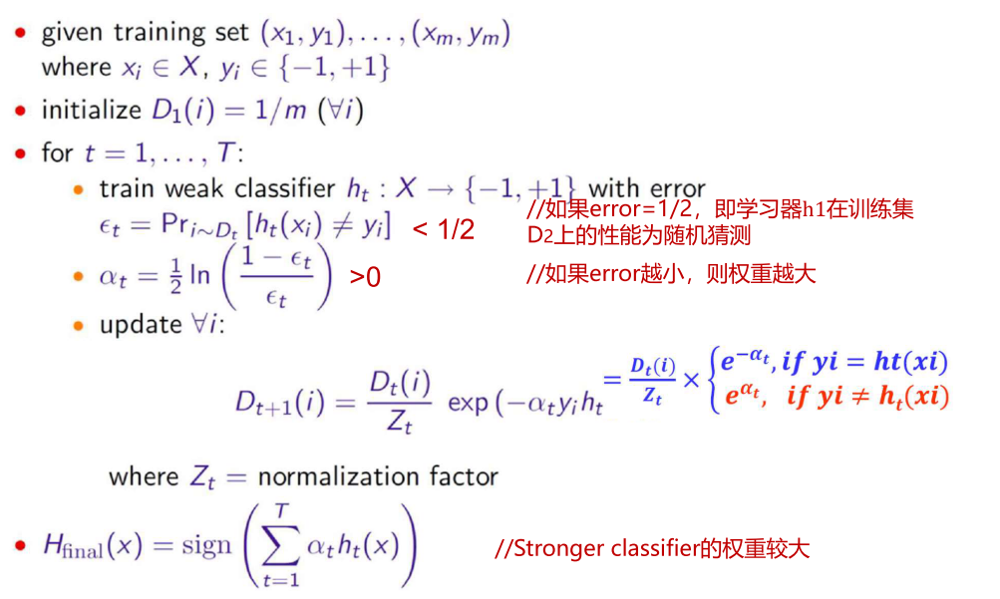
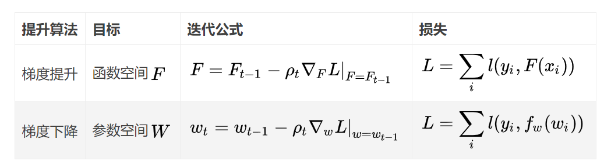

# 0 ML-集成学习

## 1 基础思想

### 1.1 bagging

1. 对给定有 N 个样本的数据集 D 进行 Bootstrap**有放回采样**, 得到$$D^1$$, 在$$D^1$$上训练模型$$f_1$$;
   - 上述过程重复 M 次, 得到 M 个模型, 则 M 个模型的平均(回归)/投票(分类)为
   - $$f_{avg}(x)=1/M \sum_{m=1}^M f_m(x)$$
2. 各个分类器无强依赖
3. bagging 对数据进行多次采样,分别训练多个模型, **可以降低模型的方差**

### 1.2. boosting

1. 各个基分类器采用串行的方式进行层层叠加, 对前一个分类器分错的样本给予更高的权重
2. 最终结果使用加权平均
3. 各个基分类器强依赖
4. boosting 聚焦于分错的样本, 可以减小偏差

## 2 基础算法

### 2.1 随机森林

对于 N 个数据, 每个样本 M 个属性的数据集:

1. 有放回的抽取 N 次形成 N 个样本, 用其训练一个决策树, 作为决策树根节点.
2. 在分裂时, 随机选取 m 个属性, m << M. 然后采用某种策略(如信息增益)选择 1 个属性作为该节点的分裂属性.
3. 决策树生成: 每个节点都要按照步骤 2 进行分裂(如果下一个节点选出来的属性是其父节点分裂时用过的属性, 则已经达到叶子节点, 无须继续分裂). 一直到不能够再分裂为止. **注意整个决策树形成过程中没有进行剪枝**.
4. 按照步骤 1~3 建立大量的决策树, 这样就构成了随机森林了.

### 2.2 AdaBoost

在前一个弱学习器失败样本上学习下一个学习器, 对分错的样本权重增加.

### 2.3 GBDT

1. boosting 算法, 基本思想还是多个基分类器串行训练, 下一个分类器对上一个分类器分错的样本给予更多的关注.
2. 改进是, 使用上一个模型的负梯度信息训练新的分类器, 然后将训练好的弱分类器以累加的形式结合到现有模型中.
3. 因为使用残差训练的, 所以在预测时,需要把所有预测值进行累加.
4. 通常使用 CART 树作为基分类器.

## 3 经典问题

### 3.1 常用基分类器

1. 主要是决策树:

- DT 表达能力和泛化能力可以方便地通过调节层数来确定
- 对样本扰动敏感, 不稳定的分类器更适合做基分类器

2. 简单的神经网络也可以作为基分类器.

### 3.3 随机森林能用线性分类器或者 knn 吗?

最好不要, 因为线性分类器等稳定的分类器对样本分布不敏感, 本身方差不大, 无法好好利用 bagging 减少方差的优势.

### 3.2 GBDT 和随机森林异同

**[GBDT 算法](https://blog.csdn.net/zpalyq110/article/details/79527653)**

1. 相同点：

   - 都是由多棵树组成;
   - 最终的结果都是由多棵树一起决定

2. GBDT 和随机森林的不同点:

   - 组成随机森林的树可以是分类树, 也可以是回归树; 而 GBDT 只由回归树组成;
   - 组成随机森林的树可以并行生成; 而 GBDT 只能是串行生成;
   - 对于最终的输出结果而言, 随机森林采用多数投票等; 而 GBDT 则是将所有结果累加起来, 或者加权累加起来;
   - 随机森林对异常值不敏感, GBDT 对异常值非常敏感;
   - 随机森林对训练集一视同仁, GBDT 是基于权值的弱分类器的集成;
   - 随机森林是通过减少模型方差提高性能, GBDT 是通过减少模型偏差提高性能.

3. GBDT 优点:
   - 预测阶段的计算速度快, 可并行计算.
   - 在分布稠密的数据集上, 泛化能力和表达能力都很好.
   - 采用决策树作为弱分类器使得 GBDT 模型具有较好的解释性和鲁棒性, 能够自动发现特征间的高阶关系, 也不需要对数据进行特殊的预处理如归一化等.
4. GBDT 局限：
   - GBDT 在高维稀疏的数据集上, 表现不如支持向量机或神经网络.
   - GBDT 在处理文本分类特征问题上, 相对于其他模型优势不如在处理数值特征时明显.
   - 训练过程需要串行训练, 只能在决策树内部采用一些局部并行的手段提升训练速度.

### 3.3 梯度提升和梯度下降的区别和联系:

1. 联系：两者均是在每一轮迭代中，利用损失函数相对于模型的负梯度方向的信息来对当前模型进行更新。
2. 区别：

   - 在梯度下降中, 模型是以参数化形式表示, 从而模型的更新等价于参数的更新;
   - 在梯度提升中, 模型并不需要进行参数化表示, 而是直接定义在函数空间中, 从而大大扩展了可以使用的模型种类.

   

   
   

### 3.4 XGBoost 与 GBDT 的联系和区别

1. GBDT 是机器学习算法，XGBoost 是该算法的工程实现。
2. 在使用 CART 作为基分类器时, XGBoost 就显式地加入了正则项来控制模型的复杂度, 有利于防止过拟合, 提高模型的泛化能力.
3. GBDT 在模型训练时只使用了代价函数的一阶导数信息, **XGBoost 对代价函数进行二阶泰勒展开**, 可以同时使用一阶和二阶导数.
4. 传统的 GBDT 使用 CART 作为基分类器, XGBoost 支持多种类型的基分类器, 比如线性分类器.
5. 传统的 GBDT 在每轮迭代时使用全部的数据, XGBoost 则采用了与随机森林相似的策略, 支持对数据进行采样.
6. **传统的 GBDT 没有设计对缺失值进行处理,** XGBoost 能够自动学习出缺失值的处理策略.
