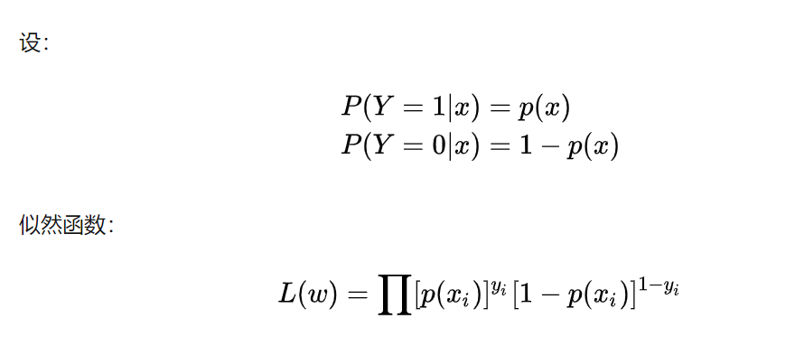
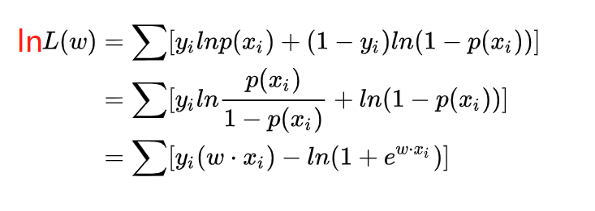
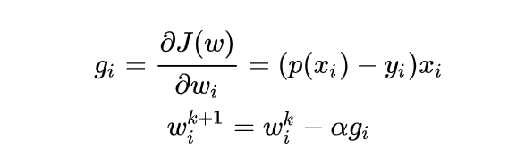
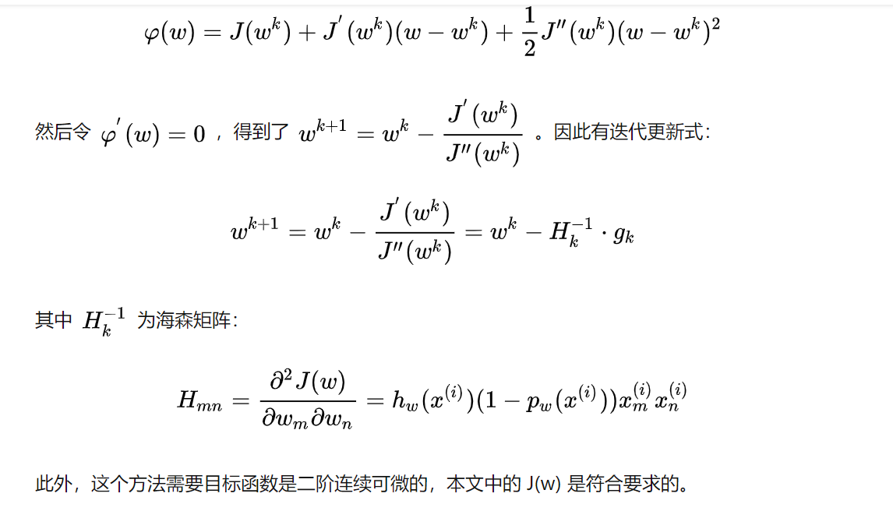

# 1 百面 ML-3 经典算法

## 1 LR 算法

### 1.1 原理

#### 基本原理

1. 通过 sigmoid 函数将样本 x 预测值映射到(0, 1)之间, 并且在做分类任务时, 将$$e^{wx+b}/1+e^{wx+b}$$作为分类为 1 的概率, $$1/1+e^{wx+b}$$作为分类为负样本的概率.

2. LR 模型的基本假设还是 **模型输出 Y=1 的对数几率时关于 x 的线性函数**. 即

   $$
   log \frac{P(Y=1|x)}{1-P(Y=1|x)}=w \cdot x
   $$

#### 训练

在训练时, LR 的 loss 可以使用极大似然估计

为了更方便求解, 我们对等式两边同取对数, 写成对数似然函数:

在机器学习中我们有损失函数的概念, 其衡量的是模型预测错误的程度. 如果取整个数据集上的平均对数似然损失, 我们可以得到:

$$
J(w) = \frac{1}{N} ln L(w)
$$

即在逻辑回归模型中, 我们最大化似然函数和最小化损失函数实际上是等价的.

**随机梯度下降法求解**

#### 牛顿法

牛顿法的基本思路是, 在现有极小点估计值的附近对 f(x) 做二阶泰勒展开, 进而找到极小点的下一个估计值. 假设 $$w^k$$ 为当前的极小值估计值, 那么有:

### 1.2 线性回归和逻辑回归的异同

1. 线性回归做回归，LR 是分类任务；
2. LR 可以不符合线性关系.
3. 逻辑回归因变量是离散的，线性回归因变量是连续的。
4. 两者都用极大似然估计建模，也都可以用梯度下降方法求解。

### 1.3 优缺点

1. 优点
   - 实现简单, 计算代价不高, 易于理解和实现, 广泛的应用于工业问题上;
   - 分类时计算量非常小, 速度很快, 存储资源低;
   - 便利的观测样本概率分数;
   - 对逻辑回归而言, 多重共线性并不是问题, 它可以结合 L2 正则化来解决该问题;
2. 缺点
   - 当特征空间很大时, 逻辑回归的性能不是很好;
   - 容易欠拟合, 一般准确度不太高
   - 不能很好地处理大量多类特征或变量;
   - 只能处理两分类问题(在此基础上衍生出来的 softmax 可以用于多分类), 且必须线性可分;
   - 对于非线性特征, 需要进行转换;

## 2 决策树

特征选择, 树的构造, 树的剪枝

### 2.1 ID3：最大信息增益(互信息)， 熵-条件熵, g(D,A)=H(D)-H(D|A)

- 倾向于选取值多的特征
- 只能处理离散变量, 只能用于分类, 对缺失值敏感, 可多分支

### 2.2. C4.5：最大信息增益比

- 对 ID3 进行了优化, 平衡了分类的问题, 对取值比较多的特征进行了惩罚, 在 ID3 基础上除以关于特征的熵.
- $$g_R (D,A)=\frac{g (D,A)}{H_A (D)}, H_A (D) = - \sum_{i=1}^{n}\frac{|D_i|}{|D|} \log _2 \frac{|D_i|}{|D|}$$, n 是特征个数.
- 可以处理连续变量, 进行切分, 只能用于分类, 可多分支

### 2.3. CART：只能二分类(基尼系数最小化), 可回归(MSE 损失最小化)

- $$Gini(p)=\sum_{k=1}^K p_k(1-p_k)=1-\sum_{k=1}^K p_k^2 $$
- 二分类: $$Gini(p)=2p(1-p)$$
- 二元树, 当基尼指数降为 0, 完成决策树的生长.

对于属性 A，分别计算任意属性值将数据集划分为两部分之后的 Gain_Gini，选取其中的最小值，作为属性 A 得到的最优二分方案。
然后对于训练集 S，计算所有属性的最优二分方案，选取其中的最小值，作为样本及 S 的最优二分方案。

