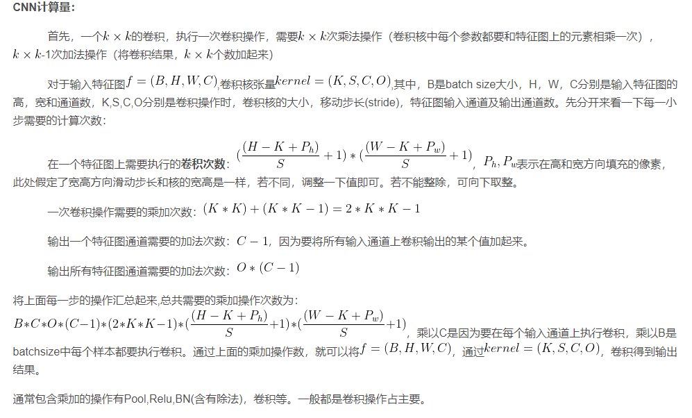
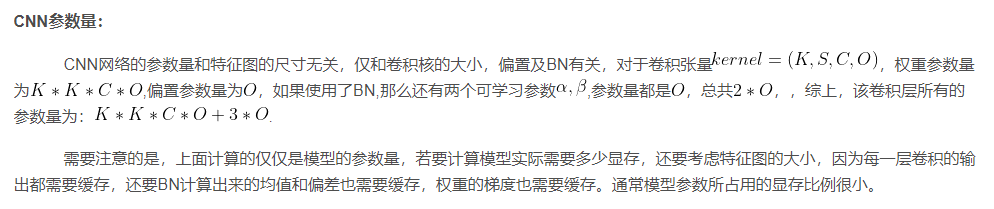
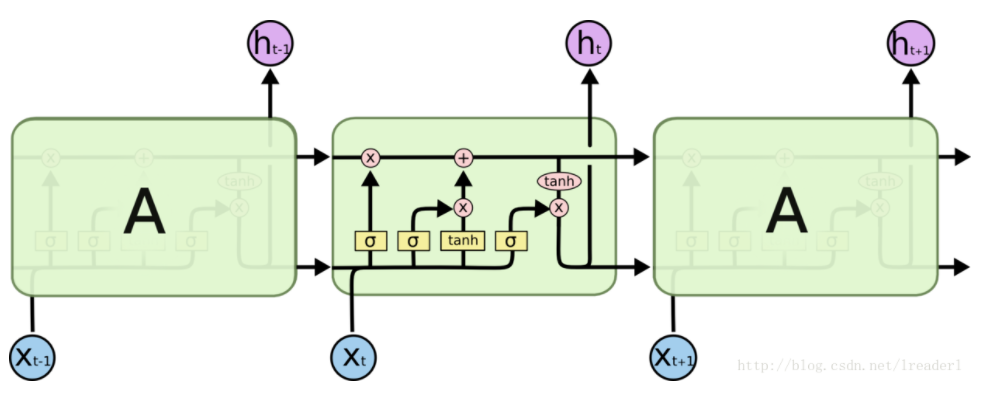
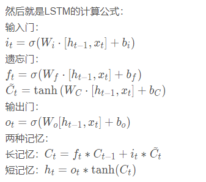
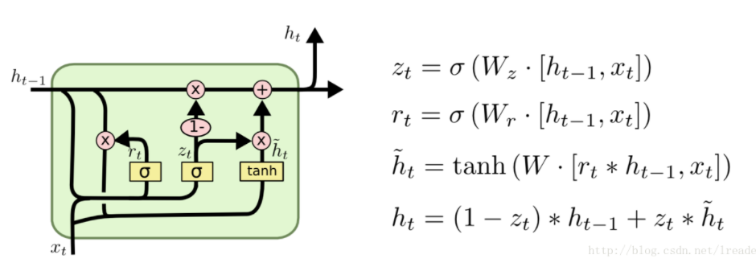

# 1 百面ML-3CNN/RNN

## 1. CNN 

### CNN 计算量

### cnn参数量

## 2 RNN 

### RNN 

### LSTM 

Vanilla RNN 具有梯度消失问题, 对长关系的依赖(Long-Term Dependencies)的建模能力不够强大.

LSTM 通过构建一些门(Gate), 让网络能记住那些非常重要的信息, 而这个核心的结构, 就是 cell state.

### GRU 

