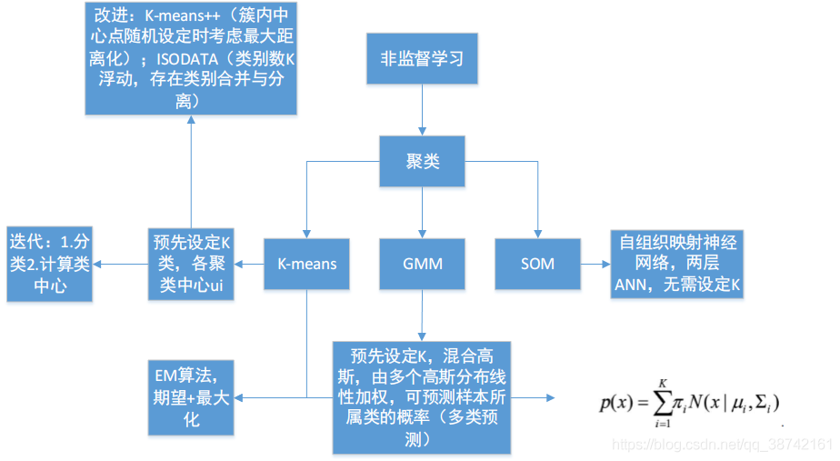

# 1 百面ML-3降维/非监督学习

## 1. 降维

### 1.1 主成分分析

1. 最大化投影方差:
   - 方向: 对样本数据进行中心化之后, 对协方差矩阵做特征分解, 最大特征值对应的特征向量
2. 最小化均方误差
   - 找一个d维超平面, 使得所有点到其距离的平方和最小
3. SVD分解方法
   - 对矩阵A进行中心化之后进行SVD分解与PCA等价
   - SVD由迭代求解方法, 直接对矩阵进行特征分解复杂度很高.

   

   
   
   
   
   
   

### 1.2 线性判别分析 LDA

具体步骤:

1. 计算每个类别的均值向量和总体均值向量；
2. 计算类内散度、全局散度、并相减得到类间散度；
3. 对上述最大化目标进行特征分解，并从大到小排列；
4. 选取前d个。

## 2 无监督学习

### 2.1 K-means

简述K均值算法的具体步骤(2)
1. 数据预处理, 如归一化, 离群点处理等
2. 随机选择K个簇中心
3. 定义代价函数: J=所有样本到其所分类别的距离平方和最小
4. 迭代如下过程知道代价函数J收敛.
   - 对每一个样本, 分配到距离最近的簇; 
   - 对每一个簇K, 重新计算该簇的中心

优点:
   - 对于大数据集, K均值聚类算法相对是可伸缩和高效的, 
   - 计算复杂度是O(NKt)接近于线性
   - 尽管算法是以局部最优结束, 但是一般情况下达到局部最优已经可以满足聚类的需求.

缺点:
   - 受初值和离群点的影响每次的结果不稳定, 
   - 通常不是全局最优而是局部最优解, 
   - 无法很好的地解决数据簇分布差别较大的情况(比如一类是另一类样本数量的100倍)

算法调优: 
   - 数据归一化和离群点处理
   - 合理选择K值: 手肘法
