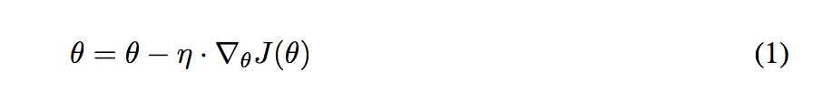
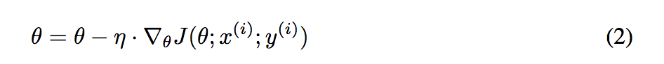
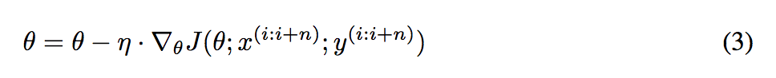
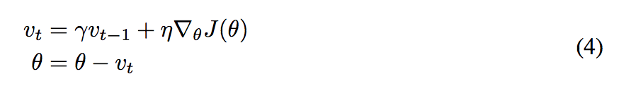
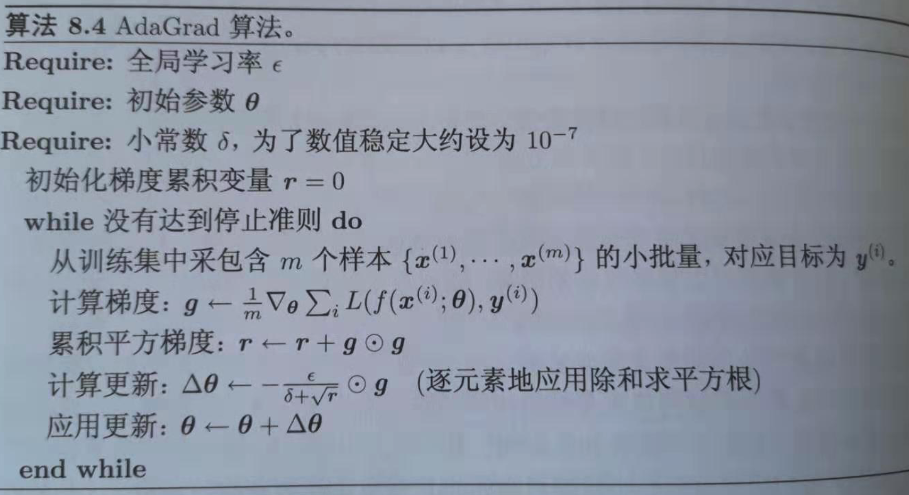
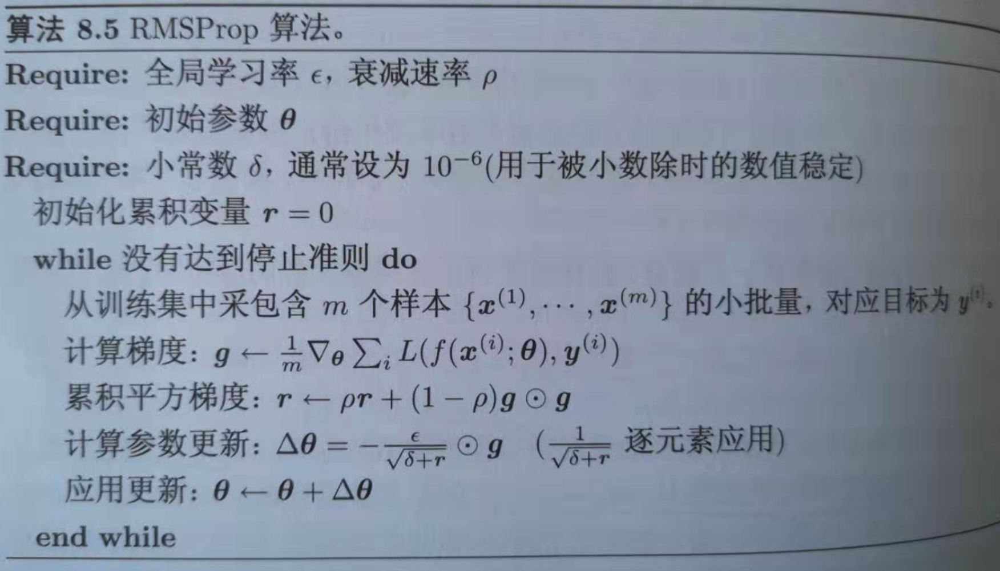
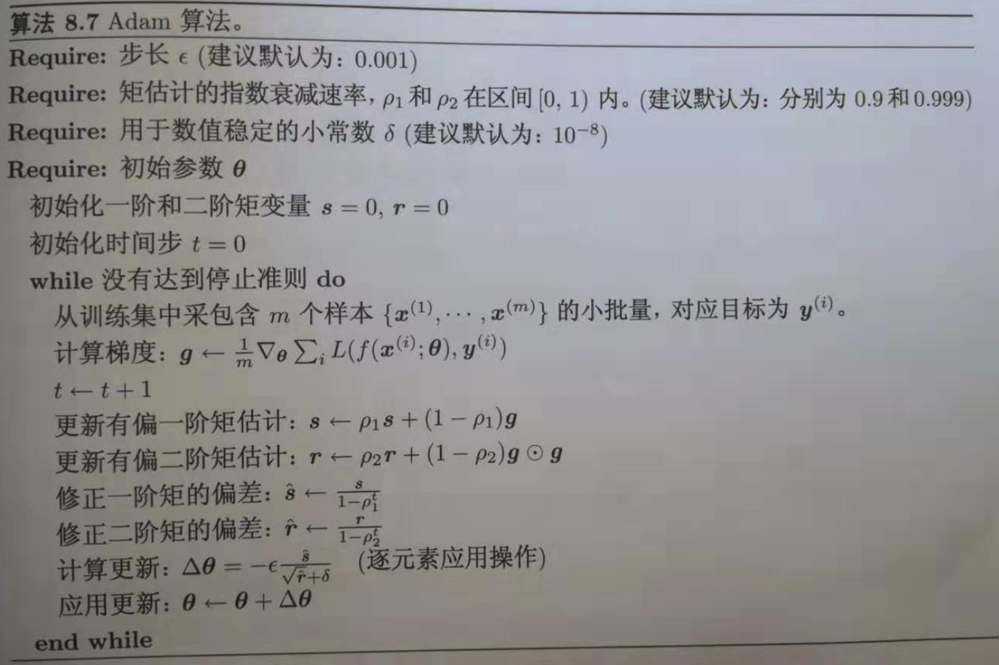

# 1 百面ML-3优化算法

## 1. 梯度下降法及其三个变种

### 1.1 BGD: Batch Gradient Descent

1. 迭代规则:
  + BGD(批量梯度下降, 这里的批量实际上是全部数据)每次迭代采用整个训练集数据来计算损失函数J(θ)对参数θ的的梯度.

2. 每次迭代的参数更新公式为:

   

   
   

   
3. 优点:
   - 由于每一步迭代使用了全部样本, 因此当损失函数收敛过程比较稳定. 对于凸函数可以收敛到全局最小值, 对于非凸函数可以收敛到局部最小值.

4. 缺点:
   - 每一步更新中, 都要利用全部样本计算梯度, 计算起来非常慢, 遇到很大量的数据集也会非常棘手, 而且不能投入新数据实时更新模型.

### 1.2 SGD: Stochastic Gradient Descent 

1. 迭代规则：
   - SGD每次迭代利用每个样本计算损失函数对θ的梯度.

2. 公式为：
   
   

   
   

3. 优点：
   - 由于每次迭代只使用了一个样本计算梯度, 训练速度快, 包含一定随机性, 从期望来看, 每次计算的梯度基本是正确的导数的.

4. 缺点:
   - 更新频繁, 带有随机性, 会造成损失函数在收敛过程中严重震荡.

### 1.3 MBGD: Mini-Batch Gradient Descent

1. 迭代规则：
   - MBGD 每一次利用一小批样本, 即 n 个样本进行计算梯度( n 一般取值在 50～256).

2. 公式为：
   
   

   
   

3. 优点：
   - 可以降低参数更新时的方差, 收敛更稳定, 另一方面可以充分地利用深度学习库中高度优化的矩阵操作来进行更有效的梯度计算.

4. 缺点:
   - 不能保证很好的收敛性, learning rate 如果选择的太小, 收敛速度会很慢, 如果太大, 损失函数就会在极小值处不停地震荡甚至偏离.(有一种措施是先设定大一点的学习率, 当两次迭代之间的变化低于某个阈值后, 就减小 learning rate, 不过这个阈值的设定需要提前写好, 这样的话就不能够适应数据集的特点.)

## 2 Momentum

1. 梯度下降法容易被困在局部最小的沟壑处来回震荡，可能存在曲面的另一个方向有更小的值；有时候梯度下降法收敛速度还是很慢。动量法就是为了解决这两个问题提出的。

2. 公式为：
   
   

   
   

   加入的这一项, 可以使得梯度方向不变的维度上速度变快, 梯度方向有所改变的维度上的更新速度变慢, 这样就可以加快收敛并减小震荡.
3. 超参数设定值:  一般 γ 取值0.5、0.9、0.99 左右。
4. 优点：
   - 前后梯度一致的时候能够加速学习; 前后梯度不一致的时候能够抑制震荡, 越过局部极小值.(加速收敛, 减小震荡.)
5. 缺点:
   - 增加了一个超参数.

## 3 Adagrad: Adaptive gradient algorithm

1. AdaGrad是一种可以自动改变学习速率的优化算法，只需设定一个全局学习速率epsilon

2. 公式为：
   
   

   
   

3. 优点：减少了学习率的手动调节.

4. 缺点:分母会不断积累, 学习率就会减小并最终会变得非常小.(一开始就积累梯度平方会导致有效学习率过早过量减小).

## 4 RMSProp

1. RMSProp 是 Geoff Hinton 提出的一种自适应学习率方法。RMSprop 和 Adadelta(这里没有介绍)都是为了解决 Adagrad 学习率急剧下降问题的。

2. 公式为：
   
   

   
   

   引入一个衰减系数, 让r每次都以一定的比例衰减, 类似于Momentum中的做法. 衰减系数使用的是指数加权平均, 旨在消除梯度下降中的摆动, 与Momentum的效果一样, 某一维度的导数比较大, 则指数加权平均就大, 某一维度的导数比较小, 则其指数加权平均就小, 这样就保证了各维度导数都在一个量级, 进而减少了摆动. 允许使用一个更大的学习率.

3. 优点：相比于AdaGrad, 这种方法更好的解决了深度学习中过早的结束学习的问题; 适合处理非平稳目标, 对RNN效果很好.
4. 缺点:引入的新的超参: 衰减系数$$\rho$$; 

## 5 Adam: Adaptive Moment Estimation

1.   Adam本质上是带有动量项的RMSProp，它利用梯度的一阶矩估计和二阶矩估计动态调整每个参数的学习率。Adam的优点主要在于经过偏置矫正后，每一次迭代学习率都有个确定范围，使得参数比较平稳。
2. 公式为：
   
   

   
   

3. 优点：Adam 比其他适应性学习方法效果要好. 适用于多数情况.
4. 缺点:复杂 

## 6 如何选择优化算法

1. 对于**稀疏数据, 尽量使用学习率可自适应的优化方法**, 不用手动调节, 而且最好采用默认值.
2. **SGD通常训练时间更长**, 但是在好的初始化和学习率调度方案的情况下(很多论文都用SGD), **结果更可靠**.
3. 如果在意更快的收敛, 并且需要训练较深较复杂的网络时, 推荐使用学习率自适应的优化方法.
4. Adadelta, RMSprop, Adam是比较相近的算法, 在相似的情况下表现差不多 . Adam 就是在 RMSprop 的基础上加了 bias-correction 和 momentum, 随着梯度变得稀疏, Adam 比 RMSprop 效果会好. 整体来讲, Adam 是最好的选择.
