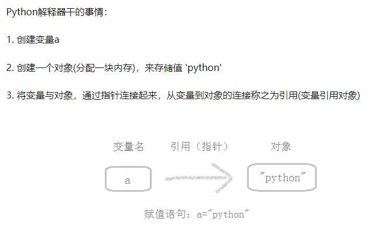
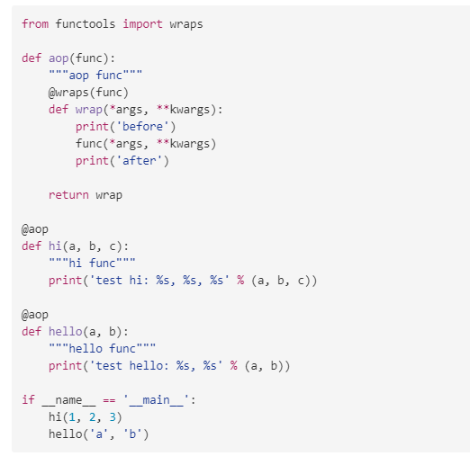
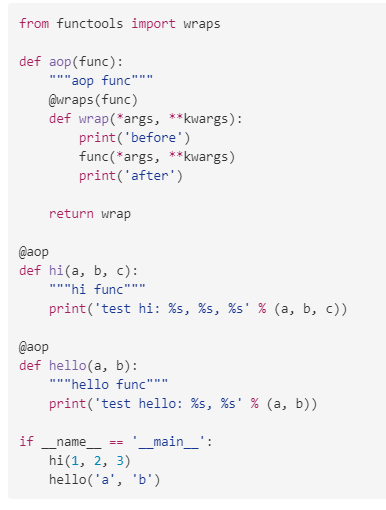

# 3 Python 经典问题

## 1 基础

### 1.1 变量与赋值

- 变量: 是一个系统表的元素, 拥有指向对象的连接空间
- 对象: 被分配的一块内存, 存储其所代表的值
- 引用: 是自动形成的从变量到对象的指针
- 类型: 属于对象, 而非变量
- 不可变对象: 一旦创建就不可修改的对象, 包括字符串、元组、数值类型
  - 不可变对象所指向的内存中的值不能变. 改变时其实是复制一份再改变, 变量指向新的地址.
- 可变对象: 可以修改的对象, 包括列表、字典、集合
  - 原地改变

赋值操作:

<div style="text-align: center; width: 70%; margin: auto; ">

</div>

### 1.2 赋值, 深拷贝, 浅拷贝

#### 1.2.1 赋值: 只是复制了新对象的引用, 不会开辟新的内存空间.

并不会产生一个独立的对象单独存在, 只是将原有的数据块打上一个新标签, 所以当其中一个标签被改变的时候, 数据块就会发生变化, 另一个标签也会随之改变.

#### 1.2.2. 浅拷贝: 创建新对象, 其内容是原对象的引用.

浅拷贝有三种形式: 切片操作, 工厂函数, copy 模块中的 copy 函数.

操作: 只拷贝对象最外边的一层, 而内部还是引用.

1. 不可变对象: 和“赋值”一样，对象的 id()（用于获取内存地址）与浅复制原来的值相同。
2. 可变对象:
   - 复制的对象中无复杂子对象, 原来值的改变并不会影响浅复制的值, 同时浅复制的值改变也并不会影响原来的值. 原来值的 id 值与浅复制原来的值不同.
   - 复制的对象中有复杂子对象(例如列表中的一个子元素是一个列表), 改变原来的值中的复杂子对象的值会影响浅拷贝的值.

#### 1.2.3. 深拷贝: 深拷贝拷贝了对象的所有元素, 包括多层嵌套的元素. 是一个全新的对象, 与原对象没有任何关联.

所以改变原有被复制对象不会对已经复制出来的新对象产生影响.

只有一种形式, copy 模块中的 deepcopy 函数

#### 1.2.4 举例

1. 不可变类型，不管是深拷贝还是浅拷贝，地址值和拷贝后的值都是一样的。
2. 对于可变对象深浅拷贝
   - 赋值: 值相等, 地址相等
   - copy 浅拷贝: 值相等, 地址不相等
   - deepcopy 深拷贝: 值相等, 地址不相等
3. 对于可变对象深浅拷贝(外层改变元素)
   - 外层添加元素时, 浅拷贝不会随原列表变化而变化; 内层添加元素时, 浅拷贝才会变化.
   - 无论原列表如何变化, 深拷贝都保持不变.
   - 赋值对象随着原列表一起变化.

### 1.3 [self 关键字](https://blog.csdn.net/xrinosvip/article/details/89647884)

self 不是关键字, 在构造时指定的第一个参数, 它指向类的实例本身, 类在实例化的时候将其属性和方法与 self 绑定.
在调用的时候自动传入.

self 只是一种约定俗称的名字, 可以在构造类的时候指定其他的名字.
注意:

1. \_\_init\_\_ 方法的第一个参数永远是 self , 表示创建的实例本身, 因此, 在 **init** 方法的内部, 就可以把各种属性绑定到 self, 因为 self 就指向创建的实例本身

2. 使用了 \_\_init\_\_ 方法, 在创建实例的时候就不能传入空参数, 必须传入与 **init** 方法匹配的参数, 但是 self 不需要传, python 解释器会自己把实例变量传进去.

### 1.4 生成器和迭代器

1. 迭代器(iter()), 对于可迭代对象遍历的方法, python 内置函数.
   - 首先使用 iter()函数返回一个迭代器;
   - 然后使用 next()遍历剩下的元素, 直到遇到 StopIteration 的异常后循环结束

```python
list = [3,12,22,33]
it = iter(list)
for i in it:
    print(i,end=" ")
```

2. 生成器: 使用 `yield` 关键字. 延迟操作, 也就是在需要的时候才产生结果，不是立即产生结果, 减少内存空间.
   - 自动创建了*iter*()和*next*()内置方法仅仅保存了一套生成数值的算法，调用时，才去计算然后返回一个值。
   - 生成器一定是迭代器，而迭代器不一定是生成器.
   - 在调用生成器运行的过程中, 每次遇到 yield 时函数会暂停并保存当前所有的运行信息, 返回 yield 的值, 并在下一次执行 next() 方法时从当前位置继续运行.

<!-- <div style="text-align: center; width: 80%; margin: auto; ">

</div> -->

> ```python
> import sys
> def fibonacci(n): # 生成器函数 - 斐波那契
>     a, b, counter = 0, 1, 0
>     while True:
>         if (counter > n):
>             return
>         yield a
>         a, b = b, a + b
>         counter += 1
> f = fibonacci(10) # f 是一个迭代器，由生成器返回生成
> while True:
>     try:
>         print (next(f), end=" ")
>     except StopIteration:
>         sys.exit()
> ```

### 1.5 [修饰器](https://zhuanlan.zhihu.com/p/51035016)

装饰器的作用就是为已经存在的函数或对象添加额外的功能。
利用了 python 参数可以传递函数引用的特点. 用一个@符号修饰.
自己定义修饰器的时候会将修饰器的函数替换自己的函数, 因此可以使用`functools.wraps`解决这个问题.

如下是一个通用的带参数的修饰器

<!-- <div style="text-align: center; width: 80%; margin: auto; ">

</div> -->

> ```python
> from functools import wraps
>
> def aop(func):
>     """aop func"""
>     @wraps(func)
>     def wrap(*args, **kwargs):
>         print('before')
>         func(*args, **kwargs)
>         print('after')
>
>     return wrap
>
> @aop
> def hi(a, b, c):
>     """hi func"""
>     print('test hi: %s, %s, %s' % (a, b, c))
>
> @aop
> def hello(a, b):
>     """hello func"""
>     print('test hello: %s, %s' % (a, b))
>
> if __name__ == '__main__':
>     hi(1, 2, 3)
>     hello('a', 'b')
> ```
