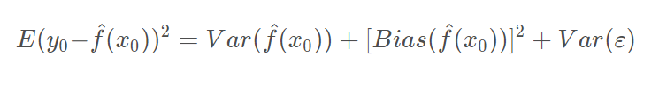
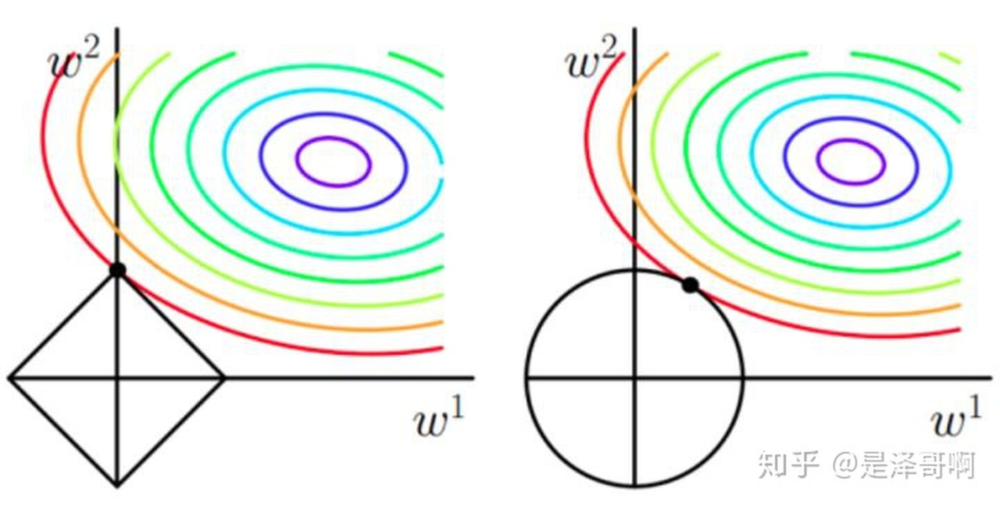
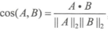

# 0 面试-ML相关

## 1. 基本原理问题

### 1.1 方差偏差

测试误差一般有三个来源, 方差, 偏差平方, 误差项方差:

1. 偏差是采样得到的训练集训练出的模型输出的平均值与真实期望之间的偏差. 通常来自于模型的错误假设.
2. 方差指由采样得到的训练集训练出的所有模型的输出的方差, 与样本分布有关. 通常方差由于模型复杂度相对于样本来说过高导致的. 

### 1.2 梯度爆炸与消失

1. 爆炸:
   - 梯度裁剪
   - 正则化
   - ReLU
   - 用maxout代替sigmoid
   - 预训练+微调
2. 消失
   - 正交初始化, 高斯初始化
   - 不用sigmoid-->> ReLu
   - LSTM的门控机制
   - ResNet的残差机制

### 1.3 过拟合

1. 模型角度
   - Dropout, 正则化, 简化模型, DT剪枝, BN层
   - 集成学习
2. 数据增强

### 1.4 神经网络

1. BN层作用
   - 解决Covariate shift问题, 在激活函数之前用.
   - 加速收敛, 控制过拟合(可少用dropout), 降低网络初始化的敏感度, 允许较大学习率, 跳出局部最优
   - BN只考虑相对差异, 分类可用, 但是想图像超分辨率等任务不能用BN

2. LN层作用
   - 也是加速收敛, 用于RNN
   - 每个样本内做标准化, 不受batch_size影响

3. ReLU
   - 优点: 计算复杂度低, 解决梯度爆炸\消失问题, 有利于稀疏表达
   - 缺点: LR较大时导致神经元死亡问题-->leaky ReLU
   - RNN中, W应该初始化为单位阵.

4. NN参数初始化方法:
   - 高斯\均匀分布初始化
   - 方差缩放初始化
   - 正交初始化

### 1.5 稀疏表示与压缩感知

1. 任意一个信号都可以在一个过完备字典上稀疏线性表出
2. 稀疏表示就是将一个复杂的数据简单化，压缩感知是要从一个简单化的数据表示中得到复杂的原始数据
   - 使用少量基本信号的线性组合表示某一目标信号, 称为信号的稀疏表示; 
   - 用低维的采样数据向量回复或重构 $$N_{quist}$$ 速率采样的高维数据向量, 称为压缩感知.
3. 稀疏表示有助于**实现特征的自动选择, 即通过参数置零过滤一些不重要的特征, 提高泛化能力**.
4. **梯度截断也可以产生稀疏性.**

### 1.6 L1与L2正则化

==**结构风险最小化: 在经验风险最小化的基础上(也就是训练误差最小化), 尽可能采用简单的模型, 以此提高泛化预测精度.**==

1. L1正则化
   - 最终加入 L1 范数得到的解一定是某个菱形和某条原函数等高线的切点. 
   - 经过观察可以看到, 几乎对于很多原函数等高曲线, 和某个菱形相交的时候及其容易相交在坐标轴(比如上图), 也就是说最终的结果, 解的某些维度及其容易是 0, 比如上图最终解是$$w=(0, x)$$, 这也就是 L1 更容易得到稀疏解的原因; 
   - 加上 L1 范数容易得到稀疏解(解向量中 0 比较多)
2. L2正则化惩罚权重变大的趋势
   - 加上 L2 正则相比于 L1 正则来说, 得到的解比较平滑(不是稀疏), 但是同样能够保证解中接近于 0(但不是等于 0, 所以相对平滑)的维度比较多, 降低模型的复杂度.

   

   
   

### 1.7 生成模型与判别模型

1. 判别模型:判别方法由数据直接学习决策函数 $$f(x)$$ 或者条件概率分布 $$P(y|x)$$ 作为预测的模型
   - **线性回归、对数回归、线性判别分析、支持向量机**、 boosting、条件随机场、神经网络
   - 优点: 需要的样本量少; 直接学习条件概率, 可以简化问题; 准确率高
   - 缺点: 黑盒操作; 不能反映训练数据本身的特性; 不适用有隐变量的问题
2. 生成模型: 由X和Y的联合概率分布, 通过贝叶斯公式求得条件概率: $$P(y|x)=p(x,y)/p(x) = p(x|y)p(y)/p(x) $$
   - 隐马尔科夫模型、**朴素贝叶斯模型、高斯混合模型**、 LDA、 Restricted、Boltzmann Machine.
   - 优点: 收敛速度比较快, 即当样本数量较多时, 生成模型能更快地收敛于真实模型; 能够应付存在隐变量的情况, 比如混合高斯模型.
   - 缺点: 联合分布能够给出更多信息, 但是需要更多计算.

## 2. 特征处理

### 2.1 归一化(normalization)

1. 基本用了正则化, 必须使用归一化
2. normalization方法
   - min-max normalization
   - z-score normalization
3. 所有需要用梯度下降的模型通常都需要进行归一化，比如线性回归、逻辑回归、支持向量机、神经网络等。但决策树模型并不需要.

### 2.2 评估指标

1. 准确率: 样本不均衡时, 占大多数的类别影响大
   - 样本方面: 重采样, 欠采样
   - 使用每个类别下的准确率
   - 使用其他指标: F1Score, 使用PR曲线或者ROC曲线

2. 余弦距离.欧式距离体现数值上的绝对差异，而余弦距离体现在方向上的差异。

## 3. 信息论

**KL散度=交叉熵-熵**

交叉熵、KL散度都不具备对称性

**KL散度可以被用于计算代价, 而KL散度=交叉熵-熵, 在特定情况下最小化KL散度等价于最小化交叉熵. 交叉熵的运算更简单, 所以用交叉熵来当做代价.**

### 3.1 熵

表示事件X的自信息量
$$H(x) = -\sum p(x) \log p(x)$$

### 3.3 交叉熵

可以用来表示从事件A的角度来看, 如何描述事件B, 适用于衡量不同事件B之间的差异

$$H(p, q) = -\sum p(x) \log q(x)$$

对于不同的事件B, 计算事件AB的KL散度时都同时减去事件A的熵(KL散度=交叉熵-熵(A)), 因此, 如果只是比较不同B事件之间的差异, 计算交叉熵和计算KL散度是等价的.

### 3.2 KL散度(相对熵)

可以用来表示从事件A的角度来看, 事件B有多大不同, 适用于衡量事件A, B之间的差异.

$$D_{KL}(p||q) = \sum p(x)\log p(x) - \sum p(x) \log q(x) = \sum p(x) \log \frac{p(x)}{q(x)}$$

性质:
   - KL散度在p(x)和q(x)相同时取到最小值0, 两个概率分布越相似, 则KL散度越小.
   - 不对称性
   - 非负性
