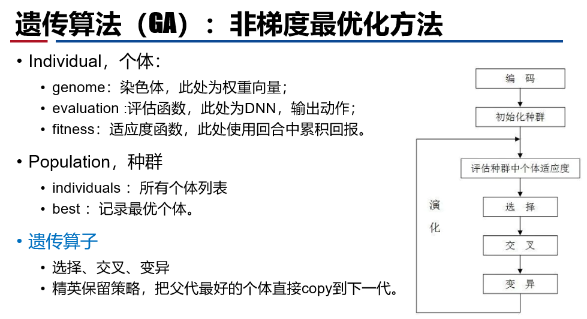
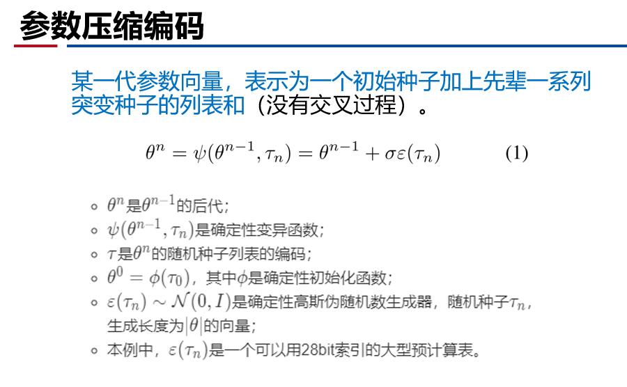
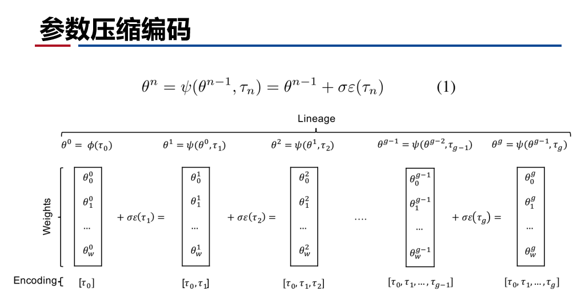
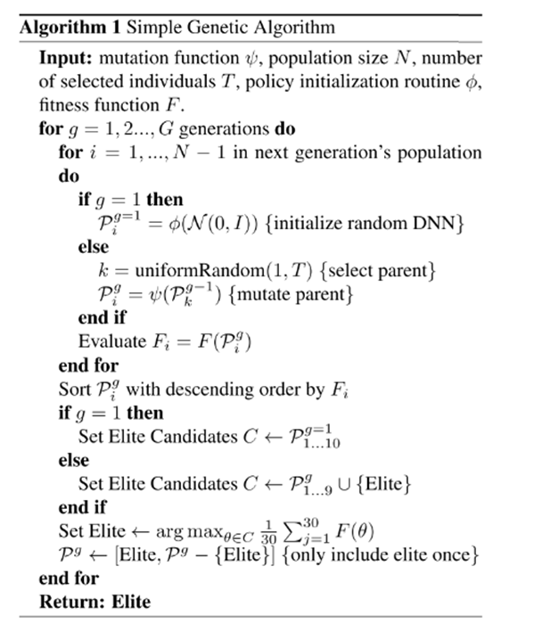
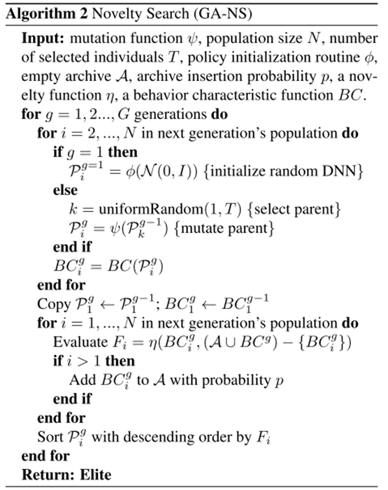

# 1 深度神经进化

作者：Ueber AI Lab

代码：[github](https://github.com/uber-research/
deep-neuroevolution)

复现：[github-thesouther](https://github.com/thesouther/GeneticAlgorithm_for_RL/tree/master/GA_Atari)

论文及翻译：[深度神经进化](./paper_RL/deep_neuroecolution.md)

## Motivation

目前DRL将DNN与RL结合，有一系列成功的任务，
- 像素游戏(Atari)、控制任务(MuJoCo)、推荐系统；

DRL 有一系列成功的算法，
- Q-learning系列、策略梯度（PG）系列、进化策略（ES）算法；

上述算法成功都使用基于梯度的训练方法，
- DQN中用bp、PG中随机梯度上升和bp、ES中随机梯度上升。

是否可以使用非梯度方法训练？比如遗传算法（GA）。

**思想演进：**

Q-learning系列：DQN…，
- 原理：用DNN逼近最优Q函数，生成策略，给定状态选择动作使得Q值最大化；
- 训练：使用BP算法训练Q函数逼近器。

策略梯度系列： A3C,TRPO,PPO …
- 原理：直接学习DNN策略网络的参数，输出每个状态的动作概率分布；
- 训练：从当前策略随机抽样动作，然后通过随机梯度上升强化动作。

ES算法
- 学习参数的均值，在参数空间近似回报函数的梯度；
- 并行化训练提升效率。

## 遗传算法介绍

## 算法设计

1. 基本的GA算法
- 截断选择、精英保留、变异繁殖（没有交叉过程）；
- 有效的参数压缩编码方法，在大型网络上压缩效率数万倍。
2. 验证纯随机搜索效果。
3. 直接利用已有的GA优化改进算法：GA-NS
- 比如一个RL困境：基于环境回报的优化机制容易陷入局部最优；
- 加入新奇搜索（Novelty Search，NS），进化时忽略回报函数，奖励那些执行了以前未见过的行为的个体。

### 基本GA算法伪代码

### GA-NS算法

1. 每一代正常选择、变异繁殖。
2. 用行为特征BC(π)描述一个策略的行为；使用行为距离函数，计算两个策略的距离。
3. 使用新奇度作为适应度。新奇度定义为到存档或种群中的k个最近的邻居的平均距离。（奖励未见过的行为）
4. 每一代结束，种群中的成员有一个概率p将BC值存档。

## 讨论

1. 高维空间探索的性质
- 某些情况下，在原点周围进行密集采样比基于梯度的方法更好。
- GA表明，次优解周围区域往往有更好的解。
- 更优的解非常密集，无需通过梯度就能找到。
2. 局部最优是限制梯度法性能的重要因素，而GA可以跳出；
3. 很多任务可能并不是像我们看上去那么困难/简单。
4. 目前DRL的成功是，RL的成功 VS. DL的成功？

## 总结

- 提出一种高效压缩编码技术；
- 验证GA等进化算法训练大型网络的可行性；
- 展示了梯度算法在某些情况下并不是最好的优化方法；
- 已有的神经进化方法可以马上应用到DNN的训练；
- 还有哪些旧算法可以被重新应用？

