# 2 遗传模糊树

论文： 遗传模糊树及其在无人机编队自主训练与控制中的应用

翻译：[1 遗传模糊树](./paper_MARL/gft.md)，[2 遗传模糊树训练](./paper_MARL/gft_train.md)

## Motivation

1. 下一代战争中，配备更高精度传感器、更先进武器的情况下，提高无人机编队作战的自主控制能力，减少远程控制通信。
    - 有对不确定性、新的场景的鲁棒性。
2. 关注模糊控制方法，期望使用模糊推断系统（FIS）完成自主控制任务（ LETHA 算法）；
3. 需要对规则库和隶属度函数进行训练：
    - 遗传模糊系统 $$\rightarrow$$ 级联模糊系统 $$\rightarrow$$ 遗传模糊树

## 背景：模糊推断系统

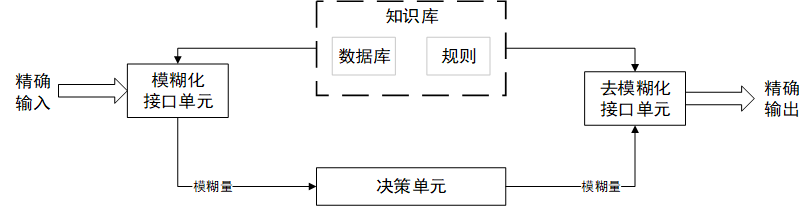

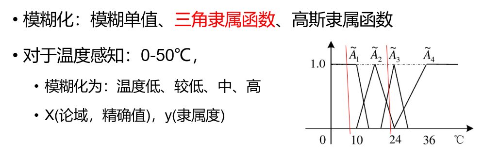

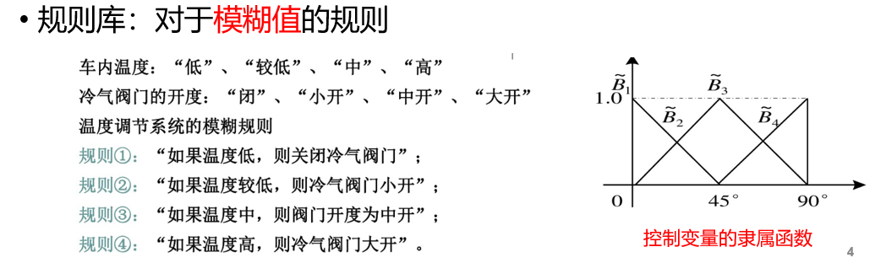

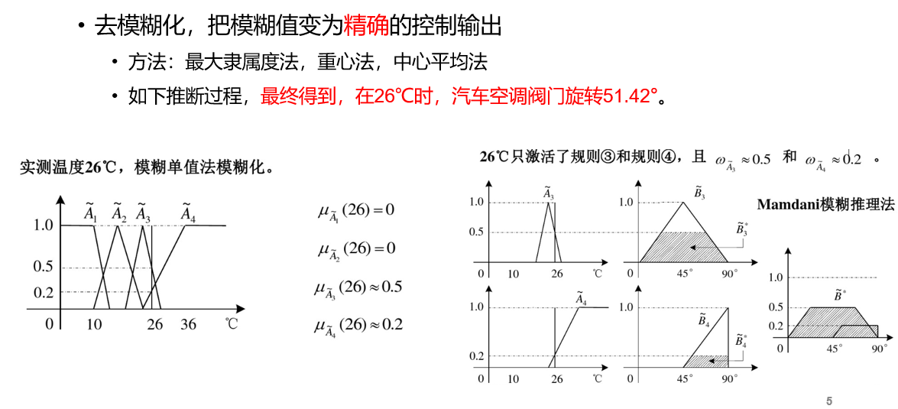

## 背景： 遗传模糊推断系统

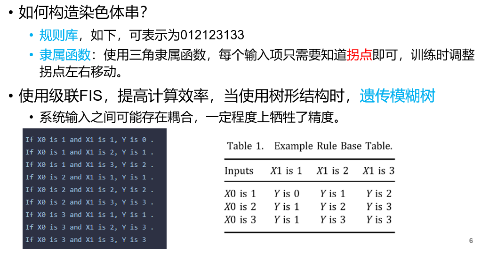

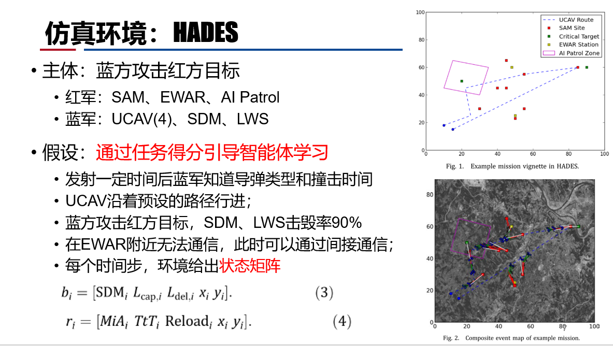

## 算法设计：LETHA

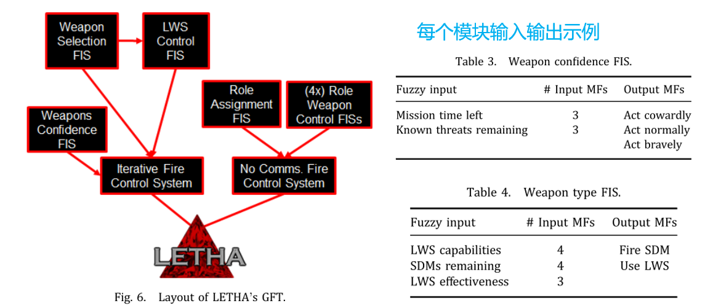

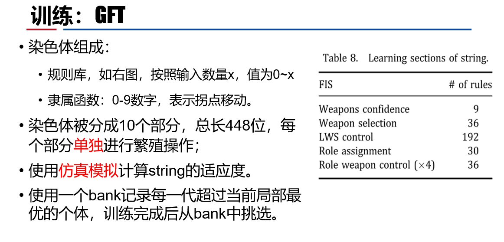

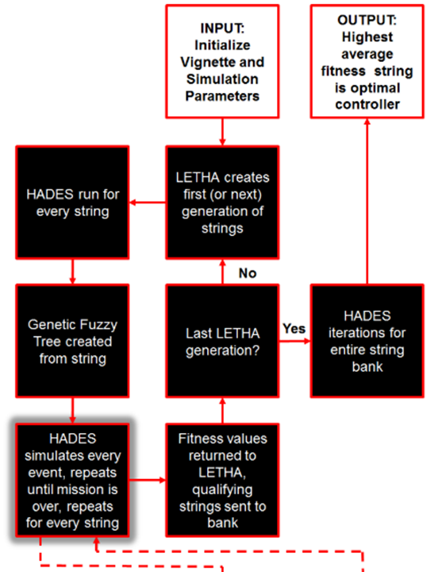

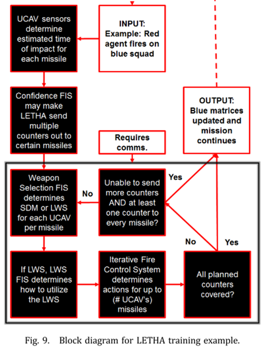

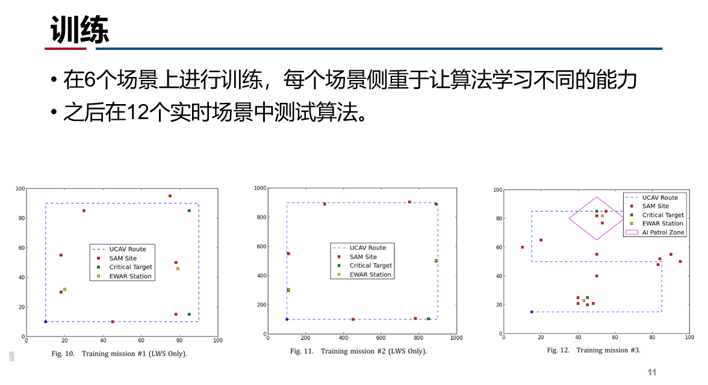

- 训练80代，每代5%的最优加入bank，单机（笔记本）运行30.47h，
- 训练后，测试时在单机上平均运行时间3.273秒
- 单个UCAV确定反击导弹数量平均6.842 ms

## 讨论

- 模糊控制训练方式：通过六个不同的场景训练智能体，每个只关注某一部分。
- 模糊控制也是面对不确定性、大搜索空间的思路。
- 个体武器选择与整体武器选择。
- 路由导航与火力系统的耦合性大不大？
- 在其他论文中，作者进行了一系列讨论

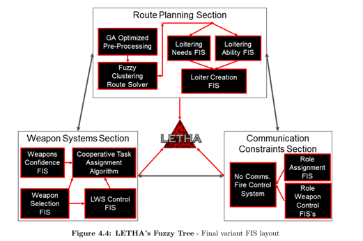