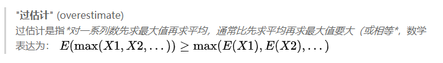
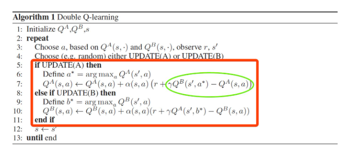
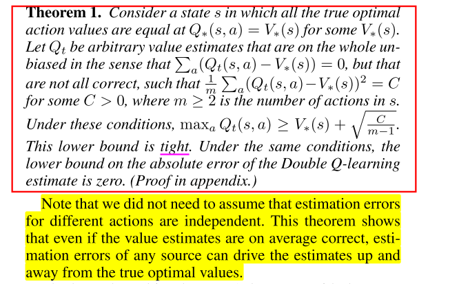
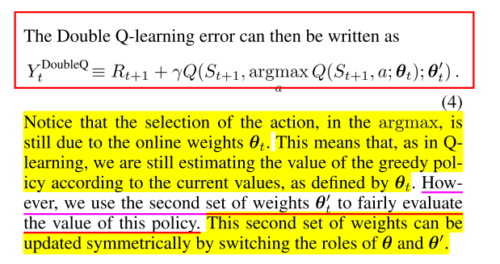
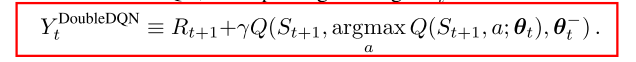

# 1 经典-double dqn

## Q-learning过估计问题

1. 原因, QLearning中的max操作是一种过度乐观的估计

   - 以前: 不够灵活的函数逼近, 噪声
   - 本文:  当action value不准确时, 无论逼近误差来源如何, 都会产生overestimation问题, 所以过估计普遍存在

2. overestimation影响:

   - 不一定产生坏的影响, 如果所有的动作均匀产生过估计, 对应的策略不受影响
   - 但是一般过估计是不均匀的, **比如探索和利用过程**, 多易会影响策略选择, **导致次优解**.

3. 证明 

   - 无论是环境噪声, 函数逼近, 不稳定, 还是其他来源, 任何类型的估计误差都可能导致向上偏差(upward bias). 在实践中, 由于真实值是未知的, 任何方法都会在学习过程中产生一些不准确的地方. 
   - 上面Thrun and Schwartz(1993)给出了特定设置下Q-learning的overestimation上限, 还需要进一步推导出Q-learning的overestimation下限.
   - 下面给出了证明, 误差下界为: $$max_a \epsilon_a \ge \sqrt{\frac{C}{m-1}}$$. 
   - 随着动作数m的增大下限减小, 但这仅仅代表的是下限, 真正取到下限是要满足特定条件的, 而实际操作中, 随着m的增大, overestimation整体上在不断增加.
   - 为什么Double Q-learning能够减少overestimation, 就是在评估动作时使用了新的$$Q^{'}$$函数, 不受已知条件限制.

1. 对于函数逼近的过估计分析

   - 不够灵活的函数逼近对Q值的估计不精确, 
   - 但是足够灵活的函数逼近在未知状态中会产生更大误差, 导致更高的overestimation, DQN就是一种非常灵活的函数逼近, 使用了神经网络来逼近价值函数.
   - 而overestimation最终会阻止学习到最优策略

## 方法

1. Double Q-learning, 把动作选择和估计进行解耦

1. Double DQN思想就是将目标中的max操作分解为使用不同的网络来进行动作选择和动作评估, 以此来减少overestimation. 而DQN中本来就使用了policy network和target network两个网络, 所以无需再引入新的网络, 只需改进DQN算法中的目标设计.

