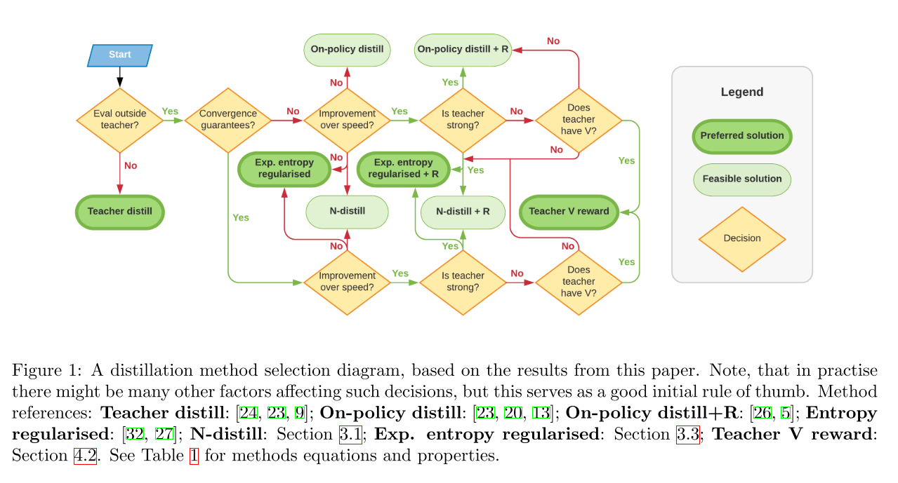
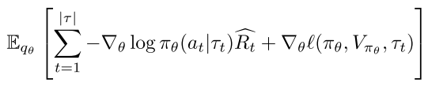
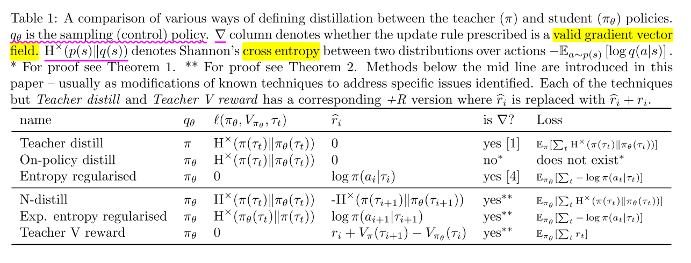
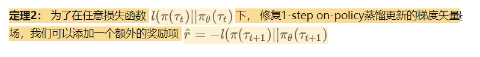
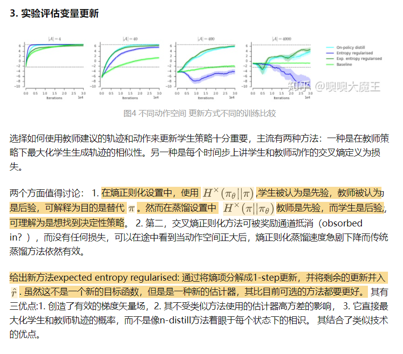
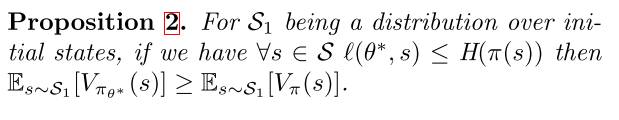
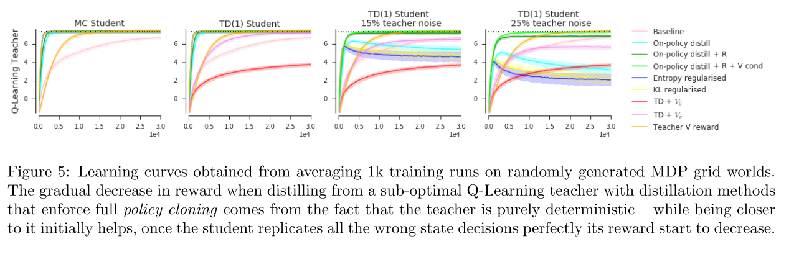

# 3 Distilling Policy Distillation

策略蒸馏有很多不同的方法, 不同的蒸馏方法对性能的影响很大. 本文在理论上分析每种变体的 motivation 和性能.本文分析三种基于具体任务的蒸馏方法.

提出**期望熵正则化蒸馏**, 应用范围更广, 且保证收敛.

## 1. Introduction

策略蒸馏, 让学生网络去拟合教师网络产生的基于状态的一个概率分布.

监督学习中: 模型压缩, 重参数化加速推理, 联合训练多个网络.
强化学习中: 训练无法训练的智能体结构, 加速学习, 构建更强的策略, 多任务学习.

策略蒸馏想法简单,但有很多变体, 比如:

- trajectory 从教师策略采样还是从学生采样,或者混合采样;
- 使用教师和学生分布的 KL 损失,还是整个 trajectory probabilities 的 KL 损失.

本文在理论和实验上对比这些思路. 主要贡献如下:

1. 证明常用的从学生网络采样的 trajectory 不能形成一个梯度向量场, 虽然在简单表格环境中有收敛保证, 但是一旦引入奖励, 就会变得震荡. 同时提供恢复梯度向量场的简单方法.
2. 通过实验对比,说明为什么学生驱动的蒸馏是有益的.
3. 在 AC 架构下, 同时对教师的策略和值函数进行蒸馏.
4. 通过理论分析和实验, 给出蒸馏策略选择的决策树.

## 3. Policy distillations

首先关于更新准则,

(1)

对于一个 control policy $$q$$ 和 $$\hat{R_t} = \sum_{i=t}^{|\tau|} \hat{r_i} = \sum_{i=t}^{|\tau|} \hat{r}(\pi_\theta, V_{\pi_\theta}, \tau_i, a_i, \tau_{i+1}, a_{i+1}, r_i) $$, 不同的 $$l$$ 和 $$\hat{r}$$定义了不同的蒸馏技术.
其中, $$l$$作为辅助损失, 负责当前 step 的策略调整; $$\hat{r}$$ 可以看作内在奖励和外在奖励的组合, 负责长期策略调整.

本文讨论的是无折扣的 episodic RL 问题, 分析过程可以扩展到带折扣的 case 中.

### 3.1 Control policy

策略蒸馏建模为监督学习问题. 早期研究使用教师策略采样数据进行更新, $$\mathbb{E}_\pi \left[\sum_{t=1}^{|\tau|} \triangledown_\theta H^\times (\pi(\tau_t)||\pi_\theta(\tau_t))  \right]$$, 之后工作发现使用学生策略采样的实验效果更好,$$\mathbb{E}_{\pi_\theta} \left[\sum_{t=1}^{|\tau|} \triangledown_\theta H^\times (\pi(\tau_t)||\pi_\theta(\tau_t))  \right]$$. 但是, 求期望和操作都是在同一个样本集上, 其收敛性没办法保证.

本节证明如下性质:

1. 对于表格型策略, 如果 $$q_\theta$$保证以非零概率方位 teacher 的每个状态, 则 dynamics 可以收敛, 尤其$$q_\theta=\pi_\theta$$经过一个 softmax 策略满足这个性质.
2. 这种更新方式不能形成梯度向量场
3. 如果加入 reward 优化, 则 dynamics 会出现循环,不能收敛.
4. 加一个一个 reward-based 修正项可以保证收敛(该修正项可以对应到适当的梯度向量场).
5. 通过控制$$q_\theta$$, 可以对收敛速度和行为复制的保真度进行权衡，

1,2,3 通过理论证明给出,每太看懂.

<b>最后这个加入的修正项,描述如下:</b>

 

使用学生模型采样，可能会导致收敛性的问题，但为什么在实践中总是使用学生模型采样蒸馏时可以得到更好的结果？
这儿有一个猜想，如果可以收敛，则学生采样的轨迹训练出来的鲁棒性更强。这符合机器学习的原则，训练和测试使用相同的域。特别是蒸馏之后，目标一般是要么评估学生模型生产自己的动作，或者是使用学生模型接着自己训练。这时重要的是 $$\pi_\theta$$ 的期望了。因此使用学生采样来训练模型，可以减少训练和测试阶段数据分布的偏移。

另一个有启发的观点是，如果教师模型是基本确定的,那么他的策略会出处理一些小概率状态空间下的情况，但这是学生模型所不会遇到的，因此在蒸馏之后，因为双方策略不等，在长时间步之后轨迹会有很大的偏差。因此如果在考虑整个状态空间的时候，使用学生模型采样会更好地复制教师的策略。

**实验分析:** 学生驱动的蒸馏表现更好，其可以更好的优化学生行为与教师行为的接近程度。只要使用适当的损失，学生驱动的蒸馏就可以有较好的效果，因此之后主要考虑学生驱动蒸馏的情况。

## 4. AC 框架下的策略蒸馏

AC 方法最近比纯 policy 的方法使用地更多，因此接下来考虑如何在蒸馏上使用价值函数。有了 $$V_{\pi}(s)$$ 的额外知识之后，我们可以更好地利用不完美的教师，因为可以估计对其的信任程度。

利用该方法后，我们就可以使用会非完美教师

如预期那样，这种方法的有效性取决于教师的水平和价值函数估计器的准确性。

### 4.1 Using the teacher’s critic to bootstrap

目前另一种使用教师的知识是用教师的价值函数而非学生的价值函数来 bootstrap，
因此 AC 更新方向从 $$\triangledown log \pi_\theta (a_t|\tau_t) \left[r(a_t,\tau_t)+V_{\pi_\theta}{(\tau_{t+1})} \right] $$, 变成了 $$\triangledown log \pi_\theta (a_t|\tau_t) \left[r(a_t,\tau_t)+V_{\pi}{(\tau_{t+1})} \right] $$, 也就是图中的 $$TD + V_\pi$$ 。 由于教师的价值函数与学生策略无关，因此其梯度矢量场并不严格有效。在简单情况下可以证明其是一个有效的更新.

如图 5 所示，从老师那 bootstapping 会比单纯的复制带来更好的效果，但依然不能解决原始问题。

### 使用教师的 critic 作为内在奖励

另一种可行的方案，是将教师的价值函数作为内在奖励, $$\hat{r}_t^V := V_\pi (\tau_{t+1}) - V_\pi (\tau_t) +r_t $$ , 其可以保证策略收敛到最大价值。

虽然这种方法不影响最终获取最优解，但学习的动力性会有影响，如果教师是接近最优的，则收敛得快，如果教师水平不高，则减缓训练速度：

**命题 4:** 如果教师是给定 MDP 的最优解，则每个偏离最优解的路径都会给学生惩罚。

实验设置一个一维网格世界，只能向左右移动，最左最右会有奖励和惩罚。设置了一个好的教师和一个坏的教师。在好教师情况下，基于策略复制的蒸馏方式都可以收敛得非常快，用教师价值函数进行 reward shaping 的方法收敛较慢。在坏教师的情况下，策略复制的方法不能学到好的效果，加上 V-reward 的方法可以学习，但提升很慢。

## 5 结论

1. 分析了各种 RL 上策略知识传递的蒸馏方法的优点，弱点，以及潜在的不收敛性。
2. 证明了许多被广泛使用的方法并没有相应的有效的梯度矢量场，因此最终容易不收敛。
3. 提出改进方式 expected entropy regularised distilltion，其在实验和理论上都是最可靠的蒸馏方式
4. AC 中价值函数可以用来指导向非完美教师学习

## References

看不下去, 后边直接抄的: [知乎链接](https://zhuanlan.zhihu.com/p/336771824)
