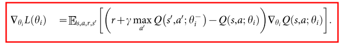
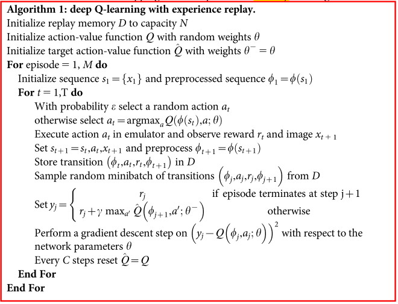

# 1 经典-DQN

## Q-learning问题

1. 函数逼近时的不稳定性和和发散问题. 

   - 观测序列相关性
   - Q值小的变化导致后续数据分布大的变化
   - Q值和target-Q的相关性

2. 部分观察下状态表示问题

   -如果使用完整历史序列, 复杂度太高.

## 对Q-Learning的改进

1. 使用CNN对Q值进行函数逼近

   - 一次前向传播, 同时估计状态对于所有动作的值, 降低计算复杂度; 
   - 高维输入, 特征自动提取
   - 较低的渐进逼近误差, 消除噪声影响.

2. replay buffer.

   - 数据重用, 提升效率
   - 去相关, **降低方差**
   - 平滑数据分布
   - **多帧数据叠加, 去除部分可观察性限制**

3. 独立目标网络

   - 减少Q值和TD-target相关性, 缓解不稳定性 (TD-$$\lambda$$也可以缓解这个问题)

4. TD-target 做clip到(-1,1)

   - 进一步防止梯度爆炸, 提升稳定性.

## 实现

1. 输入

   - 原始数据: 210x60, 60HZ
   - 处理: 去除闪烁, 叠帧, m=4, 缩放
   - 84x84x4

3. 网络: 三层卷积两层全连接
4. 训练:

   - RMSProp
   - epsilon-greedy

5. 执行

   - 跳帧, 动作重复
   - 人类玩家没有音频
   - online

## 伪代码

