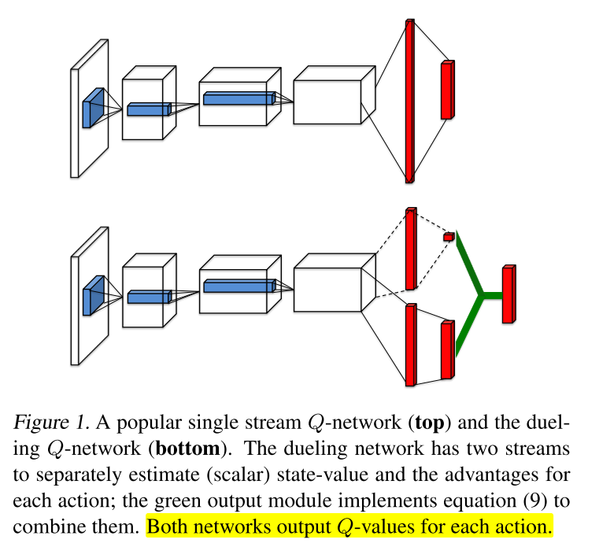

# 1 经典-dueling dqn

本文方法直接学习哪些状态是有价值的, 对于有很多相似Q值的动作时, 可以学到更好的策略. 在不改变底层RL算法的情况下提高不同动作的泛化能力.

dueling结构可以结合之前的RL架构训练.

## 优势函数

V评估在特定state的好坏程度; Q函数评估在该state选择特定action的价值. A表示每个action相对重要性的评估, **一个动作相对与其他动作有多好**.

## 方法

### 1 基本方法

则 

* V是标量, A是$$|A|$$维向量. 
* 上式适用于所有(s, a). 在矩阵形式计算时, 要用广播, 把V重复|A|次计算.
* Q是对真实Q值得参数近似. V可能不是关于状态得好的估计, A也一样.

### 2 问题与改进

1. 问题: **unidentifiable (不可辨认)**. 公式7无法从Q反推出V和A. 

   - V+常数, A-常数, Q不变
   - 直接用公式7, 表现很差

2. 改进1: **强制选定的动作优势为0**.

   这样就能得到唯一的值函数.

1. 改进2: **使用优势均值**

   - 劣: 失去V和A的语义性
   - 优: 提升稳定性. 优势函数只需要随着均值改变, 而不用像公式8那样对最优动作优势的任何变动都进行补偿.
   - 缓解unidentifiable问题: 不改变A的相对排序, 因此不影响贪心策略选择动作.
   - 公式9是网络的一部分, 而不是一个单独的步骤, 不需要额外监督信号.

## 优势:

1. 收敛速度更快

   当动作少的时候优势不明显, 但是当动作数量增加时, dueling中的V可以学习到很多类似actions的共享的一个general的value, 该问题在很多控制问题中都存在.

2. **dueling 结构的主要优势在于:its ability to learn the state-value function efficiently**. 

   Dueling结构在每次更新Q的时候都更新V, 更好地估计V. 而single stream的架构仅仅更新一个动作的value, 而其他动作的value不影响.

3. 对noise的鲁棒性更好.

   给定状态下不同动作的Q值之间的差异很小(相对于Q值量级来说, 比如Q1=501, Q2=502), 因而很小的noise会影响动作排序, 导致greedy策略更新频繁. 而平均的状态值之间的差异比较大, 对noise的鲁棒性更好.

## 网络结构

V和A可以自动反向传播计算, 不用额外监督信号. **当学习问题中加入冗余或类似的动作时, dueling架构在策略评估时可以更快识别出正确动作**

## 伪代码

