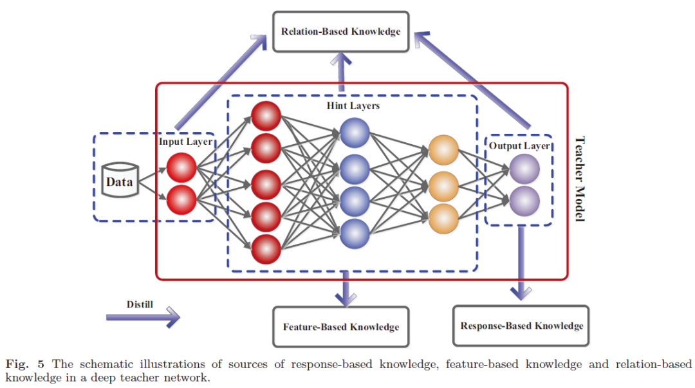
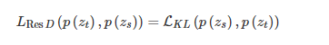
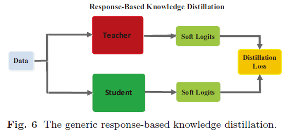
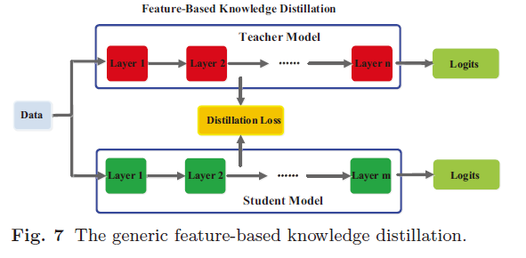
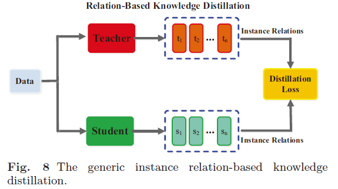
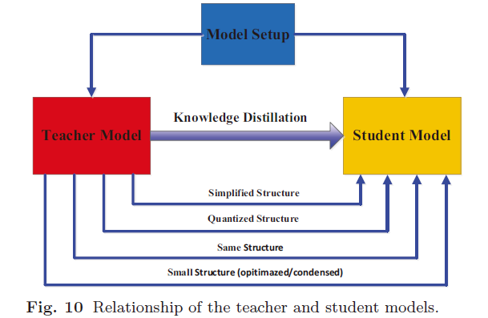

# 3 知识蒸馏

1. 知识蒸馏目的：模型压缩和加速，从大型 teacher 模型中学习小型 student 模型。
2. 深层神经网络的模型压缩和加速方法通常分为四个不同类别，即**模型剪枝和量化，低秩分解，紧凑型卷积滤波器和知识蒸馏。**
3. 组成：知识、蒸馏算法、师生架构
4. 损失函数：蒸馏损失（负责 student 学习 teacher 的知识），学生损失（student 模型和真实标签的 CE 损失）。

## 1. 知识

### 1.1 Response-Based Knowledge

基于响应的知识通常是指教师模型最后输出层的神经响应。主要思想是直接模仿教师模型的最终预测。

基于响应的知识的蒸馏损失可以表示为

基于响应的知识的概念是简单易懂的，尤其是在“黑暗知识（dark knowledge）”的情况下。从另一个角度看，软目标的有效性类似于标签平滑或正则化器。但该方法仅限于监督学习。

### 1.2 Feature-Based Knowledge

一个通用的基于特征的 KD 模型如下图所示。

### 1.3 Relation-Based Knowledge

基于响应的知识和基于特征的知识都使用教师模型中特定层的输出。基于关系的知识进一步探索了不同层或数据样本之间的关系。

## 2 蒸馏

### 2.1 离线蒸馏

使用预先训练好的教师模型，将知识从教师转移到学生模型。

离线蒸馏的第一阶段通常不作为知识蒸馏的一部分进行讨论，即，假定教师模型是预先定义的。很少关注教师模型结构及其与学生模型的关系。因此，离线方法主要集中于改进知识转移的不同部分，包括知识的设计以及用于匹配特征或分布的损失函数。

### 2.2 在线蒸馏

在在线蒸馏中，教师模型和学生模型同时更新，并且整个知识蒸馏框架是端到端可训练的。

在线蒸馏是一种具有高效并行计算功能的单阶段端到端训练方案。然而，现有的在线方法（例如，相互学习）通常不能解决在线设置中的高能力教师，这使得在在线设置中进一步探索教师与学生模型之间的关系成为一个有趣的话题。

### 2.3 Self-Distillation

在 Self-Distillation 中，教师和学生模型采用相同的网络。这可以视为在线蒸馏的特殊情况。具体来说，Zhang 等。（2019b）提出了一种新的自蒸馏方法，其中将来自网络较深部分的知识蒸馏为浅层部分。

**离线蒸馏是指知识渊博的老师向学生传授知识；在线蒸馏是指老师和学生互相学习；自我蒸馏是指学生自己学习知识。**

## 3 师生架构

知识蒸馏以前曾被设计为压缩深度神经网络的方法之一。深度神经网络的复杂性主要来自两个维度：深度和宽度。通常需要将知识从更深和更广的神经网络转移到更浅和更薄的神经网络。学生网络通常选择为：

- 教师网络的简化版本，每层中的层数更少且通道更少。
- 教师网络的量化版本，其中保留了网络的结构。
- 具有高效基本操作的小型网络。
- 具有优化的全局网络结构的小型网络。
- 与教师使用同一网络。

## 4 蒸馏算法

- 对抗蒸馏（Adversarial Distillation）
- 多教师蒸馏（Multi-Teacher Distillation）
- 跨模态蒸馏（Cross-Modal Distillation）
- 图蒸馏（Graph-Based Distillation）
- 注意力蒸馏（Attention-Based Distillation）
- 无数据蒸馏
- 量化蒸馏（Quantized Distillation）。络量化通过将高精度网络（例如 32 位浮点）转换为低精度网络（例如 2 位和 8 位）来降低神经网络的计算复杂度。同时，知识蒸馏的目的是训练小型模型以产生与复杂模型相当的性能。
- 终身蒸馏（Lifelong Distillation）
- NAS 蒸馏（NAS-Based Distillation）

## 5 总结与挑战

**基于响应的知识具有相似的动机来进行标签平滑和模型正则化; 基于特征的知识通常用于模仿教师的中间过程，而基于关系的知识则用于捕获不同样本之间的关系。**

对于知识蒸馏，关键是：1）从教师那里提取丰富的知识；2）从教师那里转移知识以指导学生的训练。因此，本文从以下几个方面讨论知识蒸馏的挑战：**知识的均等性，蒸馏的类型，师生体系结构的设计以及知识蒸馏的理论基础。**

为了提高知识蒸馏的性能，最重要的因素包括：怎样设计师生网络体系结构，从老师网络中学习什么样的知识，以及在何处提炼到学生网络中。

## References

- [中文综述](https://cloud.tencent.com/developer/article/1763873)
