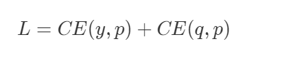
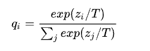
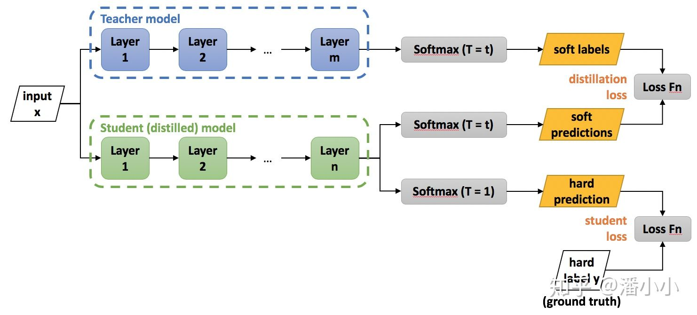

# 3 知识蒸馏简介

知识蒸馏被广泛的用于模型压缩和迁移学习当中。开山之作应该是[Distilling the Knowledge in a Neural Network](https://link.zhihu.com/?target=https%3A//arxiv.org/abs/1503.02531)。这篇文章中，**作者的 motivation 是找到一种方法，把多个模型的知识提炼给单个模型。**

文章的标题是 Distilling the Knowledge in a Neural Network，那么说明是神经网络的知识呢？一般认为模型的参数保留了模型学到的知识，因此最常见的迁移学习的方式就是在一个大的数据集上先做预训练，然后使用预训练得到的参数在一个小的数据集上做微调（两个数据集往往领域不同或者任务不同）。

在这篇论文中，作者认为可以将模型看成是黑盒子，知识可以看成是输入到输出的映射关系。因此，我们可以先训练好一个 teacher 网络，然后将 teacher 的网络的输出结果 q 作为 student 网络的目标，训练 student 网络，使得 student 网络的结果 p 接近 q ，因此，我们可以将损失函数写成

这里 CE 是交叉熵（Cross Entropy），y 是真实标签的 onehot 编码，q 是 teacher 网络的输出结果，p 是 student 网络的输出结果。

但是，直接使用 teacher 网络的 softmax 的输出结果 q，可能不大合适。因此，一个网络训练好之后，对于正确的答案会有一个很高的置信度。例如，猫的图像被错误地归类为狗的可能性非常低，但是这种错误的可能性仍然比将猫误认为汽车的可能性高很多倍。另一个示例是，手写数字 2 的图像与数字 3 相比，与数字 7 更相似。这种由教师模型学习的知识也称为 **暗知识(dark knowledge)**

文章提出了 softmax-T，公式如下所示：

这里 qi 是 student 网络学习的对象（soft targets），zi 是神经网络 softmax 前的输出 logit。如果将 T 取 1，这个公式就是 softmax，根据 logit 输出各个类别的概率。如果 T 接近于 0，则最大的值会越近 1，其它值会接近 0，近似于 onehot 编码。如果 T 越大，则输出的结果的分布越平缓，相当于平滑的一个作用，起到保留相似信息的作用。如果 T 等于无穷，就是一个均匀分布。

### 结论

知识蒸馏，可以将一个网络的知识转移到另一个网络，两个网络可以是同构或者异构。做法是先训练一个 teacher 网络，然后使用这个 teacher 网络的输出和数据的真实标签去训练 student 网络。知识蒸馏，可以用来将网络从大网络转化成一个小网络，并保留接近于大网络的性能；也可以将多个网络的学到的知识转移到一个网络中，使得单个网络的性能接近 emsemble 的结果。

### 参考文献：

Hinton, Geoffrey, Oriol Vinyals, and Jeff Dean. "Distilling the knowledge in a neural network."arXiv preprint arXiv:1503.02531(2015).
Prakhar Ganesh. "Knowledge Distillation : Simplified". https://towardsdatascience.com/knowledge-distillation-simplified-dd4973dbc764, 2019.
