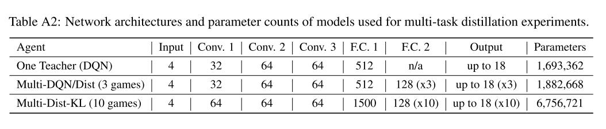

# 3 策略蒸馏(Policy Distillation)

[paper]()

策略蒸馏:

- 模型压缩,高校训练;
- 整合多个策略到单个策略中;
- 通过在线策略蒸馏提升算法的稳定性, 也可以在大规模数据或动态系统领域作为稳定训练的一种优化方法.
- 多任务蒸馏的智能体比单任务教师或者联合训练的智能体性能更好.

## 1 Introduction

DRL 通过 pixel-to-action 的策略 encoding 方式使用奖励信号端到端训练可以达到超人的表现(DQN). 但是 DQN 算法训练时间很长.因此提出策略蒸馏算法,把一个或多个行动策略迁移到一个未训练的网络中.

==**知识蒸馏, 使用监督回归方法训练一个 target Net, (通常使用 less peaked 或 'softened' 的 target distribution) 使其产生与原始网络相同的输出分布.**==

- 网络规模变小 15 倍
- 多个专家策略可以整合到一个多任务策略中, 并且性能更好.
- 可以实时在线地把当前最好的策略蒸馏到一个目标网络中.

本文分析了, single game 蒸馏; 单游戏模型压缩; 多 game 蒸馏; 在线蒸馏.

蒸馏一般被用在输出类别概率的网络中. 但是 DQN 网络的输出是实数的值函数(无界实数, 且依赖于未来期望累计奖励). 当多个动作的值相同时无法分辨,而当动作很重要时又很 sharp. 这些性质使得 distillation 很难应用.

## 2 Previous Work

本文工作和四个不同的领域有关: **模型压缩, DRL, 多任务学习, 模仿学习.**

模型压缩中有各种方法. DRL 中相关的是模仿学习.

- 通常, teacher 信号来自于一个 model-based 方法, 比如[Analysis of a classification-based policy iteration algorithm]() 使用基于遗憾的策略近似迭代, [Deep learning for realtime atari game play using offline monte-carlo tree search planning.]()使用 MCTS (UCT) 作为 oracle.
- [CAPI]() 是另一种需要 model-based teacher 的模仿学习方法. CAPI 算法的单次迭代可以看作使用一个特定的损失函数(通过 action gap 对动作分类加权)进行策略蒸馏.
- DAGGER, student 策略生成训练 trajectories.
- 而本文方法完全使用 teacher policy 生成训练 trajectories.

多任务学习利用少量类似任务作为归纳偏差的共享来源来提高泛化性能.
通常，这些任务需要定义在相同的输入分布上.
尽管 Atari 游戏具有相同的输入模式, 但它们的图像非常多样化，并且不具有共同的统计基础, 这使得多任务学习变得更加困难.
我们表明模型压缩和蒸馏可以缓解这些问题.

## 3 Approach

本文中 DQN 既作为 baseline, 也作为策略蒸馏的 teacher.

### 3.2 Single-Game Policy Distillation

知识蒸馏的目标通常是分类网络最后一层加权和过一个 softmax 网络. softmax 使目标更尖锐, 知识更好学习. 为了迁移更多的知识, teacher Net 的输出使用 relaxed (higher temperature) softmax.

困难:

1. 在给定状态下预测所有动作的 Q 值是一个困难的回归任务. 一方面 Q 值很难学习(无界且不稳定), 另外计算一个固定策略的动作价值在计算上很困难, 因为这需要对 Q 值进行估计.
2. 训练 Student 预测在单个状态下的最好动作也有问题, 因为很多情况下, 多个动作具有同样的 Q 值.

本文使用三种方法进行策略蒸馏. 假设 teacher T 已经用来生成了数据$$D^T=\{(s_i, q_i)\}_{i=0}^{N}$$, 其中, 每个样本包含一个小的观察序列$$s_i$$, 和一个非归一化 Q 值向量$$q_i$$.

1. 第一种方法只使用 teacher 最高值的动作, $$a_{i, best}=argmax(q_i)$$, 学生模型使用负 log 似然 (NLL) 预测相同的动作,

(1)

2. 第二种方法使用 MSE 损失, 其优势是 student 模型保留了所有的动作价值. 其中, $$Q^T, Q^S$$分别代表教师和学生网络的 Q 值向量.

   

   
(2)

   

   

   
   

   

3. 第三种使用 KL 散度

(3)

在传统分类场景中, 教师网络的输出很 peaked, 所以使用高温度系数的 softmax 函数可以转移更多的 secondary 知识到学生网络. 但是在策略蒸馏中, 教师网络的输出不是分布, 而是某动作的期望未来累计奖励. 所以更希望其更 sharper.

### 3.3 Multi-task policy Distillation

多任务策略蒸馏就是把 n 个单任务网络的知识进行蒸馏. 学生网络每个 episode 选择不同的 buffer 中的数据进行学习. 因为不同的任务有不同的动作空间, 所以涉及了一个 controller layer, 其中 ID 指任务 id. 同时测试了 KL 损失和 NLL 损失.

实验对比了 multi-task DQN agents (用 single-game 的方法交织训练多个游戏) 和 multi-task distillation agents. multi-task DQN agents 性能比不上单独训练的智能体, 作者认为与不同策略之间的干扰, 不同的奖励 scaling, 价值函数学习固有的不稳定性. 策略蒸馏不存在干扰和 scaling 问题.

## 4 实验和分析

### 4.1 实验设置

使用 teacher DQN 网络生成数据, 用监督学习方法训练学生网络.
single-game 的学生网络使用与 teacher 同样的网络; multi-game 的网络使用 4 倍参数量和多一个 FC 层的大网络, 同时每个游戏都有一个单独的 MLP 输出层.

由于 Atari 游戏开始都是相同的, 所以为了准确评价算法泛化性能, 使用人类专家生成开始状态. agent 不能控制初始状态的分布,也不使用人类轨迹生成任何训练数据, 所以可以断言高分意味着良好的泛化水平.

### 4.2 结果

1. 蒸馏策略表现更好. 注意使用人类起点状态增加泛化性

2. 模型压缩的性能对比. 此时,策略蒸馏损失可以看作一种正则化方法.

3. 三个游戏与 10 个游戏的多任务蒸馏结果也证明了算法的优势.

4. 通过在线蒸馏最好的策略来提升算法稳定性.
   - 在线蒸馏最好的策略是否有用还不确定, 因为训练过程中 Q 值变化很剧烈.
   - 为了验证这一点, 训练 DQN 时, 定期保持达到最高分的模型, 然后用这个网络进行蒸馏. 图 5 中, 灰色曲线显示 DQN 方差高, 绿色虚线时当前位置最高得分, 红色和紫色曲线是两种蒸馏种子的性能, 显然更稳定.
   - the best results are obtained by weighing action classification by a soft-max of the action-gap.

## 5 训练

1. 训练过程:
   - 使用训好的 DQN 评估过程在线收集数据. 初始化时 DQN 随机(30 以内) 执行 no-op 操作, 然后 95%按照 Q 值贪婪执行动作, 5% 随机动作. 一个 episode 最多 30min (108000 帧). 小比例的随机动作有利于数据的覆盖率,提高泛化性能.
   - 把 10 小时共 150000 帧的数据(输入帧, 输出合法动作的 Q 值)存入 buffer. 数据是从 buffer 中均匀采样得到的.
   - 之后, 每一小时结束, 执行 10000minibatch 的 student 网络更新. 使用 RMSProp 优化器.
   - teacher 网络训练每个 student 网络 500 小时, 不到训练 teacher 的一半.
   - multi-game 中, 每个游戏维护自己的 buffer, 也是一样的 10 小时的容量.
2. 蒸馏目标, 为三种 loss 设置了三个目标.
   - teacher 网络对所有动作的 Q 值作为监督目标, 此处使用 MSE 损失.
   - 使用 teacher 网络最高值的动作, 作为 one-hot 目标, 最小化 NLL 损失.
   - 将 Q 值经过一个带温度系数的 softmax 层, 温度系数从[1.0, 0.1, 0.01, 0.001]中选择. 输出使用 KL 损失训练.
3. 网络结构

