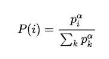
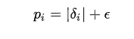
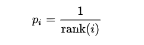
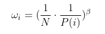
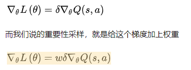
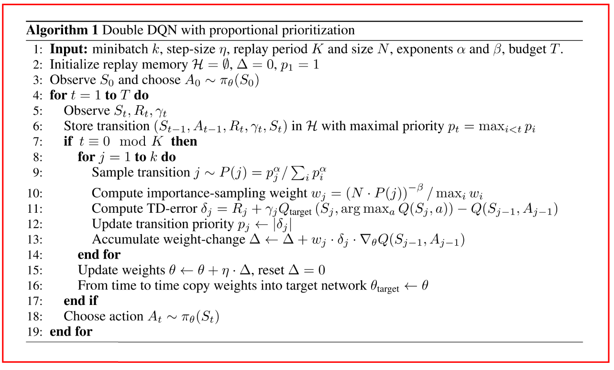

# 1 经典-Prioritized experience

motivation: 

* 在经验池中按优先级抽样, 加速收敛, 提高数据利用率和学习效率.
* 适当的样本顺序对权重更新进行算法更有效.

online方法, 用完就丢, 数据之间强相关, 打破随机梯度的IID假设; 很快忘掉出现次数少的经验, 但是出现的少也可能很重要.

使用TD-error表示经验优先级, 这可能带来新问题:

* 丢失探索的多样性. 使用 **stochastic prioritization** (proportional prioritization和rank-based prioritization).
* 引入bias, 使用 **重要性采样**.

## 方法

### TD-error

TD-error表示了样本的新奇度, 即当前Q值相对于下一个Q值的差距; 

但是直接用$$|\delta|$$的话, 

* 随机的reward让$$|\delta|$$变化激烈, 使训练敏感; 
* greedy选择样本让样本不足, 使训练现如局部最优, 也会导致过拟合.

### 解决

 

计算$$P$$的方法:

proportional prioritization, 使用的信息更多

 

rank-based prioritization, 只根据rank, 使用信息少, 更鲁棒; 至于N和$$\alpha$$ 有关, 更容易.

 

### 实现

proportional prioritization. 使用sum-tree

rank-based prioritization, 使用累积分布(CDF)分段函数, 基于二进制堆结构用优先队列直接存储各个transition; 对于MBGD, 采样 k 个值, 然后得到 k 个区间就可以, 其中 k 是mini-batch的个数

### 改善偏差

Prioritized relay 改变随机更新时的分布, 尤其时训练最后阶段. 本文使用重要性采样, 乘上一个$$w$$进行缩放

**既保证每个样本被选到的概率是不同的(从而提升训练速度), 又可以保证它们对梯度下降的影响是相同的(从而保证收敛到相同的结果).**

 

当$$\beta=1$$时完全消除bias, 越小则优先级大的样本对训练的影响越大.

**最后用w最大值对w归一化**

## 伪代码

**参考**

* [知乎](https://zhuanlan.zhihu.com/p/38358183)
* [知乎2](https://zhuanlan.zhihu.com/p/137880325)
