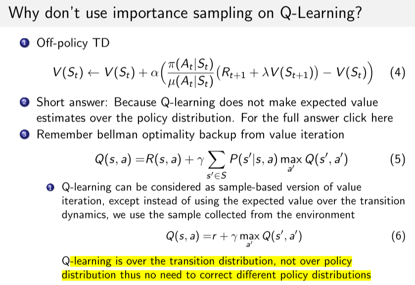

# 0 面试-RL相关

## 基础问题
### 1. 训练时gamma，设置方法：
gamma调节远期和近期奖励的影响。

- 大gamma表示考虑远期，但训练难度更高，难收敛；
- 小gamma表示考虑眼前利益，稳定性差，但是探索性强

选取原则就是 **在保证收敛的情况下尽可能大。** 启发公式为1/(1-gamma).
具体可以看一局有多长。
- 几十步一局，设置0.96
- 一两百步一局，设置0.99
- 超过400， 设置0.995

### 2. 为什么gamma不能为1？
gamma为1会有Q值过大的风险，而且难收敛；
和具体任务有关，不需要把过远的未来纳入考虑。

### 3. PPO数据复用次数
K（8？）。和具体算法的学习难度、learning rate、batch size有关。
设置小点，防止过拟合。

### 4. PPO为什么取min？
为了控制是不是使用clip的A值。因为它本身还是梯度上升算法
- 当A值大于0的时候，也就是说相应的样本让相应的策略提升，鼓励这种行为，但是需要使用clip，让新旧策略不会离得太远；
- 当A值小于0的时候，本身相应样本产生的梯度是负的，产生负影响，不用限制。

### 5. PPO单轮更新的采样步数。
为了采样的完整性，采样完整的一局游戏。但是使用的时候使用固定长度的样本。

### 5. 1-step DQN不用重要性采样，N-step是不是需要？（policy correction）
首先说n-step的 off-policy TD是需要的IS的。但是DQN算法很特殊，这个看你怎么看待行为策略。没听说过有谁实现了n-step q learning。 sutton那本书上也只有n-step off-policy SARSA。
- 如果把行为策略看成是贪心策略，那它在计算前n-1步的奖励函数的时候，就是使用的确定性策略，那它每一步的概率都是1，最后一步求max a的Q值的时候也是确定性的，所以它还是可以认为不需要重要性采样。
- 但是如果你把行为策略实现为从行为策略采样一个episode，然后再用它来计算n-step的Q，那就需要啊。

## GAE--平衡方差和偏差

### 1. 核心思想

PG算法有不同的形式，但是使用advantage方法的目标函数g有最小的方差。但是这里的g和真实g'是有偏的，所以想用一个lambda 超参数，引入多步的思想，降低偏差，同时要控制方差。
高方差需要更多的样本来训练，偏差会导致不收敛或收敛结果较差。

要想方差更小，就需要 gamma 和 lambda 较小，因为它们较小的时候会更多地考虑较近的奖励而降低了很远的奖励的影响。但是较小的 gamma 和 lambda 都会引入额外的偏差；gamma控制了目标函数g之间的偏差，lambda控制了优势函数A之间的偏差。

本质还是一种reward shaping方法。

### 2. 为什么使用状态值函数而不是动作值函数？
答：状态值函数输入维度更少，训练更方便；本文的方法能够平衡偏差和方差，如果使用动作值函数Q会让我们得到高偏差。

## AlphaStar

1. 计算优势函数, GAE与UPGO

   - GAE和UPGO都关⼼如何将多步以后未来的信息纳入现在的 Advantage估计中. GAE使⽤用Soft的形式通过λ项控制未来信息和现在信息的平衡(即偏差和⽅方差的平衡). UPGO则使用Hard的形式 直接将未来乐观的step的信息纳⼊入Advantage.

2. 计算状态值V

   - TD($$\lambda$$)

## on/off-policy

### on/off-policy 对比

<a href="./zhou_model_free.md#on_off_policy">周博磊RL-3-model_free on/off-policy</a>

### 重要性采样推导: 

<a href="./zhou_model_free.md#imsamp">周博磊RL-3-model_free 重要性采样部分</a>

### 为什么Q-learning 不用重要性采样?

简单来说, Qlearning没有在**策略分布上**对值函数的期望值进行估计.
他是采样版本的值迭代方法, 使用贝尔曼最优方程, 而不是贝尔曼期望方程.
他是在transition分布上进行的, 而不是在策略分布上进行.

## 推荐系统

### 为什么推荐系统不适用PG? 

1. 推荐系统一般需要在线更新, 并且一般建模为持续性任务.而PG一般需要episode的return
2. 样本连续性不如游戏中那么自然.
3. 需要建模为off-policy
