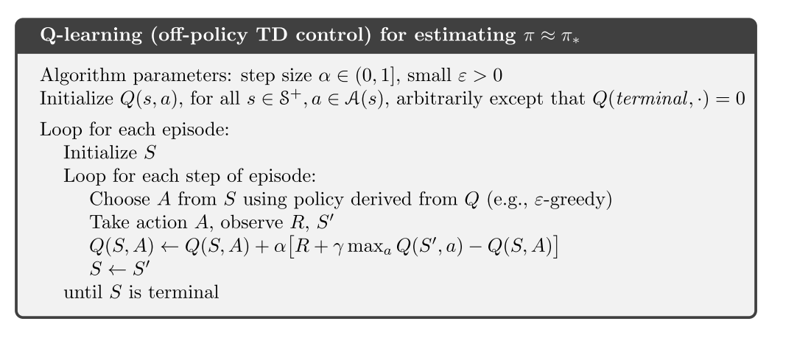

# 1 RLBook-表格型方法

DP: 期望更新
TD和MC: 采样更新
核心: 值函数估计, 回溯更新, 广义策略迭代

## 1. DP

在给定MDP完整信息的前提下, 可以收敛到最优策略和最优价值.

### 1.1 策略评估: 使用期望更新方法

### 1.2 策略改进

1. 策略改进定理
   
   

   
   

   
2. 策略改进， 比如使用贪婪策略， 可以满足策略改进定理条件(4.7), 通过该过程可以构造一个更好的策略.
   - **策略改进一定能给出更好的策略**.
   - 策略改进定理在随机策略的情况下同样成立.
   
   

   
   

   

### 1.3 策略迭代与值迭代

1. 策略迭代
   

2. 值迭代-每次都截断的策略迭代
   
   
   

   
   
   

#### 策略迭代与值迭代的区别和联系

1. 收敛性
   - 策略迭代收敛更快, 但是每次策略评估都要多次迭代.
   - 值迭代计算量少
2. 贝尔曼方程
   - 策略迭代使用贝尔曼期望方程; 值迭代使用贝尔曼最优方程

### 1.4 off-policy 与 on-policy

<a href="./zhou_model_free.md#on_off_policy">周博磊RL-3-model_free on/off-policy</a>

### 1.5 广义策略迭代(Generalized Policy Iteration, GPI)

## 2. MC

### 2.1 核心思想

1. 状态价值是从该状态开始的期望累计回报, MC的思想是, 对于某一个状态, 对所有经过该状态的回报进行平均, 随着样本数量增加, 平均值会收敛到期望值.
  + 首次访问型MC, 只记录一个episode中第一次访问到该状态的值. 是无偏估计, 其误差的标准差会以$$1/\sqrt{n}$$衰减; 
  + 每次访问型, 使用一个episode中所有访问次数的平均. 也会二阶收敛到v(s)
  + 没有使用bootstrapping思想

  

   
  

2. 优势
   + 计算状态价值时无需考虑其他状态
   + 从经验中学习
   + 可以从模拟中学习
   + 只关注状态的一个小子集, 不关注其他区域, 简单高效
   + 不用自举思想, 在马尔可夫性质不存在的任务也适用.

3. model-free MC: 计算Q值, 使用试探性出发假设.
   - 因为MC方法有些(s, a)可能永远不会被访问到, 所以需要在一个状态下对所有动作值进行估计.

### 2.2 MC控制

1. MC收敛假设:
   - 试探性出发假设
   - 在策略评估时有无限多的episode样本序列进行试探.
2. **放宽无限样本的假设**, 可以使用每个episode的数据进行策略评估, 然后再该episode访问到的状态上进行策略提升.
   
   

   
   

   
3. 放宽试探性出发假设: 
   - on-policy + $$\epsilon-soft$$策略, 满足策略改进定理.
   - off-policy: 普通重要性采样比(无偏, 方差无限); 加权重要性采样比(方差有限). 如果非贪心行为比较普遍, 尤其在很长的episode出现较早的状态, 学习速率很慢.
   - 折扣敏感的重要性采样. 解决off-policy方差敏感的问题.
   

   
   <!--  -->
   
   

## 3. TD

### 3.1 MC与TD对比

1. MC使用式6.3的估计值作为目标, 用样本回报估计期望回报
   - MC误差可以写成TD误差之和
   
   
   

   
   

   
   
2. TD使用式6.4的估计值作为目标, 估计误差来自于两方面:
  + **用样本估计期望**
  + **用当前V的估计值代替真是V**

3. TD可以适应无限长序列的任务.
4. ==批量MC算法倾向于找出最小化训练集上均方误差的估计, 而批量TD(0)找出完全符合MDP模型的最大似然估计的参数. 通常, 一个参数的最大似然估计式使得生成训练数据的概率最大的参数值.在TD(0)中, 如果模型是正确的,则估计也是正确的,这叫做**确定性等价估计**. TD(0) 可以收敛到确定性等价估计.==

### 3.2 SARSA和Q-learning

1. 算法

2. 最大化偏差与double-learning
   - 如果嫁给你估计值中的最大值当作对真实价值的最大值的估计, 就会出现最大化偏差.
   - 不一定是坏事, 但是当采样不完全的话, 会使得算法偏差过大, 对某些动作的偏好太强.
   - 最大化偏差一种看法:**其根源在于确定价值最大的动作和估计他的价值这两个过程, 使用了同样的样本**
   - 解决方案就是使用double-learning, 把上述两个过程分开计算
   
   

   
   

   

## 4. n-step Bootstrapping

==**n步方法就是向前看n步, $$TD(\lambda)$$方法在多个时间步同时展开.**==
==**资格迹可以使多步算法使用最少的内存和最小的计算量实现多步TD方法.**==

1. n步方法只有获取n步之后的回报才能计算, 只算t+1没用.

   

   
   
   

2. n步算法
   - n步SARSA
   - off-policy n-step SARSA, 需要重要性采样.
   - 带控制变量的每次决策方法: 简单重要采样比加权, 在某个时刻的动作永远不会被$$\pi$$选择时, 权重为0, 则n步回报为0, 方差大. 可以加个控制变量, p和(1-p)控制p=0的情况.
   - 不用重要性采样的方法: n-step树回溯算法

## 5. 规划与学习

真实经验可以用来:1)改善模型; 2) 改善值函数和策略

### 5.1 Dyn-Q 

1. 算法
   - 其中规划方法使用随机采样单步表格型Q-learning, 直接RL使用单步型Q-Learning算法.
   
   

   
   
   

2. 当模型出错时，规划过程可能出现次优策略.
   - 这也是探索与利用的另一种表现形式
   - Dyna-Q+, 使用简单的启发式规则平衡探索与利用. 即时间越长认为则认为模型对于状态的估计越不正确- "好奇心"机制.
3. 均匀采样有时效率很低, **使用优先遍历**.
4. 期望更新与采样更新:
   - 期望更新, 考虑的是转移的概率分布模型, 采样更新直接使用真实的转移样本采样完成更新.
   - 在随机环境中, 期望更新可以产生更好的估计, 因为不受样本偏差的影响, 但是计算量更大.

   

   
   
   

   

### MCTS 

1. rollout算法- 不是一种学习算法. 
   - 是MC控制的特例, 使用从某个状态在给定策略下的多个trajectory的结果的平均值作为状态值的估计.
   - 可以看作一种策略改进算法. rollout策略越好, 价值估计越准, 得到的下一个策略越好.
   - 平衡: 动作评估个数, 轨迹长度, 决策时间, 模拟轨迹的数量
   - 方法: 并行化, 剪枝
2. MCTS, 
   - 树内节点使用树策略选择动作(UCB), 外部或者叶子节点使用rollout策略.
   - 选择, 扩展, 模拟, 回溯
   - 在线, 增量, 基于采样的价值估计和策略改进方法
   - 通过扩展树, 形成了一张存储部分动作价值函数的查找表, 而避免了使用一个全局的Q函数.

## 6. 总结

