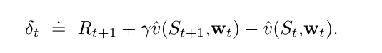
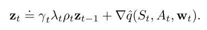

# 1 RLBook-函数近似

价值函数逼近是让状态s的估计值逼近某一个目标, 这里对于TD, MC, DP有不同的考虑

函数近似的问题:
1. 近似价值函数的准确性,收敛性无法保证
2. 一个状态的更新会影响其他状态
3. 逼近函数的复杂程度, 越复杂的函数方差越大, 且倾向于收敛到局部最优

优化的终极目标是寻找更好的策略, 但是由于目前没有关于目标函数和价值函数的明确关系, 当前主要关注的是最小化俊芳价值误差.

## 1 on-policy 函数逼近

1. on-policy在使用线性函数逼近的情况下, MC可以收敛
2. **on-poliicy函数逼近方法不满足策略改进定理**
3. **n-step方法方差大**
   - 因为计算TD target需要更长的trajectory, 每一步都是有偏的, 随着离当前状态越来越远, 随机性的影响越大, 与当前时刻的差异越大, 方差越大.
4. 连续环境设定下的函数逼近方法, 带折扣的公式表达是没有用的, 使用平均收益的差分半梯度算法有效, 可以在不影响策略排序的情况下去除gamma参数.

### 1.1 SGD

假设U是v的近似函数, 则SGD更新公式为

(1)

如果U是一个无偏估计, 那么当$$\alpha$$随时间减小满足随机近似条件时, w可以保证收敛到局部最优.

1. MC是一个无偏估计, 所以可以保证收敛到局部最优

2. TD或者DP的估计值是有偏的, 因为目标值依赖于当前权重w. 所以依赖于自举的梯度方法叫**半梯度方法**
   - 在线性函数的情况下可以收敛
   - 学习速率快
   - 支持在线学习, 使其能够用于连续问题

在**on-policy 线性函数**逼近下, 如果当$$\alpha$$满足随机近似条件随时间减小
   - MC收敛到全局最优
   - TD收敛到TD不动点
   - TD法渐进误差不超过MC方法最小误差的$$1/(1-\gamma)$$倍.

### 1.2 基于函数逼近的op-policy控制

半梯度sarsa算法

在连续环境设定下的函数逼近方法, 带折扣的公式表达是没有用的, 使用差分半梯度算法, 可以去除gamma参数.

当需要对任意策略进行排序时, 使用平均收益是一种有效的方法.

## 2 off-policy函数逼近

off-policy目前的挑战:
   - 表格型: **更新的目标, 可以使用重要性采样解决**
   - 函数逼近: 更新的分布, **再次使用重要性采样把分布拉回on-policy策略的分布(在线性情况下); 或者寻找不依赖于任何特殊分布就能稳定的真实梯度方法.**

**off-policy函数逼近面临发散的问题**

**off-policy比on-policy有更大的方差.**

### 2.1 半梯度off-policy方法

1. 半梯度off-policy TD(0)算法, **使用重要性采样**

   

   
   
   
   

   
2. 半梯度off-policy 期望SARSA算法, **表格型RL不需要IS, 但是函数逼近时显然不行,但是没有很好的解决方案.**

   

   
   

3. 半梯度off-policy n-step sarsa, **需要IS**
   
   
   

   
   

   

### 2.2 致命三要素

只要一个算法满足下列三个要素, 则面临不稳定和发散问题.

1. Function approximation
2. Bootstrapping
3. O↵-policy training

### 2.3 贝尔曼误差及其不可学习性质

贝尔曼误差是TD误差的期望.

贝尔曼误差是不可学习的: 定义良好且在给定环境内在结构时可以计算, 但是不能从外部观测的动作/奖励/状态中得到, 则称其为不可学习的.

### 2.4 减小方差

off-policy比on-policy有更大的方差, 因为使用行动策略采样的样本可能和目标策略相关性不大. 

但是这也是off-policy有更好的泛化性能的重要原因之一.

**减小方差方法之一就是限制IS比值**, 高方差意味着$$\rho \times \alpha $$可能很大, 即步长会变得很大, 使得训练不稳定. 
1. 因为IS比值随着乘积项可能会变得很大也可能消失.
2. 加权重要性采样有更小的方差.
3. 树回溯法可以不使用IS进行off-policy学习. 
4. 另一个方法是, 允许目标策略部分地由行动策略决定. 这样目标策略不会离行动策略太远,而使IS比太大.

## 3 资格迹

统一MC和TD, 降低方差和偏差, 又有**计算优势**; 适用于分幕式和连续控制任务.

核心元素: **一个短期记忆向量, 资格迹$$z_t\in\mathbb{R}^d$$, 以及相应的长期权重向量$$w_t$$.**
核心思想: **当参数w的一个分量参与计算并产生一个估计值时, 对应的z的分量会骤然升高, 然后逐渐衰减. 在迹衰减到0之前, 如果发现了非零的TD误差, 那么相应的w的分量就可以得到学习. 迹衰减参数$$\lambda\in[0, 1]$$决定了迹的衰减速率.**
优势: 
 - **通过追踪迹向量, 不用存储n-step的状态, 也不用延迟到结束才能获得奖励信号, 还可以遇到一个状态后马上进行学习, 并影响之后的状态.**
 - 相比于TD, 增加了计算, 但是加快了学习速率. 特别是奖励延迟的任务.
 - **增量式的后向视图**

### 3.1 lambda-return

首先, n-step回报的计算如下:

$$\lambda$$回报结合任意步回报, 算每一种回报的加权和, 降低方差和偏差, 保证收敛.

上式前面乘上$$(1-\lambda)$$保证权重和为1. 

$$\lambda$$回报也有迭代更新公式

### 3.2 TD(lambda)

$$TD(\lambda)$$同意了前向分析和后向计算的优势. 主要有三点改进:
1. 单步更新, 而不是在结束时才更新
2. 计算量平均在整个时间轴上, 而不是在一个episode结束
3. 可以使用离散和连续任务.

函数逼近的$$TD(\lambda)$$:
1. 资格迹$$z_t\in\mathbb{R}^d$$是一个和权值向量$$w_t$$同维度的向量;
2. w在整个训练周期进行更新; z是一个短期记忆, 通常小于episode长度.
3. 资格迹辅助学习, 唯一的作用是影响权值向量.

资格迹更新过程:

相当于特征向量$$x_t$$的贡献的累积(线性逼近时, v的梯度是$$x_t$$).

当一个reinforcing事件出现时: 我们认为这些贡献"痕迹"展示了权值向量的对应分量有多少"资格"可以接受学习过程引起的变化. 我们关注的reinforcing事件单步TD误差.

则最终的$$TD(\lambda)$$算法如下:

### 3.2 $$TD(\lambda)$$改进

实际上$$TD(\lambda)$$考虑的是之前状态(梯度)对当前TD误差计算的影响.

但是对于连续性或者太长的任务, 效果不大, 可以使用 **n步截断的$$TD(\lambda)$$**

对于在线式的$$TD(\lambda)$$, 为了在线生成数据, 改进方法是:
**每一步收集到数据增量的同时, 回到当前episode的开始, 重新更新**

### 3.3 SARSA$$(\lambda)$$

n-step版本的q值形式为:

则权重更新方式为:

因此, 总结下SARSA$$(\lambda)$$的核心公式:

### 3.4 带控制变量的off-policy 资格迹

需要使用重要性采样.

对于状态值函数估计的方法:

对于Q函数估计的方法:

在off-policy 资格迹中, 即使$$\lambda ==1$$也涉及到自举. 所以面临致命三要素问题:
* off-policy 
* 函数逼近
* 自举 

off-policy 资格迹只解决了off-policy 两个问题中的一个:
1. 纠正了目标的期望值
2. 但是没有解决, 更新的数据和策略分布与目标策略不匹配问题.

## 4 PG

pg算法优势:
1. 选择概率的动作更平滑, 更强的收敛保证
2. 适用于连续动作和离散动作. 
3. 可以产生一种随机策略, 可以以任意概率选择动作.
4. 策略参数化形式的选择有时意味着我们可以引入正确的先验.

问题: 
1. 样本效率低, on-policy
2. 高方差导致学习慢
3. 性能函数即依赖于动作的选择, 也依赖于选择动作时的状态分布, 但是他们都受策略参数的影响.
   - 策略参数对动作和奖励的影响可以容易计算, 但是对状态分布的影响很难估计, 因为其依赖于环境. 

**策略梯度定理**可以从理论上确定了如何估计策略参数对状态分布的影响:

### 4.1 REINFORCE

1. 纯MC方法:
   - 收敛性保证, 无偏
   - 收敛到局部最优
   - 高方差导致学习慢

   

   
   

2. 降低方差: 加入基线
   - 加入基线不会改变梯度, 也没引入偏差
   - 但是明显降低方差, 所以可以提高学习效率
   - 一般使用状态价值v表示基线, 因为它估计的是某状态下所有动作的均值, 很公平
   - 虽然学习了v值, 但是不认为它是AC算法, **因为它没有使用自举操作**.

   

   
   

   
3. AC
   - **一般设计值函数的自举操作**, 引入偏差, 但是明显降低方差
   - 可以在线增量式学习, 适用于持续性问题.

   

   
   

   
4. 策略参数化方法
   - 离散: softmax分布中采样

   

   
   

   - 连续: 从高斯分布中采样. 一般用线性函数逼近均值, 用exp函数逼近标准差
   
   

   
   
   
   

   
   
