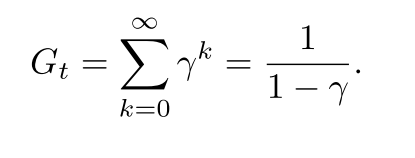

# 1 RLBook-start

## 1. RL

发展: 试错, 最优控制(价值函数+DP, MC), TD

### 1.1 基本特征

1. 试错与延迟奖励， 最大化奖励
2. 抽象为MDP过程
3. 探索与利用的均衡
4. 明确考虑了目标导向智能体与不确定环境交互的问题

###  1.2 RL要素

策略, 奖励, 价值函数, 环境模型

### 1.3 与进化策略的区别

进化算法忽略了所求策略是状态到动作的函数这一事实, 没有考虑单个状态.

进化方法中, 一般固定策略与与对手博弈多次, 用最后的获胜频率估计获胜概率, 没有考虑中间状态; 而RL方法考虑了单个状态.

进化方法和RL都要对策略空间进行搜索.

## 2 多臂赌博机

### 2.1 基础

1. 动作价值方法, 一种采样平均的方法, 收敛保证: 大数定理
2. 动作选择: epsilon-greedy, 依赖于任务:
   - 如果奖励方差大, 噪声多, 需要更多的探索, epsilon-greedy; 
   - 非平稳任务, 动作真实价值会变化, 也需要探索, 确保某个非最优动作不会变得比贪心动作好; 
   - 如果奖励方差为0, 贪心更好.
3. Q值的增量式实现. 
   $$NewEstimate \leftarrow OldEstimate + StepSize(Target-OldEstimate)$$.
   
   

   
   

### 2.2 非平稳问题.

1. 非平稳: 动作奖励随时间变化.
   - 解决思路: 给近期奖励更高的奖励.
   - 方法: **固定更新步长$$\alpha$$**, 使得Q成为对过去奖励和Q1的加权平均.

2. 该方法成为 **加权平均法(exponential recency-weighted average.)**, 因为 $$(1-\alpha)^n + \sum_{i=1}^{n} \alpha (1-\alpha)^{n-i} = 1 $$, 因此, 关于R的权重随时间间隔增加而指数减小.
3. **固定步长不满足收敛条件**. 
4. 加权平均法的收敛条件如下. 其中, 第一项保证有足够大的步长, 克服初始化或其他随机波动; 第二项保证最终步长变小. 采样平均法满足, 常数步长不满足第二项.
   
   

   

   
(2.7)

   

   

   
   

   

   

### 2.3 鼓励探索

#### 乐观初始值

1. 一般采样方法是有偏的, 因为**初始估计值不准**.
   - 采样平均法在对所有动作都采样过后, 偏差会消失, 但是在非平稳任务中表现很差; 
   - 对于固定步长, 偏差会慢慢减小, 但不会消失.
2. 乐观初始值, 给初始值Q1一个比较大的值, 可以鼓励探索.
   - 一种暂时性方法, 对平稳任务有效; 
   - 选择任何一个动作的奖励都比初始值小, 因此对该动作比较失望, 转而学会选择其他动作.

#### 置信度上界算法(UCB)

某个动作a被选择的次数增多, 其不确定性降低. 

(2.10)

其中t是当前时间步, N是a被选择的次数, c控制探索水平. 所有动作都会被选择, 但是慢慢地, Q值较低或者选择次数过多的动作选中的频率降低.

在非平稳问题中, 处理方法很负责; 在很大的状态空间下很难应用.

### 2.4 梯度赌博机

使用softmax函数表示一个动作相比于其他动作的偏好. 使用梯度上升算法更新.

(2.11)

更新方法如下:

(2.12)

其中$$\overline{R}$$是基准项, 可以提升共性能. 梯度算法收敛性强.

**期望更新项与期望奖励的梯度相同. 因此上述算法是一种梯度上升算法.**
**基准项不影响期望更新, 但是影响更新值的方差, 从而影响收敛速度. 使用采样奖励的平均值作为基准项很有效.**

## 3. MDP

MDP涉及到即时奖励与延迟奖励之间的平衡问题.

1. 状态转移概率
   
   
   

   

   
(3.4)

   

   

   
   

   

   
2. 期望奖励函数
   
   

   

   
(3.5)

   

   

   
   

   

   
   

   

   
(3.6)

   

   

   
   

   

   
3. 折扣环境累积奖励
   - 折扣率决定了未来收益的影响, 只是当前值的$$\gamma^{k-1}$$倍.

   

   

   
(3.9)

   

   

   
   

   

   
   - 尽管下式是对无限个奖励的求和, 但是只要收益是一个非零常数, 且$$\gamma<1$$, 则该值是有限的. 比如r=1, 则
   
   
   

   

   
(3.10)

   

   

   
   

   

### 4.2 MDP 

#### 贝尔曼方程

<!-- 
 -->
<!--  -->

#### 互相表示

#### 贝尔曼最优方程

1. 状态值
   - 最优策略下, 各状态的的价值等于该状态下最有动作的期望回报.
   - 对于有限MDP来说, v的贝尔曼最优方程有独立于策略的最优解.
   - 定义了$$v_*$$可以把最优的长期全局回报, 转化为每个状态对应的一个当前局部计算量的计算.

   

   
   
   

2. 动作-状态值

   

   
   
   

3. 最优动作选择

   

   
   
   

4. 用三参数p和双参数r表示贝尔曼方程和贝尔曼最优方程
   
   
   

   
   
   
   
   

   
   
