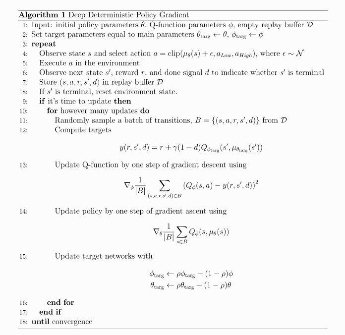

# 2 spinup-DDPG

连续动作空间, 确定性策略, off-policy算法
使用polyak 平均, 相当于把目标的稳定性和bias做一个权衡. dqn的target比较稳定, 但bias会越来越大.

1. off-policy, 用TD(0)更新critic Q函数, 用Q值更新策略
2. DQN 在连续动作空间的扩展, 核心思想: 如果能得到Q* , 则通过求argmax可以得到最优动作.
3. 解决的问题就是当动作空间巨大或者是连续动作空间, 通过穷举对Q求max操作不现实;
4. 因为是连续动作空间, 所以Q对于a是可导的, 因此可以通过策略函数$$\mu(a)$$得到基于梯度的学习方法.然后计算 $$\max_a Q(s,a) \approx Q(s,\mu(s))$$代替计算所有动作的Q值.
5. DDPG中求max的操作隐含在计算对策略函数求梯度最大化方向的过程中.

## 1. critic--通过Q-learning 计算

首先贝尔曼最优方程为:

$$
\begin{aligned}
Q^*(s, a) = E_{s' \sim P}\left[r(s, a) + \gamma \max_{a'} Q^*(s', a')\right]
\end{aligned}
$$

Q-Learning使用函数逼近+贝尔曼最优方程更新Q值. 使用mean-squared Bellman error (MSBE) function作为目标函数

$$
\begin{aligned}
L(\phi, {\mathcal D}) = E_{(s, a, r, s', d) \sim {\mathcal D}} \left[
\Bigg( Q_{\phi}(s, a) - \left(r + \gamma (1 - d) \max_{a'} Q_{\phi}(s', a') \right) \Bigg)^2
\right]
\end{aligned}
$$

训练技巧:
1. Replay Buffers, 平滑训练, 使训练过程更稳定
   - 打破数据前后相关性, 降低方差
   - 平滑数据分布, Q值小的变化引起后面数据的分布剧烈变化
   - 数据重用, 数据效率高
2. Target Networks
   - 减少Q值和TD-target相关性, 缓解不稳定性
   - 使用soft-ubuntu_update

**如何计算动作分布中的最大值**? DDPG通过使用**目标策略网络**来计算近似最大化$$ Q_{\phi_{\text{targ}}}$$

## 2 Actor--策略梯度计算

学习一个确定性的策略, 它倾向于给出最大化Q值的动作. 因为动作连续可微, 因此可以通过梯度上升计算

$$ 
\begin{aligned}
\max_{\theta} E_{s \sim {\mathcal D}}\left[ Q_{\phi}(s, \mu_{\theta}(s)) \right].
\end{aligned}
$$

此时Q函数的参数认为使常数.

##  3 探索与利用

因为是确定性策略, 所以单纯使用上述方法无法进行有效探索. 

DDPG通过在动作中添加噪声来鼓励探索.

原论文使用时间相关的 OU noise. 最初的DDPG论文的作者推荐了时间相关的OU噪声, 但零均值的高斯噪声更好更简单. 并且噪声可以随时间减小.

在测试时, 不添加噪声.

<b>本文实现时加了一个trick</b>

在开始时对动作进行均匀采样几个时间步, 之后再使用标准的DDPG算法

## 4 伪代码

