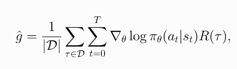
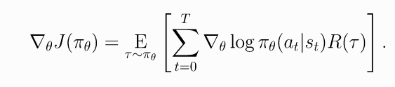
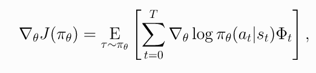

# 2 spinup-PG

代码:[github]()
<a name="spinup_pg" id="spinup_pg" href="#">spinup-PG </a> 

## 1. 策略梯度导出

首先考虑参数化的随机策略$$\pi_\theta$$, 我们的目标是基于该策略最大化期望奖励 , 使用梯度上升算法优化策略.

(1)

策略性能函数的梯度  称为**策略梯度**. 一般PG算法需要两个步骤: 1) 导出策略performance的梯度, 表示成期望值的形式; 2) 构造期望值的抽样估计函数.

首先介绍几个概念:

1. **Probability of a Trajectory**.

(2)

2. **The Log-Derivative Trick**. 

(3)

3. **Log-Probability of a Trajectory**. 

(4)

1. **Gradients of Environment Functions**. 环境动力学方程不依赖于参数$$\theta$$, 所以,$$\rho_0(s_0), P(s_{t+1}|s_t, a_t), R(\tau) $$的梯度为0.

2. **Grad-Log-Prob of a Trajectory**. 

(5)

由此, 

<b>导出策略梯度</b>

因此策略梯度可以表示成期望的形式, 可以使用样本均值来估计. 通过策略$$\pi_\theta$$从环境中获取轨迹$$\mathcal{D} = \{\tau_i\}_{i=1, ..., N}$$, 则策略梯度估计值为

(6)

## 2. 代码

代码: [github]()

<b>You Should Know</b>

RL中虽然定义了loss, 但是这里的loss函数和监督学习中是不一样的. 主要有两点区别.

<ol>
<li><b>数据分布与参数有关. </b> 一般SL中的loss 函数中数据与参数是独立的, 但是这里的数据是根据策略参数从环境中采样的.</li>
<li><b>It doesn't measure performance</b> 一般损失函数用来评估性能函数. 但是这里我们关心的是期望回报值J. 但是这里的loss函数并不近似该值. 这里使用loss 的唯一用处是为了表明, 在当前参数下进行评估时, 使用当前参数生成的数据, 它是性能函数的负梯度.</li>

但是当执行一步梯度下降之后就与当前性能函数无关了. 这意味这用一个batch最小化loss, 不能保证提升环境期望奖励. loss可以到负无穷, 策略性能函数也会崩坏. 在监督学习里经常称之为过拟合. 但是在RL意义不一样, 因为这里不牵扯泛化

</ol>

==这里说明上述loss的问题是为了警示: **在监督学习里关注loss下降, 模型表现变好, 但是在策略梯度里, 关注loss下降是没有意义的, 只需要关注平均回报.**==

## 3. Expected Grad-Log-Prob Lemma

这一节导出一个常用的中间结果. 称为期望log梯度概率引理(Expected Grad-Log-Prob, EGLP lemma).

**EGLP Lemma**假设$$ P_{\theta}$$是随机变量$$x$$上的一个参数化概率分布, 那么

(7)

证明

<b>Proof
</b>

## 4. 去除之前状态的影响--降低方差

上一步的策略梯度为

(8)

这个公式考虑了所有步骤的奖励, 包括当前状态之前的奖励. 按理说不应该考虑, 所以上式可以变化为

(9)

上式称为"**reward-to-go policy gradient**". 

**为什么去掉之前时间步的奖励会变好呢**? 策略梯度的一个关键问题是使用多少trajectory样本得到其低方差估计. 上述公式(8)的均值为0 但是包含非零方差, 因此这些样本在策略梯度的估计中添加了噪声. **通过去掉这些没用的reward, 减少了噪声, 可以减少所需的样本数量.**

**这本质也是解决了不同动作的信用分配问题**.

## 5. Baselines in Policy Gradients--降低方差

EGLP lemma说明任何只依赖状态的函数$$b$$的期望log梯度为0

(-1)

因此在公式里减去一个baselines不影响最后的梯度. 所以有了加入baseline的trick.

(10)

**为什么加入baseline**? 如果r总是正的, 可以通过log概率调整动作分布. 但是因为是sampling, 有些动作没有抽样到, 其概率分布会变小. 一般  

动作a因为没被抽样到, 概率会变小, 但a可能是个好动作

**常用的baseline是 on-policy value function $$V^{\pi}(s_t)$$. 该值是从状态s出发根据策略$$\pi$$行动的平均回报.**

一般选择$$ b(s_t) = V^{\pi}(s_t)$$可以在sample估计中减策略梯度的方差, 加速训练. 一般使用的值函数用神经网络近似, 使用MSE训练, 

(-1)

## 6. 策略梯度其他形式

目前策略梯度的通用形式为

(11)

其中$$\Phi$$可以有多种形式

(11.1)

(11.2)

(11.3)

上面公式都把策略梯度引向相同的期望值. 还用其他可选形式

1. **On-Policy Action-Value Function**.

(11.4)

1. **The Advantage Function**. 优势函数定义为   

(11.5)

, 

重要论文: 广义优势估计( [Generalized Advantage Estimation, GAE](https://arxiv.org/abs/1506.02438))
