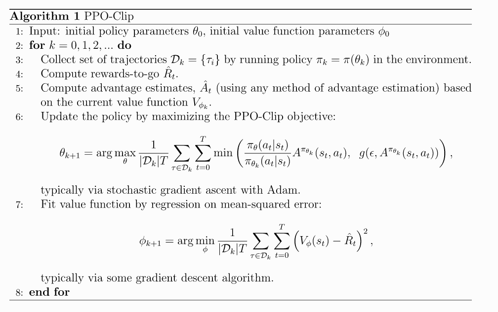

# 2 spinup-PPO

是一种直接简单的算法, 算是OpenAI的御用算法.
核心: 如何提高数据利用率, 最大化策略提升步骤, 同时保证性能函数不崩溃. 

PG算法的缺点:
* 对lr敏感, 太小慢, 太大噪声让算法不收敛, 性能崩溃; 
* PG在高维空间需要频繁采样.

创新: 
1. 主要是基于TRPO的改进.
   - 采样, 打破on-policy采样的样本效率低的限制
   - 首先TRPO提供了理论保证, 就是新策略更新后的性能比旧策略保证单调不减, 又为了不让新旧策略偏离太远, 使用新旧策略的KL散度作为约束项, 整个问题是带约束的优化问题. PPO是对TRPO的简化, 也能得到TRPO差不多的理论保证, 但TRPO使用二阶方法, PPO使用一阶方法保持新旧策略保持一致. 
   - 基本的PPO把KL散度项作为惩罚项加到loss里, 但是引入了新的超参数. 所以作者提出了一种简化方法, 就是直接在新旧策略的比值过大的时候, 对梯度做clip. 就有了他的目标函数
2. 另外为了提高数据利用率, 使用了重要性采样, 这一块也是直接从TRPO继承来的. 同时它也可以进行数据重用.
3. 最后就是它使用GAE估计优势函数, 这种多步方法可以减少方差和偏差; 也可以基于A3C算法进行并行化.

**核心算法性质:**

* PPO是on-policy算法; 
* 适用于离散和连续动作空间环境; 
* 支持MPI实现并行化．

## 速览

### 算法版本

* PPO-Penalty: 把KL散度作为目标函数的惩罚项, (TRPO使用带约束的优化问题), 并在训练过程中自动调整惩罚系数.
* PPO-Clip: 没有对KL散度的惩罚, 而是直接对目标函数进行clip, 让新旧策略不会偏离太远.

### 核心公式

参数更新过程为, 

$$
\theta_{k+1} = \arg \max_{\theta} \mathrm{E}_{s, a \sim \pi_{\theta_k}} \left[ L(s, a, \theta_k, \theta)\right]
$$

使用SGD更新的目标函数为

$$
L(s, a, \theta_k, \theta) = \min\left(
\frac{\pi_{\theta}(a|s)}{\pi_{\theta_k}(a|s)}  A^{\pi_{\theta_k}}(s, a), \; \; 
\text{clip}\left(\frac{\pi_{\theta}(a|s)}{\pi_{\theta_k}(a|s)}, 1 - \epsilon, 1+\epsilon \right) A^{\pi_{\theta_k}}(s, a)
\right), 
$$

其中$$\epsilon$$表示新旧策略最多离多远的超参数. 上式有一个简单版本:

$$
L(s, a, \theta_k, \theta) = \min\left(
\frac{\pi_{\theta}(a|s)}{\pi_{\theta_k}(a|s)}  A^{\pi_{\theta_k}}(s, a), \; \; 
g(\epsilon, A^{\pi_{\theta_k}}(s, a))
\right), 
$$

其中

$$
g(\epsilon, A) = \left\{
\begin{array}{ll}
(1 + \epsilon) A & A \geq 0 \\
(1 - \epsilon) A & A < 0.
\end{array}
\right.
$$

1. 当A>0, 鼓励当前行为, 但是不让策略偏离太远
2. 当A<0, 减少当前行为, 所以不让它大于$$(1-\epsilon)$$

### 伪代码

PPO是一种on-policy算法, 也就是说算法根据最新版本的策略版本进行动作抽样. 动作随机性来自初始化和训练过程, 但是随着训练更新, 动作随机性会降低, 容易陷入局部最优.

