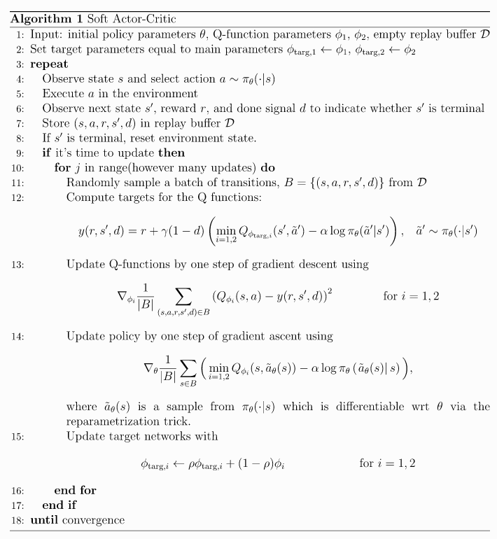

# 2 spinup-SAC

**随机策略**, 连续动作空间, off-policy算法, 但是通过改变策略更新规则适用离散动作空间.
1. 随机策略+DDPG方法, 
2. 使用了TD3相似的double-Q trick; 因为固有的策略随机性, 它也从类似于策略平滑方法中受益.
3. 核心是**熵正则化(entropy regularization)**. 策略训练目标是最大化期望奖励和熵的权衡, 即考虑最大化期望奖励的同时保证策略的随机性. 
   - 这也是一种exploration-exploitation trade-off: 熵增加会增加探索性, 可以加速学习. 
   - 同时可以防止策略过早收敛到局部最优.

## 核心公式

### 1 Entropy-Regularized Reinforcement Learning

#### 熵

衡量随机变量分布的随机性.

$$
H(P) = E_{x \sim P}{-\log P(x)}.
$$

#### 熵正则化RL

SAC通过熵正则化训练随机策略, 并以on-policy方式进行探索. 用熵作为正则化项, 策略公式变成:

$$
\pi^* = \arg \max_{\pi} E_{\tau \sim \pi}{\left[ \sum_{t=0}^{\infty} \gamma^t \bigg( R(s_t, a_t, s_{t+1}) + \alpha H\left(\pi(\cdot|s_t)\right) \bigg)\right]}, 
$$

其中$$\alpha$$为平衡系数, 用来权衡奖励和策略随机性. 这里假设有限MDP问题.

那么, Q值和V值计算公式变成:

$$ 
\begin{aligned}
V^{\pi}(s) =& E_{\tau \sim \pi}{ \left[ \left. \sum_{t=0}^{\infty} \gamma^t \left( R(s_t, a_t, s_{t+1}) + \alpha H\left(\pi(\cdot|s_t)\right) \right) \right| s_0 = s \right]}, \\
Q^{\pi}(s, a) =& E_{\tau \sim \pi}{ \left[ \left. \sum_{t=0}^{\infty} \gamma^t  R(s_t, a_t, s_{t+1}) + \alpha \sum_{t=1}^{\infty} \gamma^t H\left(\pi(\cdot|s_t)\right)\right| s_0 = s, a_0 = a \right]}
\end{aligned}
$$

由此, Q和V相互表示的公式为

$$ 
\begin{aligned}
V^{\pi}(s) = E_{a \sim \pi}{\left[ Q^{\pi}(s, a) \right]} + \alpha H\left(\pi(\cdot|s)\right)
\end{aligned}
$$

可以得到贝尔曼迭代公式为:

$$
\begin{aligned}
Q^{\pi}(s, a) &= E_{s' \sim P, a' \sim \pi}{\left[R(s, a, s') + \gamma\left(Q^{\pi}(s', a') + \alpha H\left(\pi(\cdot|s')\right) \right)\right]} \\
&= E_{s' \sim P}{\left[ R(s, a, s') + \gamma V^{\pi}(s')\right]}.
\end{aligned}
$$

### 2 SAC

SAC同时学习策略和两个Q函数, 目前关于熵正则化项有两种变体:
1. 使用固定的熵正则化系数
2. 通过在训练过程中自适应变化alpha来加强熵约束项
另外SAC也可以选择是否学习V值, 形成不同的版本, 但是核心思想不变.

#### 熵正则化的作用

用熵的定义重写Q迭代公式

$$
\begin{aligned}
Q^{\pi}(s, a) &= E_{s' \sim P, a' \sim \pi}{\left[R(s, a, s') + \gamma\left(Q^{\pi}(s', a') + \alpha H\left(\pi(\cdot|s')\right) \right)\right]} \\
&= E_{s' \sim P, a' \sim \pi}{\left[ R(s, a, s') + \gamma\left(Q^{\pi}(s', a') - \alpha \log \pi(a'|s') \right)\right]}
\end{aligned}
$$

公式右边是关于下一个状态(来自replay buffer)和下一个动作(**来自于当前策略, 不在buffer中**)的期望, 因此可以用样本逼近期望

$$
\begin{aligned}
Q^{\pi}(s, a) \approx r & + \gamma\left(Q^{\pi}(s', \tilde{a}') - \alpha \log \pi(\tilde{a}'|s') \right), \\
&\tilde{a}' \sim \pi(\cdot|s').
\end{aligned}
$$

<b></b>

上边动作加了个波浪线表示, 下一个动作必须从策略中采样更新, 而s'和r从buffer中采样得到.

#### Q-learning

与TD3相似, 但也有些不同
1. 相似
   - Q函数使用MSBE训练, 来回归一个共享的target
   - 这个共享的target使用target-Q-net计算, 目标网络参数通过polyak averaging得到
   - 共享的target使用clipped double-Q trick
2. 差别
   - SAC 的target包含了熵正则化项
   - SAC中, **下一个状态-动作用于当前策略, 而不是目标策略.**
   - SAC不使用 target policy smoothing. TD3是确定性策略, 需要给next-state actions加入噪声进行探索并进行clip. SAC训练随机策略, 所以随机性满足探索需求.

这里, SAC使用MSBE逼近target, 使用 clipped double-Q trick.

$$
\begin{aligned}
L(\phi_i, {\mathcal D}) =& E_{(s, a, r, s', d) \sim {\mathcal D}} \left[\Bigg( Q_{\phi_i}(s, a) - y(r, s', d) \Bigg)^2 \right], \\
y(r, s', d) =& r + \gamma (1 - d) \left( \min_{j=1, 2} Q_{\phi_{\text{targ}, j}}(s', \tilde{a}') - \alpha \log \pi_{\theta}(\tilde{a}'|s') \right), \; \; \; \; \; \tilde{a}' \sim \pi_{\theta}(\cdot|s').
\end{aligned}
$$

#### policy 学习

策略应该在每个状态下, 输出最大化目标(未来回报和期望未来熵的和)的动作. 也就是说需要最大化V, 

$$
\begin{aligned}
V^{\pi}(s) &= E_{a \sim \pi}{Q^{\pi}(s, a)} + \alpha H\left(\pi(\cdot|s)\right) \\
&= E_{a \sim \pi}{Q^{\pi}(s, a) - \alpha \log \pi(a|s)}.
\end{aligned}
$$

这里优化策略使用**reparameterization trick**. 从策略中采样得到的动作表示为 状态, 策略参数, 和一个独立噪声的确定性函数. 即

$$
\begin{aligned}
\tilde{a}_{\theta}(s, \xi) = \tanh\left( \mu_{\theta}(s) + \sigma_{\theta}(s) \odot \xi \right), \; \; \; \; \; \xi \sim \mathcal{N}(0, I).
\end{aligned}
$$

<b>reparameterization trick下的策略与其他策略优化的区别</b>

1. 扁函数(The squashing function). SAC策略使用tanh函数保证动作有界. VPG或PPO等算法的动作没有这样处理. 这也改变了动作的分布: tanh之前的策略是因式高斯分解(网络输出 mu和sigma 两个参数), 但是经过了tanh之后分布就不是了, 但是仍然可以计算动作的log-Probability.
 
2. The way standard deviations are parameterized. 在VPG, TRPO,PPO中, 表示 log std devs. 在SAC中, log std devs可以用神经网络的输出来表示, 也就是说它与状态相关. spinnup版本的SCA使用状态无关的log std devs没有用. (原因很明显，观察loss函数，熵的大小与log std devs密切相关，所以必须是神经网络算出来的，不然熵对神经网络就是个常数还放进loss里干嘛)

这样, 通过reparameterization trick重写期望公式. 解决了一个痛点:
* **原来动作分布与策略参数相关, 现在不相关了**

$$
\begin{aligned}
E_{a \sim \pi_{\theta}}{Q^{\pi_{\theta}}(s, a) - \alpha \log \pi_{\theta}(a|s)} = E_{\xi \sim \mathcal{N}}{Q^{\pi_{\theta}}(s, \tilde{a}_{\theta}(s, \xi)) - \alpha \log \pi_{\theta}(\tilde{a}_{\theta}(s, \xi)|s)}
\end{aligned}
$$

<b></b>

这个方法就解决了其他随机策略的一个问题: 其他随机策略方法是不可以直接对Q求梯度, 而只能对策略pi求梯度. 
 
而SAC可以像DDPG那样直接对Q求梯度.

下面求Q的梯度, 这里与TD3不同, TD3只是用第一个Q函数优化策略, SAC使用两个Q的最小值, 然后使用链式法则计算:

$$
\begin{aligned}
\max_{\theta} E_{s \sim \mathcal{D}, \xi \sim \mathcal{N}}{\min_{j=1, 2} Q_{\phi_j}(s, \tilde{a}_{\theta}(s, \xi)) - \alpha \log \pi_{\theta}(\tilde{a}_{\theta}(s, \xi)|s)}, 
\end{aligned}
$$

与DDPG不同点: **the min-double-Q trick, the stochasticity, and the entropy term.**

### 3 探索与利用

SAC通过熵正则化训练随机策略, 并以on-policy方式进行探索.

SAC使用熵正则化项明确控制探索性, $$\alpha$$越大探索性越强

<b>本文实现时加了一个trick</b>

在开始时对动作进行均匀采样几个时间步, 之后再使用标准的DDPG算法

## 伪代码

