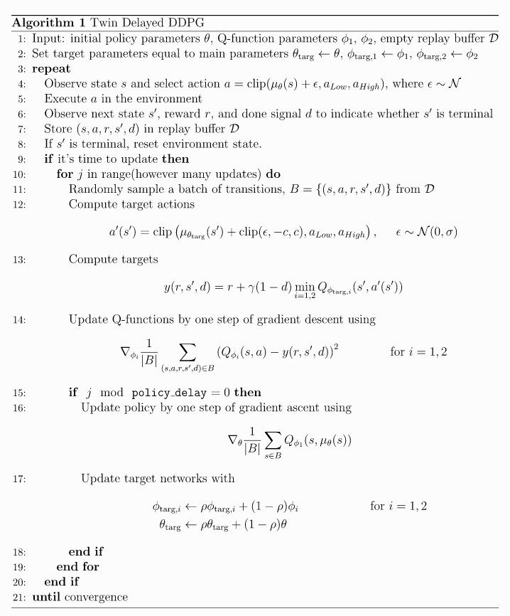

# 2 spinup-TD3

TD3: 连续动作空间, off-policy, 确定性策略算法

DDPG算法缺点:
1. 对超参数敏感
2. 对初始化敏感
3. Q-Learning倾向于对Q值过估计, 导致策略学习崩溃

TD3算法改进:
1. **Clipped Double-Q Learning**. TD3使用两个Q函数, 并选择Q值较小的那个计算target.
2. **Delayed” Policy Updates**. 策略(和目标网络)的更新延迟. paper中每两个Q值更新才更新一次policy.
3. **Target Policy Smoothing**.  在目标动作中加入噪声,并clip; 让策略比较难利用Q函数的error, 同时clip起到正则化作用, 避免策略出现尖峰.

## 1 核心公式

首先, **target policy smoothing**. Q-learning中计算target的action基于目标策略$$\mu_{\theta_{\text{targ}}}$$, 对动作和噪声进行clip操作. 让动作范围为$$ a_{Low} \leq a \leq a_{High}$$, 得:

   $$
   a'(s') = \text{clip}\left(\mu_{\theta_{\text{targ}}}(s') + \text{clip}(\epsilon, -c, c), a_   {Low}, a_{High}\right), \; \; \; \; \; \epsilon \sim \mathcal{N}(0, \sigma)
   $$
  
* 该部分可以作为算法的 **正则化项**, 主要用于解决DDPG中的一个问题: 如果Q函数逼近器输出了一个尖峰, 值, 那么策略会很容易利用这个尖峰, 并学会错误的动作, 并导致后续策略崩溃. 
* 因此直接对动作做clip, 可以避免Q函数尖峰

然后, **clipped double-Q learning**. TD3使用两个Q函数$$ Q_{\phi_1}, Q_{\phi_2}$$, 每个Q函数都有自己的目标网络. 并选择Q值较小的那个计算target. 避免过估计.

$$
\begin{aligned}
y(r, s', d) =& r + \gamma (1 - d) \min_{i=1, 2} Q_{\phi_{i, \text{targ}}}(s', a'(s')), \\
L(\phi_1, {\mathcal D}) =& E_{(s, a, r, s', d) \sim {\mathcal D}}{\left[ \Bigg( Q_{\phi_1}(s, a) - y(r, s', d) \Bigg)^2\right]}, \\
L(\phi_2, {\mathcal D}) =& E_{(s, a, r, s', d) \sim {\mathcal D}}{\left[ \Bigg( Q_{\phi_2}(s, a) - y(r, s', d) \Bigg)^2\right]}.
\end{aligned}
$$

最后, 通过最大化$$ Q_{\phi_1}$$来优化策略. 注意, **策略更新延迟**.
**另外注意这里只使用第一个Q函数计算梯度**

$$
\begin{aligned}
\max_{\theta} E_{s \sim D} \left[ Q_{\phi_1}(s, \mu_{\theta}(s)) \right], 
\end{aligned}
$$

## 2 Exploration vs. Exploitation

TD3使用确定性策略off-policy算法. 在训练时, 在动作中加入零均值高斯噪声增加探索性.

为了均衡探索与利用, 可以随时间减小噪声规模. 

在测试时不使用噪声.

<b>本文实现时加了一个trick</b>

在开始时对动作进行均匀采样几个时间步, 之后再使用标准的DDPG算法

## 3 伪代码

