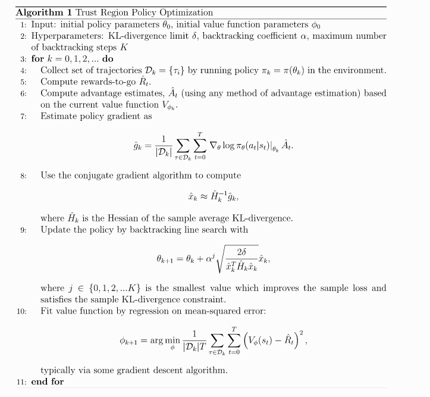

# 2 spinup-TRPO

在更新策略过程中最大化性能提升的步长, 并使用KL散度限制新旧策略的分布不要偏离的太远. 

与标准PG的区别:
* PG的新旧策略在参数空间距离很近; 但是即使参数空间距离很近, 也不能保证策略或性能离得近．所以PG算法中, 某一步的策略不好, 可能导致整个算法崩溃. 
* 同时PG算法样本效率低, 因为它不能使用比较大的步长
* TRPO使用重要性采样避免了性能函数崩溃, 同时倾向于更平滑的性能提升.

综上, TRPO性质:
* on-policy, 随机策略算法
* **适应离散和连续动作空间**
* 可以支持并行化

## 1. 关键公式

TRPO更新公式为

$$
\begin{aligned}
\theta_{k+1} = \arg \max_{\theta} \; & {\mathcal L}(\theta_k, \theta) \\
\text{s.t.} \; & \bar{D}_{KL}(\theta || \theta_k) \leq \delta
\end{aligned}
$$

其中 $${\mathcal L}(\theta_k, \theta)$$ 称为surrogate advantage, 衡量新旧策略相对性能.
$$D_{KL}$$为平均KL散度.

$$
\mathcal{L}(\theta_k, \theta) = E_{s, a \sim \pi_{\theta_k}} \left[ \frac{\pi_{\theta}(a|s)}{\pi_{\theta_k}(a|s)} A^{\pi_{\theta_k}}(s, a)\right]
$$

<b></b>

<ol>
<li>当新旧策略相同时, 目标函数和约束项都为0</li>
<li>当新旧策略相同时, 约束项相对于theta的梯度为0</li>
</ol>

##  2 更新

TRPO将目标函数和约束项进行泰勒展开, 然后使用函数近似进行更新:

$$
\begin{aligned}
{\mathcal L}(\theta_k, \theta) &\approx g^T (\theta - \theta_k) \\
\bar{D}_{KL}(\theta || \theta_k) & \approx \frac{1}{2} (\theta - \theta_k)^T H (\theta - \theta_k)
\end{aligned}
$$

得到如下近似的带约束优化问题:

$$
\begin{aligned}
\theta_{k+1} = &\arg \max_{\theta} \; g^T (\theta - \theta_k) \\
\text{s.t.} \; & \frac{1}{2} (\theta - \theta_k)^T H (\theta - \theta_k) \leq \delta.
\end{aligned}
$$

其中$$g$$是surrogate advantage函数在$$\theta=\theta_k$$处的梯度, 等于策略梯度$$\triangledown_{\theta} J(\pi_{\theta})$$

## 3. 解析求解, 使用拉格朗日对偶公式

$$
\begin{aligned}
\theta_{k+1} = \theta_k + \sqrt{\frac{2 \delta}{g^T H^{-1} g}} H^{-1} g.
\end{aligned}
$$

上述公式就是 **Natural Policy Gradient**的求解公式. 但是问题是:
1. 由于泰勒展开引入的函数逼近误差可能导致上述更新不满足KL约束, 也有可能不满足性能提升的目的
   - TRPO使用如下更新规则: a backtracking line search(回溯线性搜索)

   $$
   \begin{aligned}
   \theta_{k+1} = \theta_k + \alpha^j \sqrt{\frac{2 \delta}{g^T H^{-1} g}} H^{-1} g, 
   \end{aligned}
   $$

   其中, $$ \alpha \in (0, 1)$$是回溯因子, $$j$$表示满足KL约束并产生正surrogate advantage的**最小的非负整数**.

2. 使用神经网络逼近时, 矩阵求逆运算复杂度太高. 
   - TRPO使用共轭梯度算法( conjugate gradient, CG). 
   - 通过计算$$Hx = g$$ 代替计算 $$x = H^{-1} g$$, 只用计算一个矩阵-向量的乘积就行, 不用存储整个矩阵H.
   $$
   \begin{aligned}
   Hx = \nabla_{\theta} \left( \left(\nabla_{\theta} \bar{D}_{KL}(\theta || \theta_k)\right)^T x \right), 
   \end{aligned}$$

## 4 伪代码

TRPO是on-policy, 随机策略算法, 对最新策略抽样得到动作. 
动作选择的随机性取决于初始条件和训练过程.
随着训练随机性下降, 可能陷入局部最优

