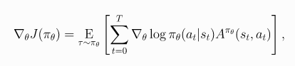
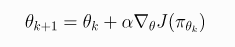
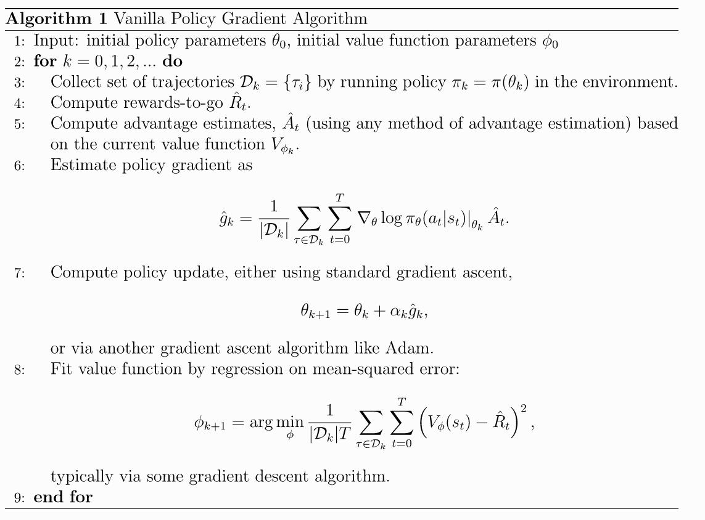
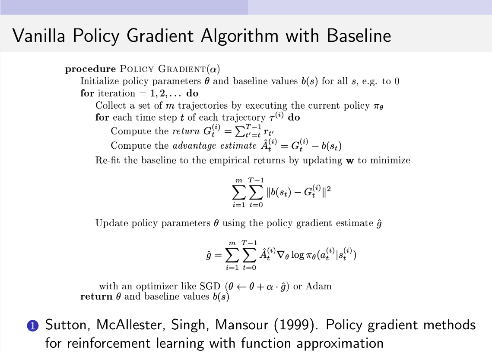

# 2 spinup-VPG

策略梯度算法的关键思想是: **提高高回报操作的动作的概率, 减少低回报动作的概率**.

VPG算法:

* on-plocy算法
* 可用于离散或连续动作空间
* 支持使用MPI接口并行化

## 公式定义

令 $$\pi_{\theta}$$ 代表策略, 则性能函数的梯度是

(1)

则随机梯度上升算法更新公式为

(2)

## 伪代码

VPG使用on-policy训练. 意味着它基于最新随机策略抽样动作进行探索. 动作选择的随机性取决于初始条件和训练过程. 

但是更新规则鼓励exploit rewards, 所以动作随机性会降低. 

这使得算法收敛速度比较快, 但是容易陷入局部最优.

## 参考文献

* [Policy Gradient Methods for Reinforcement Learning with Function Approximation](https://papers.nips.cc/paper/1713-policy-gradient-methods-for-reinfo), Sutton et al. 2000. Sutton Book经典.
* [Optimizing Expectations: From Deep Reinforcement Learning to Stochastic Computation Graphs](http://joschu.net/docs/thesis.pdf), Schulman 2016(a). 第2章介绍了策略梯度理论, 包括伪代码.
* [Benchmarking Deep Reinforcement Learning for Continuous Control](https://arxiv.org/abs/1604.06778), Duan et al. 2016. 最新Benchmark论文, 比较了VPG(如NN+Adam)与其他RL算法.
* [High Dimensional Continuous Control Using Generalized Advantage Estimation](https://arxiv.org/abs/1506.02438), Schulman et al. 2016(b). 本文实现的VPG用广义优势估计(GAE)来计算PG.
