# 4 周博磊RL-8-IRL

IL

1. 训练简单稳定
2. 分布偏移问题
3. 性能上限不超过示例数据
4. 数据获取问题

RL

1. 性能上限可以超过人类
2. 探索与利用的均衡
3. 某些任务无法快速学习有效策略或者代价很高

RL+IL
1. 初始化+微调
   - 性能可以比初始化的更好
   - 无法解决分布偏移, 可能会忘记初始化学会的策略
2. 纯RL+示例的off-policy
   - 无偏RL
   - 示例数据不一定一直有用
3. 混合目标函数, 让模仿学习作为辅助loss.
   - 性能优势
   - 引入新的超参数
   - 不再是纯RL, 可能是有偏的

## 1. 模仿学习

模仿学习不能看作是纯监督学习, 因为还是一个序列决策任务, 之后的状态分布和动作决策相关.

一般都是直接拿人的数据进行训练

**但是: 当进入样本没有访问过的状态时, 会出错, 并且错误会累加**

### 1.1 解决1:**DAgger: Dataset Aggregation** 

1. 加入更多的数据. 即让训好的模型在环境中运行, 收集出错的状态, 人类再给他指导数据
   - **让训练数据的分布与策略产生的数据的分布一致**
   - 思想: 从策略收集数据, 让人打标签

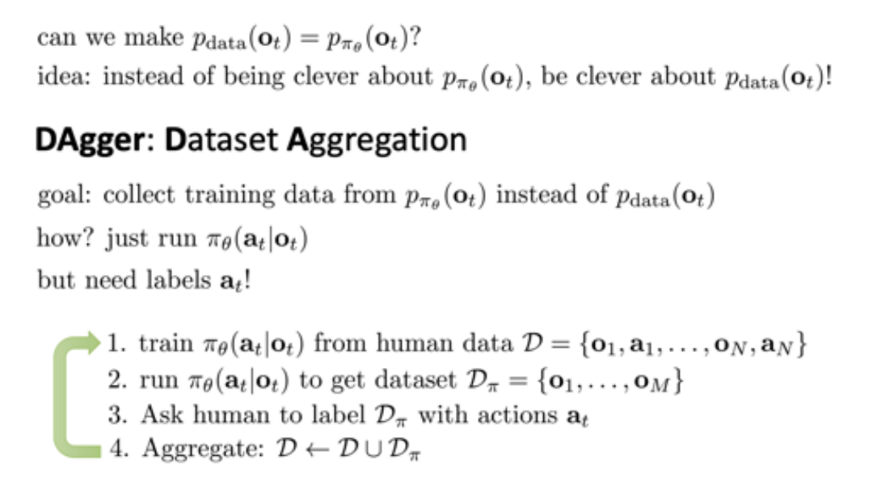

2. 缺点: 第三步需要人类打标签, 成本高
3. 改进: 让3步询问其他速度慢但是准确率高的算法.

### 1.2 模仿学习缺点

1. 需要人类提供数据，但通常数量有限
2. 人类不擅长提供某些类型的行动
3. 人类可以自主学习(非监督学习)

## 2 Inverse Reinforcement Learning (IRL)

### 2.1 Guided Cost Learning

1. paper:[Finn, et al, ICML'16. https://arxiv.org/pdf/1603.00448.pdf](https://arxiv.org/pdf/1603.00448.pdf)
2. 

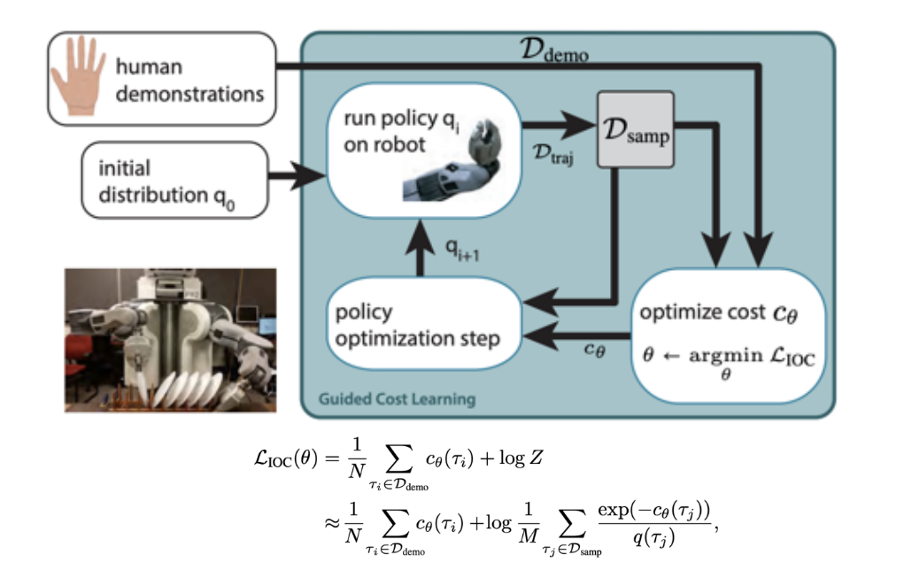

### 2.2 Generative Adversarial Imitation Learning(GAIL)

1. paper1 [Ho and Ermon, NIPS'16. https://arxiv.org/pdf/1606.03476.pdf](https://arxiv.org/pdf/1606.03476.pdf)
2. paper2 [Finn, Christiano, et al. A connection between GANs, Inverse RL, and Energy-based Models. https://arxiv.org/pdf/1611.03852.pdf](https://arxiv.org/pdf/1611.03852.pdf)

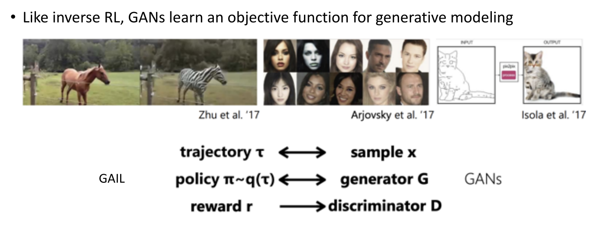
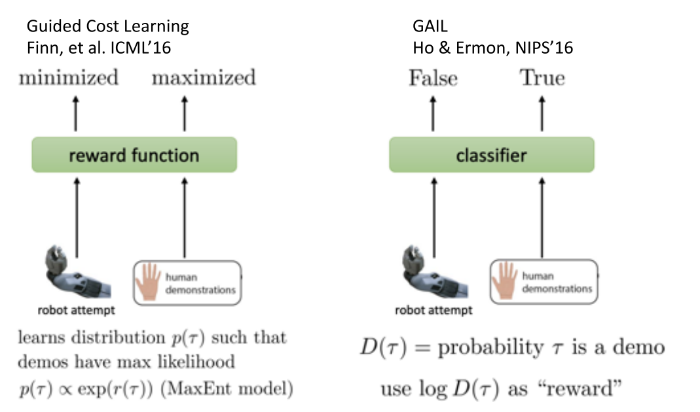

### 2.3 IRL 改进

改进方向:

1. Multimodal behavior:对于一个状态可能有多个解
   - 可以使用多峰的混合高斯分布
   - Latent variable models 或者 Autoregressive discretization
2. Non-Markovian behavior
   - 建模整个序列, 而不是只看当前状态---使用LSTM网络等

   

   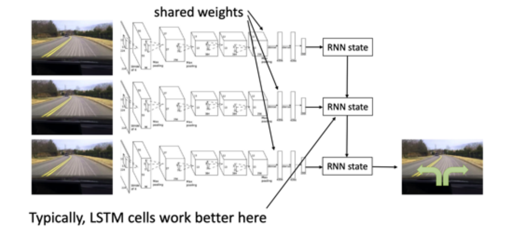
   

### 2.4 Learning from demonstration 

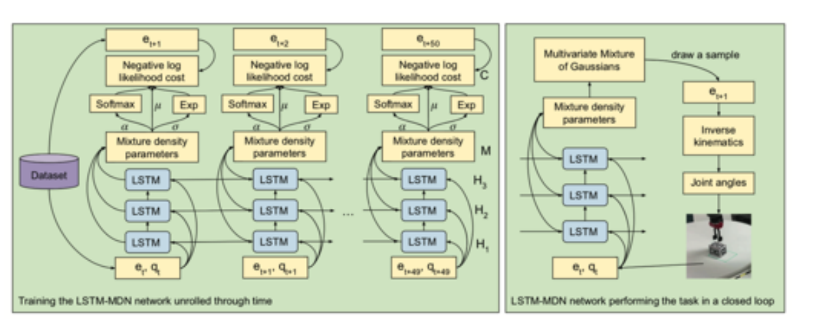

## 4 IL与RL结合

1. IL
   - 需要demonstrations
   - 分布偏移问题
   - **是监督学习, 训练简单稳定**
   - 但最好也就和演示一样
2. RL
   - 需要奖励函数
   - 必须进行探索和利用均衡
   - 潜在的非收敛性
   - **可以超越人类**

### 4.1 简单结合: Pretrain \& Finetune

1. 先用人类数据预训练模型,作为参数初始化机制
2. 然后使用RL提升策略
   - 学习处理偏移问题, 并超越示例数据性能

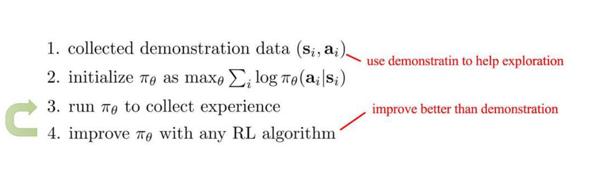

3. 问题:
   - 策略采集到的经验数据可能很差, 进而导致性能崩溃

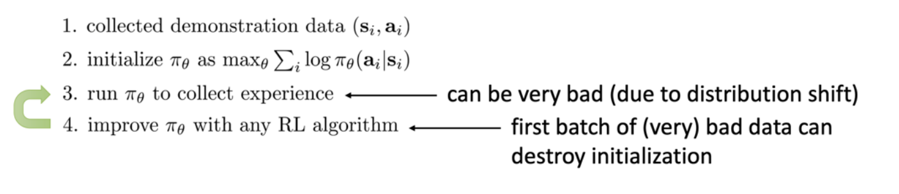

### 4.2 Solution: Off-policy Reinforcement Learning

1. 将demonstrations作为off-policy 数据
2. Off-policy policy gradient (with importance sampling)
3. Off-policy Q-learning

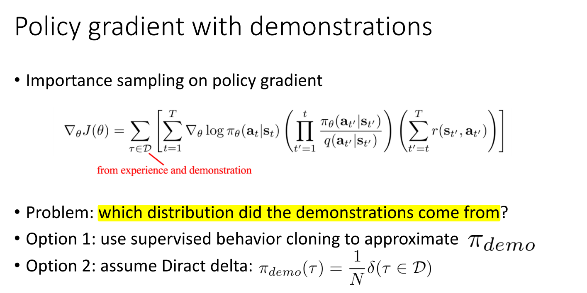

#### 4.2.1 Guided policy search (GPS)

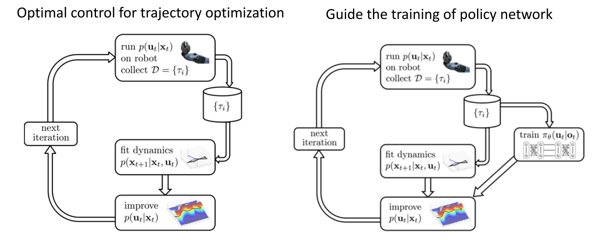
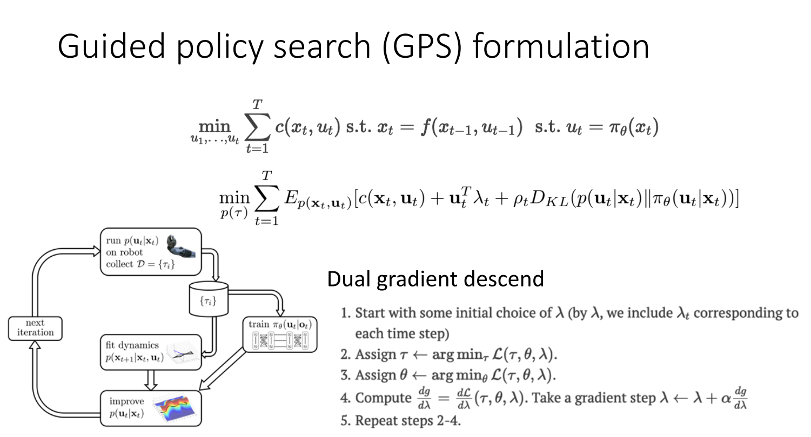

#### 4.2.2 Q-learning with demonstrations

直接将示例数据放到replay-buffer里

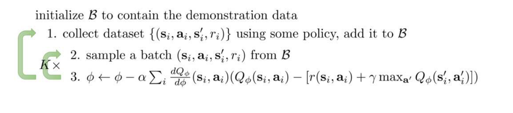

### 4.3 将模仿学习作为复制loss

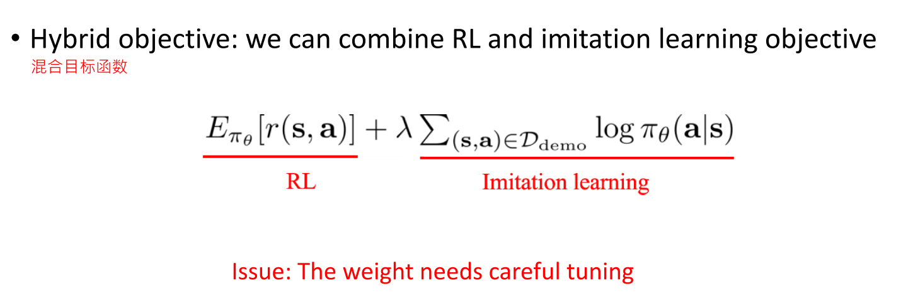

#### Hybrid policy gradient

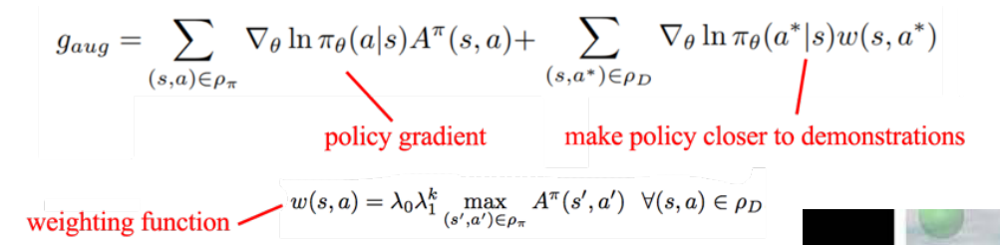

#### Hybrid Q-Learning

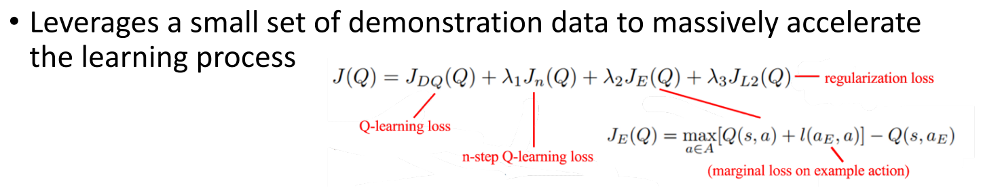

### 应用--电影中的Motion Imitation

