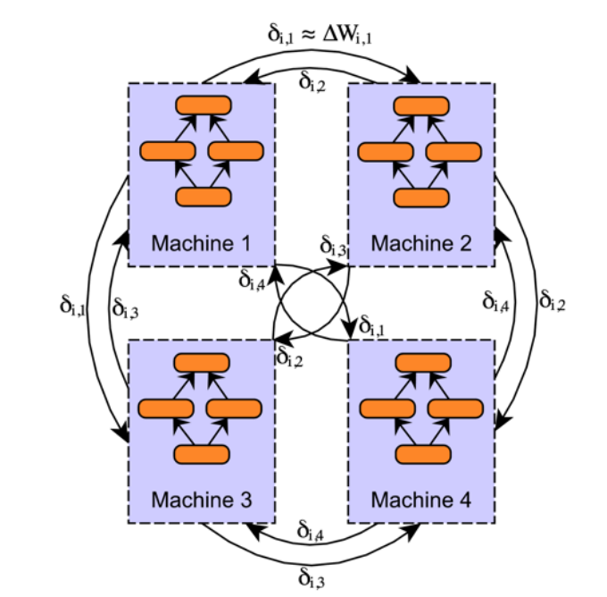
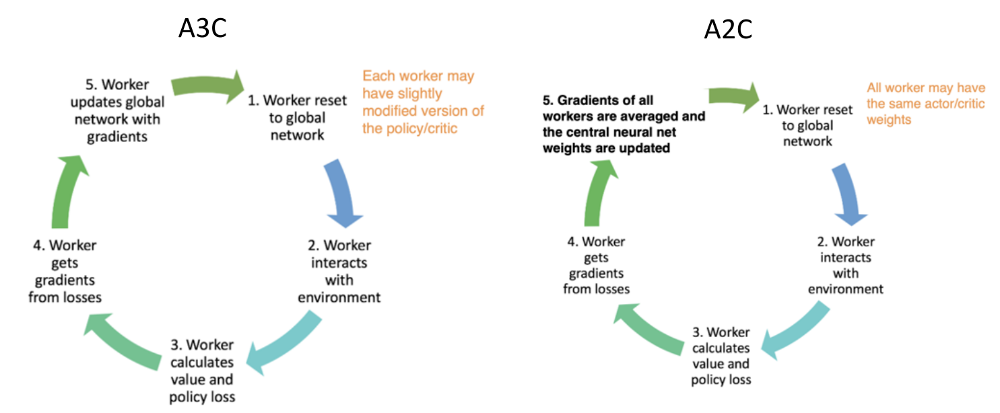
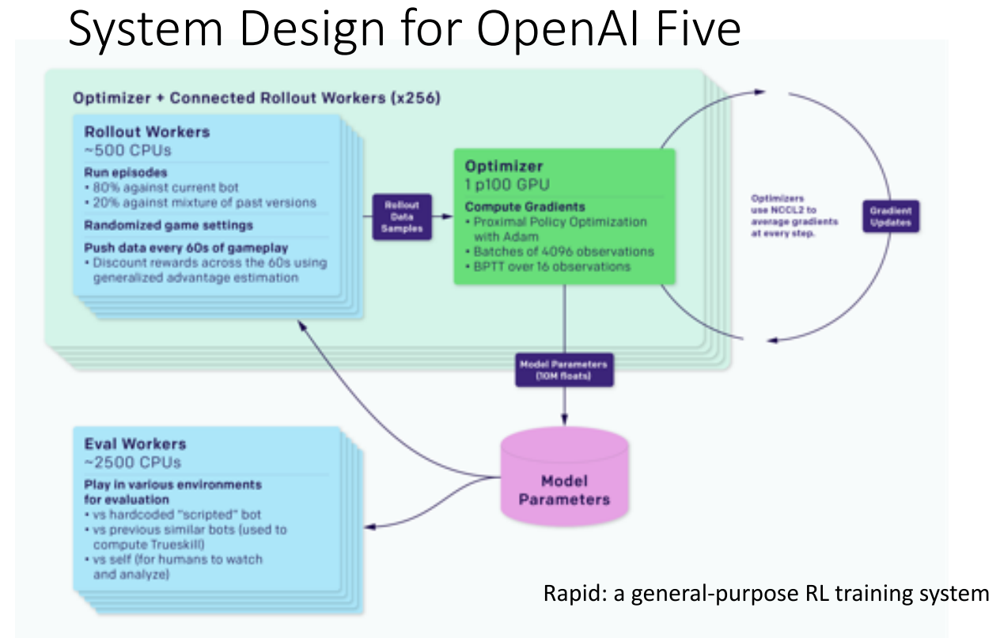

# 4 周博磊RL-9-分布式

## 1 分布式ML

ML并行化有两种方法:
1. 模型并行: 不同机器负责网络不同部分的计算
2. 数据并行: 不同机器都复制整个模型, 用不同的数据进行计算
3. 模型和数据都并行
   - 模型一般使用多GPU并行, 然后数据在不同机器上并行

分布式系统一般要平衡并行程度和性能, 一般从一下两个视角进行考虑

### 1.1 模型参数更新

1. 参数平均
   - 每个worker都复制当前参数
   - 每个worker使用部分数据训练
   - 全局参数用所有worker的平均

   

   
   

2. 传递梯度
   - 直接把每个worker的梯度传给server, 进行加权平均

   

   
   

### 1.2 模型更新

根据模型更新方法可以分为同步更新和异步更新
1. 同步: 智能体并行训练, 所有智能体训完一轮之后, 同时更新所有模型. 
   - 必须等最慢的那个训完才能更新
2. 异步: 全局网络用单独的worker更新, 不用等所有的智能体都训完一轮在更新
   - 可能会不一致, 性能不如同步的好
   - Hogwild: Lock-free asynchronous SGD, **证明了异步SGD性能可以接近同步算法**

3. Decentralized Asynchronous Stochastic Gradient Descend
   - 之前的方法都要有一个中心化的sever, 它出错可能导致所有的都出错
   - 使用p2p通信, 去中心化地更新参数
   - Scalable distributed dnn training using commodity gpu cloud computing.
   
   

   
   

### 1.3 分布式系统case

1. MapReduce

   

   
   

2. DisBelief
   - GooGle 分布式学习系统
   - 在CPU上的模型并行和数据并行的结合
   - [paper](https://papers.nips.cc/paper/2012/file/6aca97005c68f1206823815f66102863-Paper.pdf)

   

   
   

3. AlexNet
   - 由于当时显存限制, 模型在实现时, 把kernel分成了两部分, 在两块显卡上计算
   
   

   
   

## 2 分布式RL

**多个agent, 多个env, 每个env多个episode**

### 2.1 General Reinforcement Learning Architecture (GORILA)

1. DQN: 单智能体, 单机, 单个环境, 效率很低
2. GORILA: 
   - 多机, 其中一个parameter server
   - 需要reply memory: 多个actor产生大量数据传到replay-buffer里
   - Q网络更新使用参数server机制进行更新.
   - [deepmind-paper](https://arxiv.org/pdf/1507.04296.pdf)

### 2.2 A3C/A2C

1. AC: 
   - Critic使用Qlearning更新
   - Actor使用Q值计算梯度:

   

   
   
   

   
2. AAC(Advantage AC)
   - 用V作为baseline计算优势函数A.
   - 用A计算策略梯度
3. A3C (Asynchronous Advantage Actor Critic): 
   - **单机多CPU线程异步变体** 1-step Sarsa, 1-step Qlearning, n-step Q-learning, AAC.
   - **用多个并行的Actor进行探索**
   - 由于智能体的多样性, **不需要reply memory**稳定训练
   - 不需要线程锁
   - **为什么Asynchronism有用?**, 异步会引入噪声, 可以提供探索性和正则化.
   - 如何用GPU对A3C 加速? A2C

   

   
   

4. A2C
   - 多CPU线程+GPU加速
   - Synchronous版本: 等每个actor训完, 然后取平均.
   - 可以使用GPU提升效率(large batch sizes)
   - 因为使用的同步更新, 每个actor的参数也更准确
   - [代码](https://github.com/ikostrikov/pytorch-a2c-ppo-acktr-gail)

5. Apex-X (Distributed Prioritized Experience Replay): 多机版本的分布式DQN/DDPG
   - A2C/A3C 在多机上不好扩展
   - RL收集rollout数据比较难, Apex-X使用并行Actor与环境交互, 收集大量数据来加速训练
   - 一个learner更新参数, 再把参数复制给多个Actor进行rollou来收集数据

   

   
   

6. IMPALA (Importance Weighted ActorLearner Architecture)
   - 一种异步(Asynchronous)的设计, 效率比A2C 高
   - Actor只用来收集数据, 没有梯度
   - Actor之间互相独立, **因为每个Actor保留的参数不同, 所以使用重要性采样对不同Actor采样的数据进行加权**. 
   - **对于策略梯度直接使用重要性采样权重**
   - **对于critic使用V-Trace目标函数**
   
   
   

   
   
   

7. RLlib: 把不同的分布式方法进行模块化, 可以统一调用和组合不同的分布式思想
   - 不同分布式思想可以有GPU/CPU, 单节点/集群两个思考维度
   - RLlib可以通过组合不同的模块, 快速实现不同的分布式RL算法
   - 在进行系统实现的时候, 通过抽象出不同的层次整合
   - 可以很快地搭建不同的复杂系统

8. OpenAI Five

