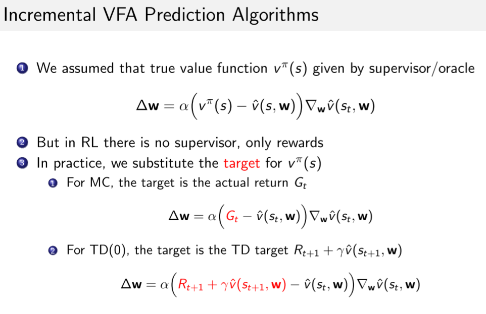
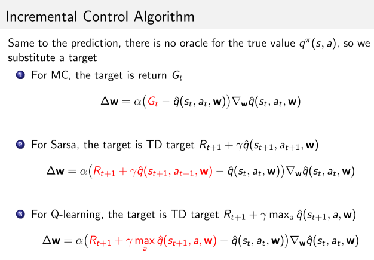
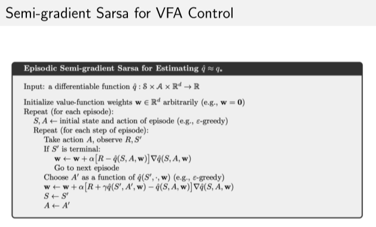
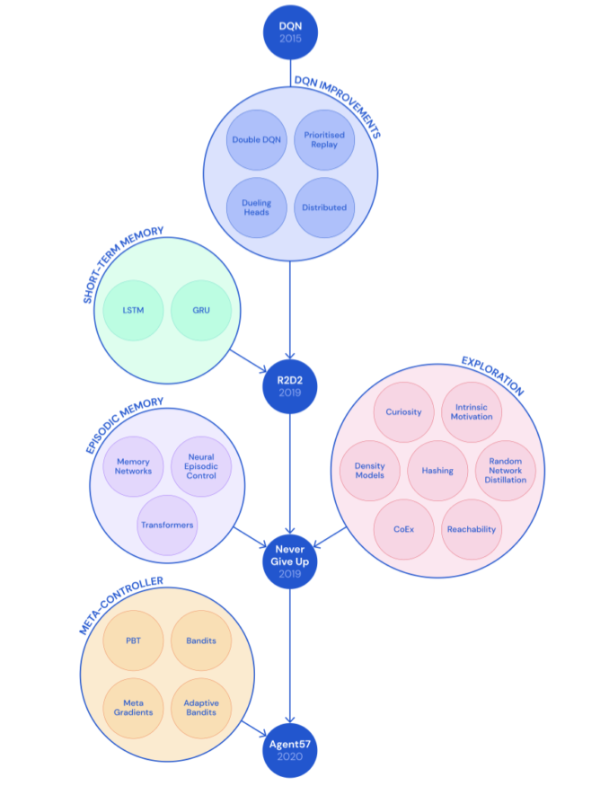

# 4 周博磊RL-5-值函数逼近

## 1 TD与MC

1. MC
   - G是**无偏的**, 但是是对真实V值进行noisy采样, 所以方差大; 
   - $$E[G_t] =v(s_t)$$
   - 线性: $$\Delta w=\alpha(G_t-\hat{v}(s_t, w))\triangledown_w \hat{v}(s_t, w) =\alpha(G_t-\hat{v}(s_t, w))x(s_t) $$
2. TD
   - TD target $$R_{t+1}+\gamma \hat{v}(s_{t+1}, w) $$是真实V的**有偏采样**.
   - $$R_{t+1}+\gamma \hat{v}(s_{t+1}, w) \neq v(s_t)$$
   - 线性: $$\Delta w=\alpha(R+\gamma \hat{v}(s', w)-\hat{v}(s, w))\triangledown_w \hat{v}(s, w) =\alpha(R+\gamma \hat{v}(s', w)-\hat{v}(s, w))x(s) $$

## 2 基础

## 3 TD近似的收敛性问题

### TD在off-policy和非线性近似的时候为什么不稳定?

以下问题引入了太多误差累积/

1. sarsa或者Q-learning在计算的时候,梯度里也包含了用当前参数计算下一步状态值;
2. 同时, 更新过程中设计两个近似过程:
   - 用梯度更新近似bellman方程迭代
   - 对价值函数的近似
3. 在off-policy的时候, 行为策略和目标策略不同, 导致值函数估计不准确

### 死亡三角

1. 函数逼近. 近似引入误差.
2. bootstrapping. 比如TD,也是引入噪声; 而MC方法相对好,因为是无偏的,不用bootstrapping.
3. off-policy. 行为策略和目标策略不同, 可能导致miss online ,也是引入不确定因素

## DQN及其改进

### 算法

<a href="./dqn.md">DQN 算法</a>

实现和demo

[1 Demo of Breakout by DQN](https://www.youtube.com/watch?v=V1eYniJ0Rnk) 
[2 Demo of Flappy Bird by DQN](https://www.youtube.com/watch?v=xM62SpKAZHU)
[3 Code of DQN in PyTorch](https://github.com/cuhkrlcourse/DeepRL-Tutorials/blob/master/01. DQN.ipynb)
[4 Code of Flappy Bird](https://github.com/xmfbit/DQN-FlappyBird)

### 改进

[Agent57](https://deepmind.com/blog/article/gent57-Outperforming-thehuman-Atari-benchmark)

## 代码示例

[作业1](https://github.com/cuhkrlcourse/ierg6130-assignment)

[https://github.com/cuhkrlcourse/RLexample/blob/master/modelfree/q_learning_mountaincar.py](https://github.com/cuhkrlcourse/RLexample/blob/master/modelfree/q_learning_mountaincar.py)

[tutorial on the relevant algorithms](https://github.com/cuhkrlcourse/DeepRL-Tutorials)
