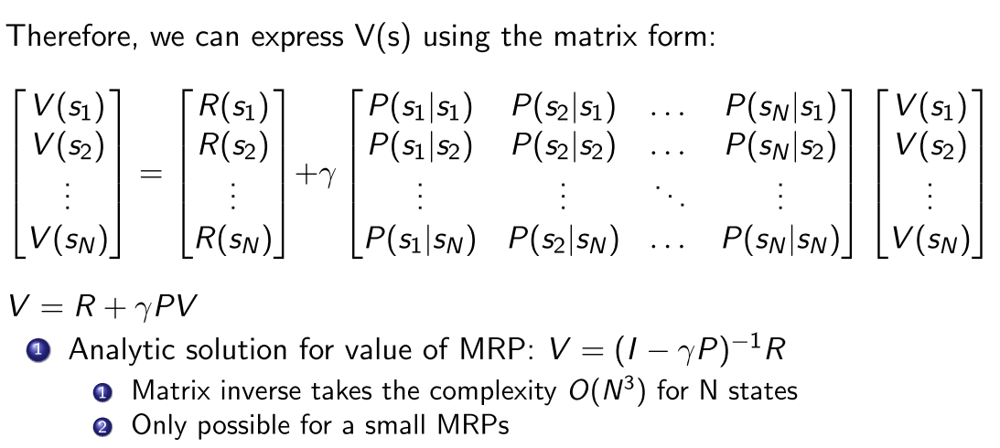
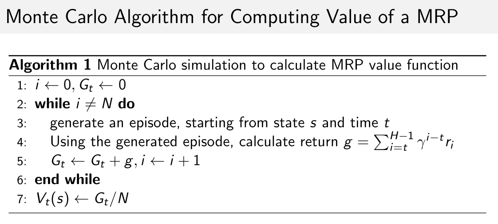
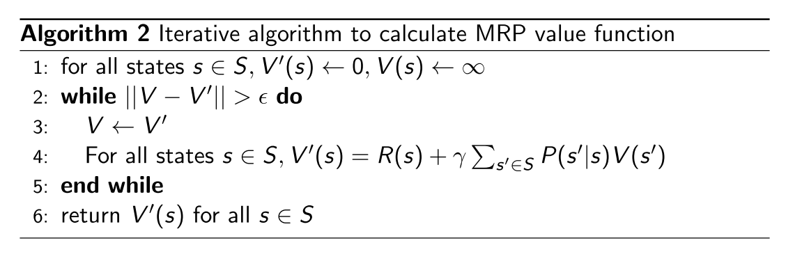
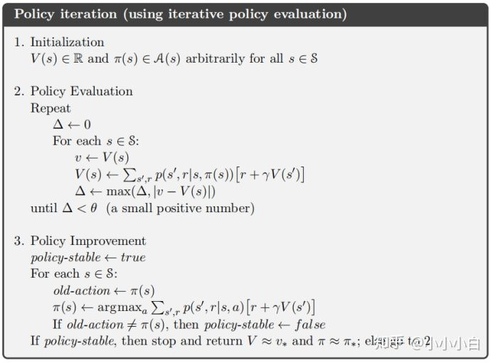
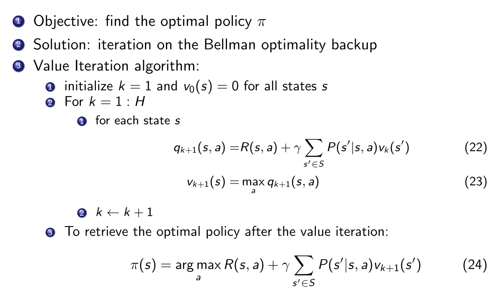

# 4 周博磊RL-2-MDP

## 基础

1. 马尔可夫过程,马尔科夫性
2. 马尔可夫链
3. 马尔科夫奖励过程,MRP=马尔科夫链+奖励函数
4. 一些定义

   - Horizon, episode的长度
   - return, reward的折扣累积和
   - 值函数, 当前状态未来期望累积奖励

5. 为什么使用折扣因子:

   - 避免马尔科夫链存在环时陷入死循环
   - 表示未来的不确定性
   - 当有立即回报时, 表示对较近的未来更感兴趣
   - 人或动物更关注即时奖励

## MRP的状态值函数

1. 状态的Bellman方程, $$V(s)=R(s)+\gamma \sum_{s'\in S} P(s'|s)V(s')$$

   

2. 计算MRP值函数方法:

   - DP
   - MC
   - TD

3. 例子

   

   

## MDP

1. MRP->MDP
2. 贝尔曼期望方程,贝尔曼最优方程
3. 预测和控制
4. 策略迭代, 策略估计-策略提升

   

5. 值迭代

6. 

   

## 总结

1. 值迭代, 计算量少,收敛慢,贝尔曼最优方程, DQN
2. 策略迭代,计算量大,收敛快,贝尔曼期望方程

   - 策略估计, 贝尔曼期望方程迭代计算值函数, 直到收敛到局部最优
   - 策略提升, 对值函数取argmax得到每个状态的当前最优策略
