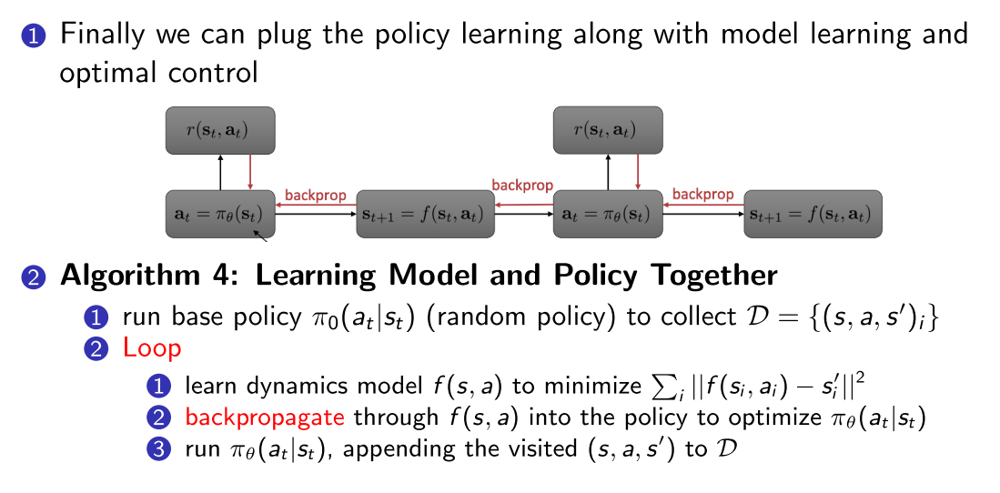

# 4 周博磊RL-7-model_based

model-based方法样本效率高, (而不是真实事件)

## 1. Table Lookup Model

### 1.1 model-based

1. 之后,可以通过估计出的模型进行planing, MC或TD
2. 但是当模型出错的时候,学习到的值函数也是错的
   - 当模型准确率低的时候, 使用model-model
   - 解释模型的不确定性或置信度: 使用高斯过程或者贝叶斯模型等概率模型.

### 1.2 整合planning和learning

## 2. Model-based policy optimization

1. 纯PG从trajectory中学习, 是model-free的, 但是其推到的时候假设状态转移函数和性能函数无关. 但真实情况不一定
2. Model-based policy optimization与最优控制理论联系密切. 最优控制理论中一般把system dynamics (model)作为约束项, 最小化cost函数
   - cost函数可以看作RL中的负奖励函数
   - 最优解可以通过 Linear-Quadratic Regulator (LQR) and iterative LQR (iLQR)求解.

   

   
   

### 2.1 算法1--整合model learning and trajectory optimization

### 2.2 算法2

解决planning 偏移问题

### 2.3 算法3-MPC

1. 上述算法在拟合新model之前, 执行所有了planned actions, 还是无法解决一开始就有偏移的问题.
2. 使用Model Predictive Control (MPC)
   - 同样是优化整个trajectory, 但是执行的时候只往下执行一步, 然后进行replan
   
   

   
   
   

   

### 2.4 算法4--将MPC与policy learning结合起来

### 2.5 环境模型的参数化:

1. Global model: f使用大型神经网络参数化
   - 拟合能力强但是需要大量数据
2. Local model: 把transition建模为时变线性高斯函数
   - 数据效率高
   - 但是对于非平滑函数表现不好, 
   - 在数据量大的时候很慢
   

## 3 具体应用的算法

### 3.1 机械臂搭积木--PILCO

1. 论文: A model-based and data-efficient approach to policy search. Deisenroth and Rasmussen. ICML 2011
2. Demo link: [http://mlg.eng.cam.ac.uk/pilco/](http://mlg.eng.cam.ac.uk/pilco/)

### 3.2 机械抓取

