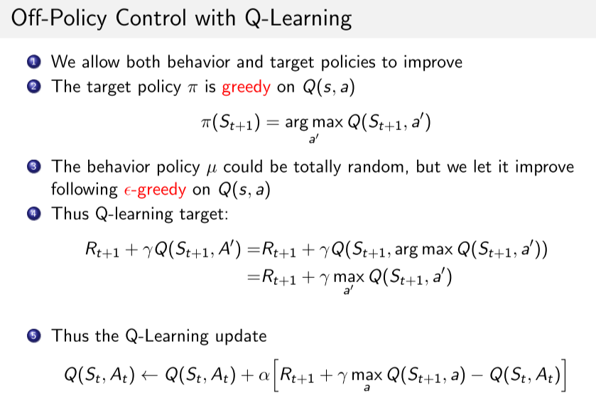

# 4 周博磊RL-3-model_free

## MC 方法

<a href="#imsamp">123</a>

### 1. MC增量迭代公式

### 2. MC与DP区别

1. MC可用于model-free 
2. 不关心与采样轨迹无关的状态，减少状态更新成本；
3. 在状态空间特别巨大的环境中，状态转移函数很复杂。使用MC采样效率更高

## TD

### TD 与MC对比

1. TD可以online学习； MC必须等一个回合结束
2. TD可以使用不完整的序列学习，MC必须完整序列
3. TD可以用于连续或无终止状态的环境，MC只用于episodic的环境
4. TD利用马尔科夫性，在MDP环境效率更高；MC没用马尔科夫性。
5. **TD: 低方差，online，不完整序列**

### n-step TD 

## TD, MC, DP

## model-free Control

### MC 

### TD - 可以online

#### On-Policy 

#### Off-Policy

1. on-policy: 行动策略不使用最优策略，保证探索所有动作，然后减少探索性（比如epsilon-greedy）
2. off-policy：学习的策略和行动策略不同。行动策略可以更具探索性。

   - 行为策略可以更具有探索性
   - 样本重用, 样本效率高, **不需要重要性采样**
   - 可以使用人类或其他数据(模仿学习)
   - **没有去采样下一个action**

### on-policy, off-policy 对比

## 例子

[https://github.com/cuhkrlcourse/RLexample/tree/master/modelfree](https://github.com/cuhkrlcourse/RLexample/tree/master/modelfree)

## 重要性采样

<a name="imsamp" id="imsamp" href="#">重要性采样 </a> 

