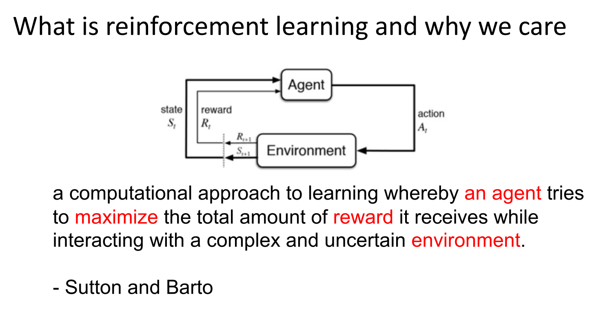
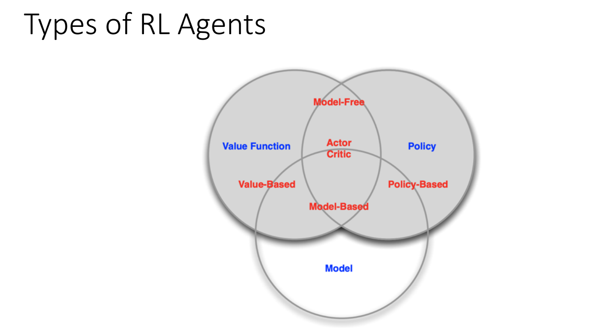

# 4 周博磊RL-1-概述

RL由 model, policy, value组成

## 链接

[Sutton Book](http://incompleteideas.net/book/the-book-2nd.html)
[Andrej Karpathy blog](http://karpathy.github.io/2016/05/31/rl/)
[Andrej的代码](https://gist.github.com/karpathy/a4166c7fe253700972fcbc77e4ea32c5)
[课程代码](https://github.com/metalbubble/RLexample)
[retro环境](https://github.com/openai/retro)
[retro介绍](https://zhuanlan.zhihu.com/p/37324507)
[Python tutorial](http://cs231n.github.io/python-numpy-tutorial/)
[PyTorch tutorial:](https://pytorch.org/tutorials/beginner/deep_learning_60min_blitz.html)
