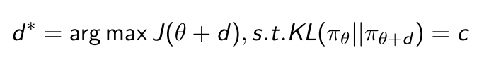

# 4 周博磊RL-6-策略优化
1. 优势:
   - 收敛性好, 至少是局部最优; 
   - 在高维动作空间更高效, PG输出是向量, value-based只是单值; 
   - 可以学习随机策略, value-based不可以. 比如剪刀石头布游戏, 随机更好.
2. 劣势
   - 经常收敛到局部最优; 
   - 评估策略方差比较大.

## 1. 策略梯度

1. 推导
2. 对于无法求导的性能函数,可以使用Cross Entropy Method (CEM)或者有限微分(Finite Difference)
   
   
   

   
   
   

   
3. score-function, $$\triangledown_\theta \log \pi_\theta(s,a) $$
   score function指的应该是每个样本会对应一个score, 这个score近似衡量了这个样本对于log likelihood的贡献. 最终的log likellihood就是每个样本的score加起来再加上一个常数. 因此, 当score的方差大的时候, 每个样本就提供了关于loglikelihood更多的信息, 所以用MLE估计参数的时候, 得到的参数估计的方差反而越小.
   
   

   

   
(1)

   

   

   
   

   

### 策略举例

考虑离散和连续, 使用softmax和高斯, 其导数如下

## 2 策略函数优化

<a href="./spinup_PG.md#spinup_pg">spinup-PG</a>

### A2C

### 参考链接

1. [A very nice summary of policy graident algorithms](https://lilianweng.github.io/lil-log/2018/04/08/policy-gradient-algorithms.html)

2. [REINFORCE code on CartPole:](https://github.com/cuhkrlcourse/RLexample/blob/master/policygradient/reinforce.py)

3. [Policy Gradient on Pong](https://github.com/cuhkrlcourse/RLexample/blob/master/policygradient/pg-pong-pytorch.py)

4. [Policy Gradient with Baseline on Pong](https://github.com/cuhkrlcourse/RLexample/blob/master/policygradient/pgb-pong-pytorch.py)

## 3 PG 改进

PG问题:
1. on-policy样本效率低, 用同一policy进行串行地采样和优化, 采样效率低;
2. 训练不稳定. 数据相关性大, (策略出错->错的样本->更坏的策略)导致训练崩溃, 无法自动修正偏差.

优化方向:
1. 样本效率低: 重要性采样(TRPO)
2. 不稳定: 限制策略更新的置信区间. (natural PG, TRPO)

### 3.1 重要性采样公式

(2)

(3)

### 3.2 Natural Policy Gradient

纯PG算法再参数空间进行梯度上升, ==**这种方法只考虑了更新最快的方向, 没有和策略联系起来, 而且对参数地初始化非常敏感**==.

因此, 可以考虑在分布空间(策略输出)上进心梯度上升, 即加入KL散度作为约束项, 控制分布空间的更新速度, 而不管曲率, (因为只关心由参数诱导的分布的, 因此更鲁棒.) 

(1)

由此将问题转化为带约束最优化问题

增加置信区间的鲁棒性

(4)

但是比率太大会导致训练不稳定性, 步长太大容易跳过最优解, 所以要限制这个比例的大小, 所以引入一个限制, 用KL散度:

(5)

NPG推导之后的形式: 

<b></b>

好处:
1. 不用显示设置学习率, 只用设置一个置信区间的大小$$\delta$$.
2. 参数的剧烈变化不会显著改变策略网络的输出.

伪代码

### 3.3 TRPO

1. NPG+important sampling的改进版.
2. 近似计算Fisher Information Matrix (FIM)的方法, 通过解线性方程$$Hx=g$$的方法估计$$x=H^{-1}g$$
   
   
   

   
   

   
3. TRPO伪代码
   
   

   
   

   
4. TRPO 论文证明了, 在迭代的过程中, 每一步都能产生更好的策略, 即通过在每步迭代中最大化$$M_t$$, 可以保证真实目标函数$$J$$不下降:
   
   

   
   

5. TRPO算法是MM算法的一个实例,
   - 目标函数最小化问题: 此时MM表示Majorize-Minimization, 每次迭代找到原非凸目标函数的一个上界函数, 求上界函数的最小值.
   - 目标函数最大化问题:  此时MM表示Minorize-Maximization, 每次迭代找到原非凸目标函数的一个下界函数, 求下界函数的最大值.
   - 期望最大化(EM)算法可以被视为MM算法的特殊情况, 在EM算法中通常涉及条件期望, 而在MM算法中, 凸性和不等式是主要焦点.
   
6. TRPO的问题
   - 为当前策略求$$H$$计算量大, 二阶优化
   - 逼近H需要large batch of rollouts
   - 共轭梯度(CG)算法实现复杂

### 3.4 ACKTR

1. 思想来源: 
   - SGD是一阶优化方法, 优化效率低
   - Natural Gradient Descend可以通过二阶优化加速收敛, 但是需要有H矩阵求逆过程
2. 通过Kronecker-factored Approximate Curvature (K-FAC)加速H矩阵求逆运算.

### 3.5 PPO

spinningup PPO

## 4. 值函数主线

1. Q-learning
2. DDPG
3. TD3
4. SAC

### 4.1 DDPG

对初始化很敏感

### 4.2 TD3

**只能用于连续动作空间.**

主要解决Q值过估计的问题.
1. Clipped Double-Q Learning. 
   - double Q function
   - 每个Q函数都有一个target net, 用估值小的target输出计算TD Target.
   - $$y(r, s', d) = r+\gamma(1-d)min_{\color{red}{i=1, 2}}Q_{\phi_{i, targ}}(s', {\color{red}{a_{TD3}(s')}}) $$ 

2. Target Policy Smoothing.往target action中加入噪声并clip, 
   - $$ {\color{red}{a_{TD3}(s')}} = clip(\mu_{\theta, targ}(s')+clip(\epsilon, -c, c), a_{low}, a_{high} ), \epsilon\sim \mathcal{N}(0, \sigma)$$ 
   - $$\epsilon$$加入噪声
   - clip起到正则化作用, 避免策略出现尖峰.
3. “Delayed” Policy Updates. TD3策略网络的更新比Q网络更新慢. paper建议每两次Q更新一次policy.

4. 代码: [https://github.com/sfujim/TD3/](https://github.com/sfujim/TD3/)

### 4.3 SAC

**基础版本只能用于连续动作空间, 但是可以改进成离散动作空间.**

使用**off-policy优化随机策略**, 通过加入熵正则化项, 把随机策略优化和DDPG方法结合.

1. Entropy-regularized RL:策略优化目标为最大化预期回报和熵(策略的随机性)之间的权衡

熵正则化项本质为了保证探索性

2. 与TD3一样, 也使用了double Q函数, 计算目标时也是用较小的target Q;

3. 策略优化: **使用Reparameterization trick**. 可以把关于动作的期望写成关于噪声的期望.
   - 因为动作分布取决于策略参数, 会造成样本和参数的相关性.
   - 使用Reparameterization之后, 动作分布就与策略参数去相关了

4. Reparameterization技术介绍
   - 假设要求如下期望: $${\color{red}{\triangledown_\theta E_{x\sim p_\theta(x)}[f(x)]} }$$, x采样值严重依赖于参数$$\theta$$的分布
   - 可以通过引入一个与$$\theta$$独立的噪声变量$$\epsilon$$重写采样函数; 
   - 将x重参数化为$$\epsilon$$的函数, $$p_\theta$$的随机性被$$q(\epsilon)$$代替, 则$$g_\theta(\epsilon)=\mu_\theta+\epsilon \sigma_\theta, where \epsilon \sim \mathcal{N}(0, 1)$$
   
   
   

   
   

5. 代码: [https://github.com/pranz24/pytorch-soft-actor-critic/blob/master/sac.py](https://github.com/pranz24/pytorch-soft-actor-critic/blob/master/sac.py)
   
