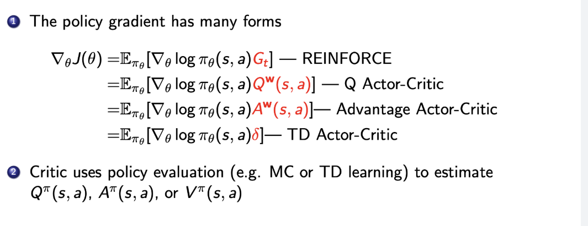
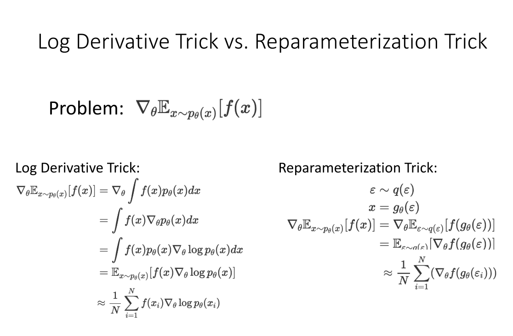

# 4 周博磊RL-10-总结

## MDP 

1. 策略, 值函数, model 
2. 贝尔曼期望方程, 贝尔曼最优方程
3. 评估, 控制, 策略评估与策略提升
4. model-base/ model-free
5. 值迭代/策略迭代, on/off-policy
6. DP/MC/TD 

7. SARSA: On-policy
   - 从Q导出动作$$A_t$$, 并执行
   - $$A_{t+1}$$也是从Q中导出的
   - 使用贝尔曼期望方程更新
8. Q-learning:Off-policy
   - 从Q导出动作$$A_t$$, 并执行
   - $$A_{t+1}$$是用argmaxQ求出的, 没有实际执行, 是想象出来的
   - 使用贝尔曼最优方程更新

## 值函数逼近

1. MC, TD
2. Q-learning/ DQN

## 策略优化

1. 直接简单, 收敛性好, 随机策略
2. log求导技巧, 重要性采样
3. REINFORCE: 基于MC的PG算法
4. 使用critic降低方差: QAC, AAC

1. SOTA算法
   - PG--> Natrual PG/TRPO--> ACKTR-->PPO
   - Q-learning --> DDPG --> TD3 --> SAC

2. Log Derivative Trick vs. Reparameterization Trick

## 高阶RL

1. model-based RL
   - 基于value的, 基于policy的
2. IL+RL
   - 预训练+微调
   - off-policy
   - IL 作为辅助损失 
3. 分布式RL system
   - 数据并行, 模型并行
   - DQN, GORILA, A3C, A2C, Apex-X, IMPALA, RLlib

## 未解决的问题

1. Sample efficiency
2. **通用RL**
   - 多任务
   - 少先验
3. 新环境设计, 新智能体
4. RL中引入ML的方向: 
   - 预测模型
   - 生成模型
5. 元学习和多任务学习
