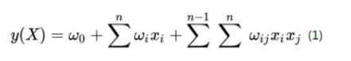
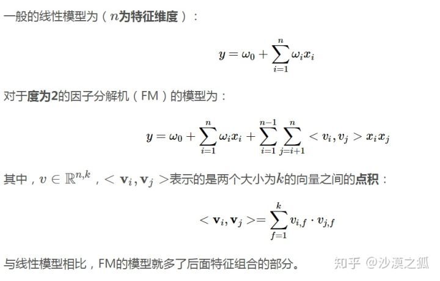
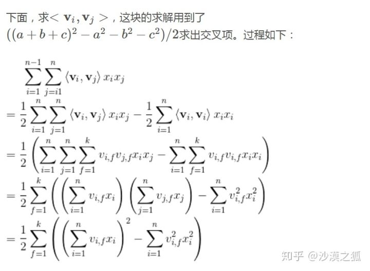
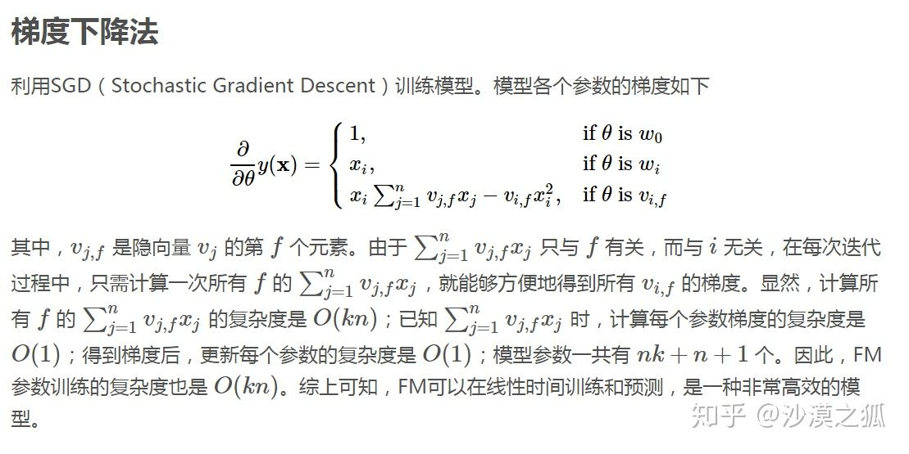
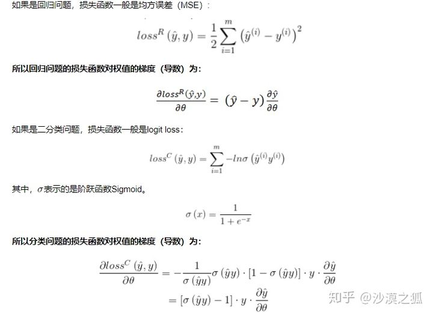

# 1 传统算法-FM

FM（factor Machine，因子分解机）算法是一种基于矩阵分解的机器学习算法，是为了解决大规模稀疏矩阵中特征组合问题。

## 1. 核心思想

**特征组合**，通过对两两特征组合，引入交叉项特征，提高模型得分；
**高维灾难**，通过引入隐向量（对参数矩阵进行矩阵分解），完成对特征的参数估计。

- 传统矩阵分解(MF), CF 等方法只能用到用户 id 特征，使用的特征少且稀疏； 而 LR 方法可以使用多特征，但是特征之间独立，忽略特征之间的关联信息。
- POLY2 使用一个权重矩阵进行二维特征组合，高维稀疏矩阵且满足 xi 和 xj 组合的样本量少，计算量大，权重更新慢，对于缺失的特征组合的权重更新不准确。

FM 解决高维稀疏数据下的特征组合问题，优点：

- 可以在非常稀疏的数据中进行合理的参数估计；
- FM 模型的时间复杂度是线性的；
- FM 是一个通用模型，它可以用于任何特征为实值的情况；同时解决了特征组合问题。

## 2. FM model

FM 给每个特征分量 xi，引入一个辅助向量 vi=(v1,v2,.......vk)，然后利用 vi\*vj 对交叉项的系数 wij 进行估计。

<b>FM二阶公式</b>

 
为了降低计算复杂度，通过公式变换，复杂度从 O(kn\*n) --> O(kn), 其中 k 是属性数量，n 是样本数。

## 3. 训练

<b>SGD</b>

损失函数可以是 MSE 或者 Ligit loss。

<b>损失函数</b>

