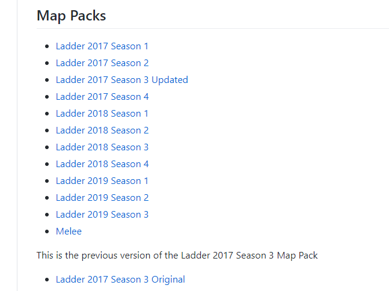

# 1.环境安装

windows环境安装。

参考教程地址：
- [YouTuBe](https://www.youtube.com/watch?v=v3LJ6VvpfgI&list=PLQVvvaa0QuDcT3tPehHdisGMc8TInNqdq)
- [doc tutorial](https://pythonprogramming.net/starcraft-ii-ai-python-sc2-tutorial/)
- [BiliBili](https://www.bilibili.com/video/BV1uv411q7jR?from=search&seid=4612749856828866356)

## 1. 游戏下载

[官网下载](https://starcraft2.com/)，下载完成后安装游戏，游戏比较大。

## 2. 地图下载

[github地址](https://github.com/Blizzard/s2client-proto#downloads)

往上翻，注意解压密码：`iagreetotheeula`

|  | 
| - |

下载一个赛季的地图，这里用的是2019年第一赛季。加压到游戏安装目录下，新建一个`Maps/`文件夹，把解压后的内容移到你的`E:\SC2\StarCraft II\Maps`目录里。

## 3. 下载SC的python API

下载`python-sc2`和`pysc2`，后边这个是deepmind提供的API，但是一般认为比较复杂，不如前一个简单上手，

```bash
pip install sc2
pip install pysc2
```

修改`sc2`包下的`path.py`文件。本文用的是anaconda环境，所以在`E:\soft\anaconda\envs\py36\Lib\site-packages\sc2`下，

内容修改为

```python

BASEDIR = {
    "Windows": "E:\SC2\StarCraft II",
    "Darwin": "/Applications/StarCraft II",
    "Linux": "~/StarCraftII",
    "WineLinux": "~/.wine/drive_c/Program Files (x86)/StarCraft II",
}
```

## 4. 测试运行

```python

import sc2
from sc2 import run_game, maps, Race, Difficulty
from sc2.player import Bot, Computer


class SentdeBot(sc2.BotAI):
    async def on_step(self, iteration):
        # what to do every step
        await self.distribute_workers()  # in sc2/bot_ai.py


run_game(maps.get("AbyssalReefLE"), [
    Bot(Race.Protoss, SentdeBot()),
    Computer(Race.Terran, Difficulty.Easy)
], realtime=True)

```