# 8-拉格朗日对偶理论

仿射集,仿射函数, 凸集, 凸函数, 凸优化问题相关定义, 可以查看[凸优化笔记 0](./co.md)

## 1. "松弛"与"界"

我们面对数学规划问题中的约束项时, 有时可以很直观地感受到一些约束比较简单, 而另一些约束是比较复杂的.

$$
\begin{array}{ll}
\max  & c^{\top} x \\
\text{s.t. }  & A x \leq b  \quad \text {(nice constraints)} \\
& D x \leq d \quad  \text{(complicated constraints)} \\
& x \in X
\end{array}
$$

一个自然而然的想法是能否想办法把这些比较难的约束去掉. 由此引申出优化求解方法中一种重要的思想--"松弛".

关于"松弛", 最容易理解的例子, 莫过于求解线性整数规划问题时, 可以将整数约束转化为整个集合区间上的连续约束, 即"**连续松弛**". 在得到这样一个线性规划松弛问题之后, 可以使用单纯形或内点法等进行快速求解. 之后使用"分支定(上/下)界"的方法, 使用类似于树搜索的方法求解原问题的最优解.

此外, 还可以将困难的约束直接放进目标函数里, 通过引入一个 **price**, 对违反该约束的函数取值增加一些代价. 这就是"**拉格朗日松弛**"的基本思想.

**拉格朗日松弛可以比连续松弛提供更紧的界**

### 1.1 示例 1

我们首先看这样一个问题,

$$
\begin{array}{ll}
\min _{x, y} &c^{T} x+d^{T} y \\
\text{s.t. } &A_{1} x=b_{1} \quad (A1)\\
&A_{2} y=b_{2} \quad (A2) \\
&A_{3} x+A_{4} y=b_{3} \quad (A3)\\
& x,y \in D.
\end{array}
$$

很明显, 约束 A1 和 A2 分别只和 x/y 有关, 而约束 A3 把两类变量耦合在了一起。我们看看如果将 A3 放入目标函数, 问题会转为什么样子:

$$
\begin{array}{ll}
\min _{x, y} &c^{T} x+d^{T} y+\lambda^{T}\left(A_{3} x+A_{4} y-b_{3}\right) \\
\text{s.t.}  &A_{1} x=b_{1} \\
&A_{2} y=b_{2} \\
& x,y \in D.
\end{array}
$$

这其实相当于分别求如下两个优化问题, 再进行求和:

- 子问题 1

$$
\begin{array}{ll}
\min _{x} & c^{T} x+\lambda^{T} A_{3} x \\
\text{s.t.}  & A_{1} x=b_{1} \\
\end{array}
$$

- 子问题 2

$$
\begin{array}{ll}
\min _{y} & d^{T} y+\lambda^{T} A_{4} y \\
\text{s.t.}  & A_{2} y=b_{2} \\
\end{array}
$$

问题看起来简单了很多. 引入的新变量就是上边所说的 price, 即**拉格朗日乘子**, 也称"**对偶变量**".

- price 的意思是, 对于违反松弛的约束的变量取值的情况, 可以通过这个$$\lambda$$进行惩罚.
  - 求极大, 就让松弛项为负, 使目标值比原来变小; 求极小, 让松弛项为正

**这个 price 还有另一层意思, 我们通过松弛引入了原问题的一个下界, 之后我们可以通过调整$$\lambda$$, 让新问题的最优解的取值满足原来的约束.**

### 1.2 示例 2 整数规划问题

传统整数规划求解方法包括割平面法/动态规划/分支定界等

但是再大规模整数规划问题下, 这些方法无法在可接受的时间内求解. 因此一般寻求对原问题进行分解或松弛, 之后再使用割平面或者分支定界, 快速求解小规模问题的方法. 主要方法分为如下三类.

```
1. Benders decomposition (主要思想是行生成+割平面方法)
2. Dantzig-Wolfe decomposition (主要思想其实就是列生成)
3. Lagrangian decomposition (主要思想是 Lagrangian relaxation)
```

考虑如下 0-1 整数规划问题, 我们看一下使用了拉格朗日松弛后会发生什么:

$$
\begin{array}{lll}
(0-1 \mathrm{IP}) & \min & c^T x,\\
& \text{s.t. } & Ax\le b,  \\
&& x\in \{0,1\}^n \\
\end{array}
$$

将$$Ax \le b$$进行松弛, 引入拉格朗日乘子$$u\in R^m_+$$. 为什么此处的$$u$$取正值, 下一节会进行介绍.

$$
\begin{aligned}
z(u) &=\min \left\{c^{\mathrm{T}} x+u^{\mathrm{T}}(A x-b) \mid x \in\{0,1\}^{n}\right\} \\
&=-u^{\mathrm{T}} b+\min \left\{\left(c+A^{\mathrm{T}} u\right)^{\mathrm{T}} x \mid x \in\{0,1\}^{n}\right\} \\
&=-u^{\mathrm{T}} b+\sum_{i=1}^{n} \min \left\{\left(c+A^{\mathrm{T}} u\right)_{i} x_{i} \mid x_{i} \in\{0,1\}\right\} \\
&=-u^{\mathrm{T}} b+\sum_{i=1}^{n} \min \left\{\left(c+A^{\mathrm{T}} u\right)_{i}, 0\right\}
\end{aligned}
$$

可以看出, 在求解$$z(u)$$的时候, 只需要遍历一遍向量$$(c+A^{\mathrm{T}} u)$$的各个分量, 如果大于 0, $$x$$就取 0; 如果小于 0, $$x$$就取 1. 可以在$$O(n)$$时间内求解.

### 1.3 一般形式的拉格朗日松弛方法

为了更明确地说明拉格朗日乘子在不同情况下的取值, 下面对等式约束和不等式约束进行分别说明, 混合约束的情况下就是把这两种进行组合.

注:

- 我们将**原来的问题称为原始(Primal)问题, 用记号 P 表示**

#### 1.3.1 等式约束线性规划

$$
\begin{array}{llc}
(\mathrm{P}) & \min & f(x) = c^T x,\\
& \text{s.t. } & Ax = b,  \\
&& x  \ge 0 \\
\end{array}
$$

由等式约束$$b - Ax = 0$$, 引入拉格朗日乘子$$\lambda \in R^m $$, 得到

$$
\begin{array}{lc}
\min &  c^T x + \lambda^T (b- Ax),\\
\text{s.t. } & x\ge 0 \\
& \lambda\in R^m \\
\end{array}
$$

此时我们得到了一个在很简单的约束上的目标函数. 将其进行进一步整理, 并定义函数:

$$
\begin{array}{ll}
d(\lambda) &= \min_{x\ge0} \{ b^T \lambda + (c-A^T \lambda)^T x \} \quad (1.3.1) \\
&=  b^T \lambda +  \min_{x\ge0} \{(c-A^T \lambda)^T x \}  \quad (1.3.2)\\
\end{array}
$$

考虑式 1.3.2 右边求极小的项:

$$
\begin{array}{llll}
\text{if} & c-A^T \lambda\ge 0, & d= b^T \lambda, & x^* = 0 \\
\text{if} & c-A^T \lambda < 0, & d=-\infty, & x^* = \infty (\text{infty})\\
\end{array}
$$

显然原始问题转化为一个关于$$\lambda$$的函数, 称为**对偶函数**, 记为$$d(\lambda)$$.

$$
d(\lambda)=\left\{ \begin{array}{l}
b^T \lambda, \text{ if } A^T \lambda \le c \\
-\infty, \text{ otherwise }
\end{array} \right.
$$

另外一个显然的结论是, 引入松弛项后, 定义域变大了, 实际上是引入了一个**原始问题的下界**.

- 因为$$b-Ax=0$$在原始问题的可行域上, d 总能取到不大于原始问题的极小值.

#### 1.3.2 不等式约束线性规划

不等式约束与等式约束类似,

$$
\begin{array}{llc}
(\mathrm{P}) & \min & f(x) = c^T x,\\
& \text{s.t. } & Ax \ge b,  \\
&& x  \ge 0 \\
\end{array}
$$

通过引入一个额外的辅助变量$$s\ge0$$, 可以使得

$$
(A,-I)\left(\begin{array}{c}
x \\
s
\end{array}\right)=b
$$

得到了等式约束, 再通过如上一节的等式约束问题的求解过程, 可以得到,

$$
(A,-I)^{T} \lambda \leq\left(\begin{array}{l}
c \\
0
\end{array}\right)
\Rightarrow
d(\lambda) = \left\{b^T\lambda |A^T \lambda \le c, \lambda \ge 0 \right\}
$$

最终的松弛问题是一个关于$$\lambda$$的优化问题.
特别在不等式约束下, 令$$\lambda \ge 0$$, 有更好的性质 (注意原始问题不等式约束为大于等于号$$\ge$$).

#### 1.3.3 一般约束问题

考虑如下优化问题:

$$
\begin{array}{cl}
\min _{x} & f_{0}(x) \\
s . t . & f_{i}(x) \leq 0, i=1,2, \ldots, m \\
& h_{j}(x)=0, j=1,2, \ldots, p
\end{array}
$$

将松弛后的问题称为**拉格朗日函数**

$$
\begin{array}{l}
L(x, \lambda, v)=f_{0}(x)+\sum_{i=1}^{m} \lambda_{i} f_{i}(x)+\sum_{j=1}^{p} v_{j} h_{j}(x), \\
\text{where, }x \in R^{n}, \lambda \in R^{m}, v \in R^{p}
\end{array}
$$

新引入的变量(向量) $$\lambda, v$$称为**拉格朗日乘子**

<div style="text-align: center; width: 80%; margin: auto; ">
<div style="background: #4cc; width: 100%; height: 30px; text-align: left; ">
<p style="color:white; margin-left: 10px; "><b></b></p>
</div>
<div style="width: 100%; background: #ddd;">
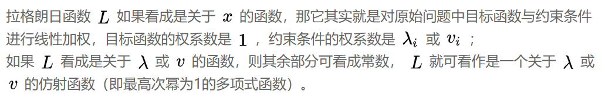
</div>
<br>
</div>

在 1.3.1 节我们也粗略给出过一个**对偶函数**, 并在简单例子上理解了这是原始问题的一个下界. 我们下面给出**拉格朗日对偶函数**的正式定义:

将拉格朗日函数关于$$x$$的下确界, 称为**拉格朗日对偶函数**:

$$
d(\lambda, v) = inf_{x} L(x, \lambda, v)
$$

```
inf 符号表示取下确界。 即一个集合最大的下界.  **考虑一个开区间(0,1)的下确界是什么?**
求解析式可先将 L 看成是关于 x 的函数，而将拉格朗日乘子看作常数，求出 L 的极小值点;
再将该点代入 L ，得到的关于 λ 和 v 的表达式就是对偶函数。
```

      在回头看一下 1.3.1 所说的对偶函数是否符合这个定义?

对偶函数具有如下两条重要性质：

<div style="text-align: center; width: 90%; margin: auto; ">
<div style="background: #4cc; width: 100%; height: 30px; text-align: left; ">
<p style="color:white; margin-left: 10px; "><b><font color="red">1. 对偶函数一定是凹函数，其凹性与原目标函数和约束函数凹凸与否无关。</font></b></p>
</div>
<div style="width: 100%; text-align: left; background: #ddd;">
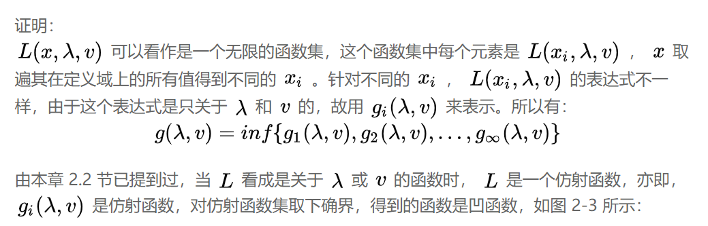
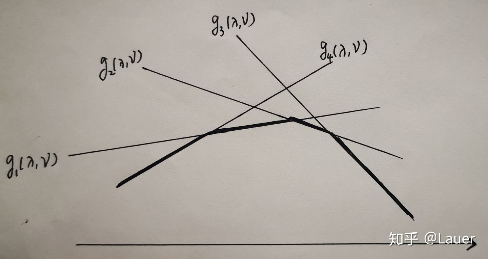
fig 2-3
</div>
<br>
<br>
</div>

前边使用不等式线性规划验证了$$\lambda$$的取值为非负值时, 原松弛问题才是有界的, 下面证明这个界确实是原问题的下界.

<div style="text-align: center; width: 90%; margin: auto; ">
<div style="background: #4cc; width: 100%; height: 70px; text-align: left; ">
<p style="color:white; margin-left: 10px; "><b><font color="red">2. 对于 ∀ λ ≥ 0, ∀ v（泛指向量中的每个分量），如果原问题最优解对应的目标函数值为p*, 则 g(λ,v)≤p* </font></b></p>
</div>
<div style="width: 100%; text-align: left; background: #ddd;">
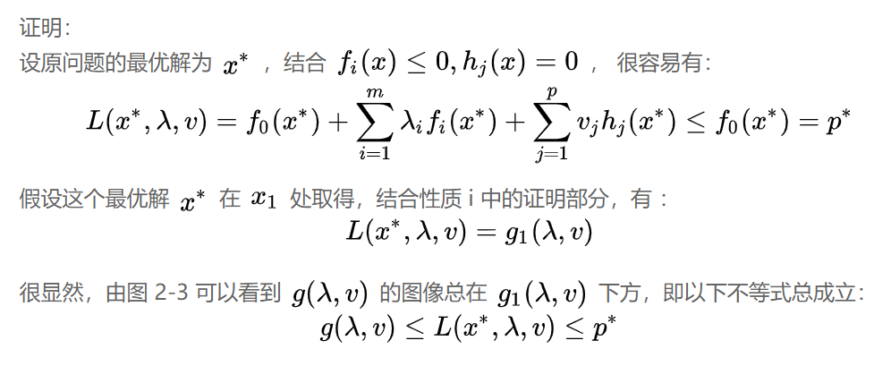
</div>
<br>
<br>
</div>

关于这个下界和后续对偶的关系,[知乎-李竞宜, 给出了更加通俗易懂的解释](https://www.zhihu.com/question/58584814/answer/1119054535)

以上我们说明了拉格朗日对偶函数得由来, 并证明了其是原始优化问题得下界.

下面可以正式介绍对偶理论.

---

## 2 拉格朗日对偶

### 2.1 拉格朗日对偶问题

根据对偶函数的性质 2 ，
对 $$\forall \lambda \geq 0, \forall v$$, 对偶函数 $$ d(\lambda, v)$$ 是原问题最优值 $$p^{*}$$ 的一个下界.

**但是, 我们的目的是求原始问题的最优值.** 我们废了这么大力气构造了对偶函数有什么意义吗? 其实在数学中我们得到一个下界是很有意义的, 一个最广泛的应用方法是:我们得一个简单的下界函数, 然后通过最大化这个下界函数, 来逼近原问题的最优解.

<div style="text-align: center; width: 80%; margin: auto; ">
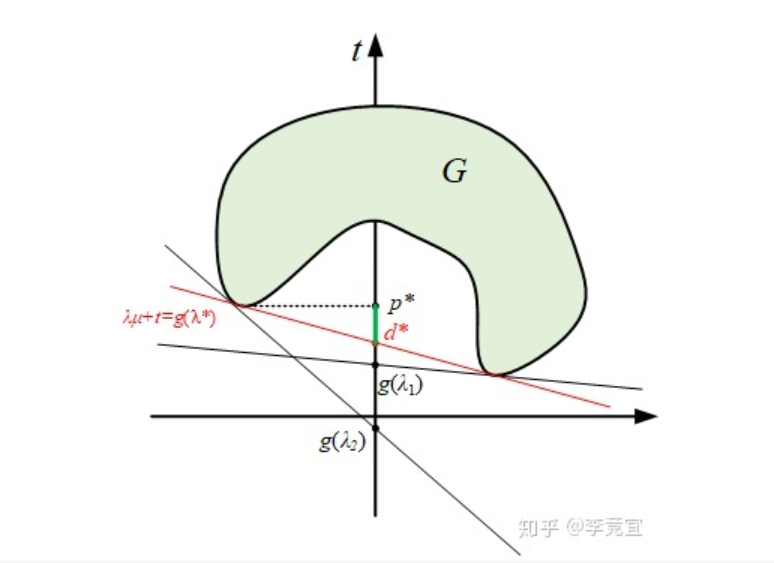
</div>

上图中$$d^*$$称为对偶间隙 (duality gap). 我们优化的目标其实是最小化这个间隙.

原问题的**拉格朗日对偶(Dual)问题**, 记为 D, 定义如下:

$$
\begin{array}{lcl}
\text{(D.)} &\quad\max_{\lambda, v} & d(\lambda, v) = min_x L(x, \lambda, v) \\
&\text { s.t. } & \lambda \geq 0
\end{array}
$$

由于对偶函数是凹函数，故拉格朗日对偶问题一定是凸优化问题，其对应的最优解为 $$\lambda^*, v^*$$ (最优拉格朗日乘子)，对应的最优值为 $$d^*$$, **有$$d^* \leq p^*$$**.

### 2.2 强/弱对偶性

**(1) 显然, 针对所有对偶问题, 如果有解, 则$$d^* \leq p^*$$, 称"弱对偶性"成立.**

弱对偶性在有解时存在, 但是并不是我们想要的, 因此我们更希望$$d^* = p^*$$, 此时对偶问题的最优解就是原始问题的最优解.

**(2) 如果$$d^* = p^*$$, 称"强对偶性"成立.**

那么如何判断什么时候强对偶性成立呢?
首先, 一般而言, 当原问题是凸优化问题时，强对偶性往往成立 (但并不总是); 否则，可以利用求解对偶问题求出原问题最优值的下界。.

很遗憾, 没有通用的判断条件判断一个问题是否具有强对偶性, 但是很多成果给出了除凸性条件之外的强对偶性成立的条件.

### 2.3 Slater 条件与 KKT 条件

#### 2.3.1 Slater 条件

Slater 条件用于判断什么情况下强对偶是成立的.

当原始问题为凸优化问题时, 若$$\exists x \in \text{relint}(D)$$, 使得如下约束条件满足, 则强对偶性成立:

$$
\begin{array}{ll}
f_{i}(x)<0,  \quad i=1,2 \ldots, m ;  \\
h_{j}(x)=0,  \quad j=1,2, \ldots, p
\end{array}
$$

<div style="text-align: left; width: 90%; margin: auto; ">
<div style="background: #4cc; width: 100%; height: 30px; text-align: left; ">
<p style="color:white; margin-left: 10px; "><b><font color="red"></font></b></p>
</div>
<div style="width: 100%; background: #ddd;">
relint(D) 表示原始凸问题定义域的相对内部，即在定义域上除了边界点以外的所有点。只要能找到一个这样的点使原凸问题等式约束依然成立且不等式约束都严格小于 0 即可。

幸运的是，对大多数一般的原凸问题，强对偶都是成立的。

</div>
<br>
</div>

Slater 条件是强对偶性成立的**充分不必要**条件.
若满足 Slater 条件, 则强对偶一定成立, 不满足时强对偶也可能成立.

#### 2.3.2 KKT 条件

KKT 条件也是强对偶成立的**必要条件**, 但是某些情况下可以称为充要条件.

##### (1) 首先介绍互补松弛条件.

<div style="text-align: center; width: 80%; margin: auto; ">
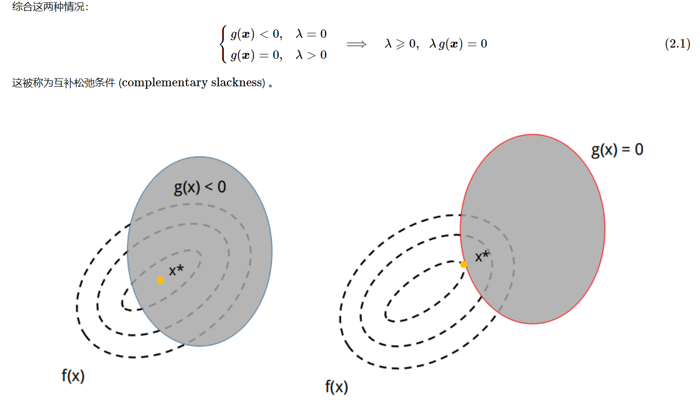
</div>

<div style="text-align: center; width: 80%; margin: auto; ">
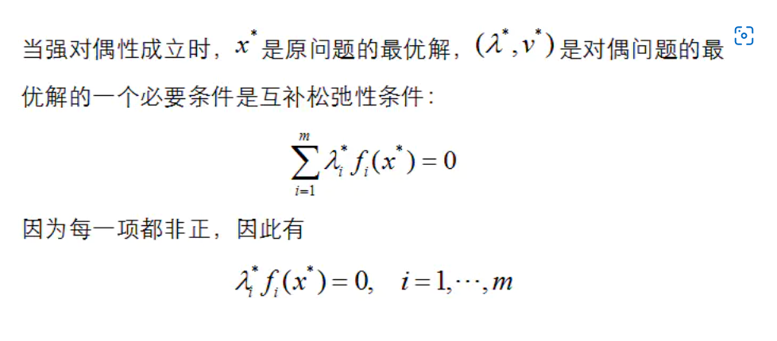
</div>

细节可以看
[知乎-彭一洋的回答](https://www.zhihu.com/question/58584814/answer/159863739)

##### (2) 下面先介绍必要性.

在对偶间隙为 0 (强对偶成立), 且 $$L$$ 对 $$x$$ 可微的前提下，设 $$x^{*} ; \lambda^{*}, v^{*}$$ 分别是原问题和对偶问题的最优解，则以下四组 KKT 条件必定满足:

$$
\left\{\begin{array}{ll}
\left.\frac{\partial L\left(x, \lambda^{*}, v^{*}\right)}{\partial x}\right|_{x=x^{*}}=0 & (\text { stationarity }) \\
\lambda_{i}^{*} f_{i}\left(x^{*}\right)=0 & (\text { complementary slackness }) \\
f_{i}\left(x^{*}\right) \leq 0, h_{j}\left(x^{*}\right)=0 & (\text { primal feasibility }) \\
\lambda_{i}^{*} \geq 0 & (\text { dual feasibility })
\end{array}\right.
$$

1. 稳定性条件（stationarity）
   - 该条件是说, 最优值必在极值处取得, 此时$$L$$关于$$x=x^*$$的偏导为 0
2. 互补松弛条件（complementary slackness）
   - 互补松弛条件是说, 对于非等式约束而言, 严格不等式是无效的不等式, 需要去掉其影响, 即当$$f_{i}\left(x^{*}\right)<0$$时, $$\lambda_{i}^{*}=0 .$$.
   - 而如果约束有效, 必在边界$$f_{i}\left(x^{*}\right)=0$$上取得, 即当$$\lambda_{i}^{*}>0, f_{i}\left(x^{*}\right)=0$$
   - 同时表明, 在最优点处，原问题的不等式起作用时, 对偶问题对应的不等式不起作用, 反之亦然.
3. 问题的可行性（primal feasibility）
   - 原问题的最优解必然满足原问题的约束条件。
4. 对偶问题的可行性（dual feasibility）
   - 对偶问题的最优解必然满足对偶问题的约束条件.

对一般的原问题，KKT 条件是$$x^{*} ; \lambda^{*}, v^{*}$$ 为最优解的必要条件，即只要 $$x^{*} ; \lambda^{*}, v^{*}$$为最优解，则一定满足 KKT 条件。

##### (3) 何时时充要条件

若某个凸优化问题具有可微的目标函数和约束函数，且满足 Slater 条件，那么 KKT 条件是最优性的充要条件。

### 2.4 补充: 原始问题与对偶问题形式

在学习时, 我们经常见到$$\min \max$$形式的原始问题, 和$$\max \min$$形式的对偶问题, 这是这么回事呢? 其实时拉格朗日函数的另一种描述方法.

<div style="text-align: center; width: 80%; margin: auto; ">
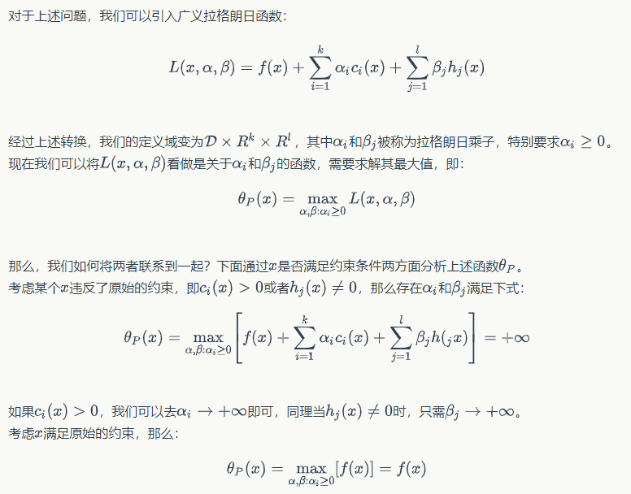
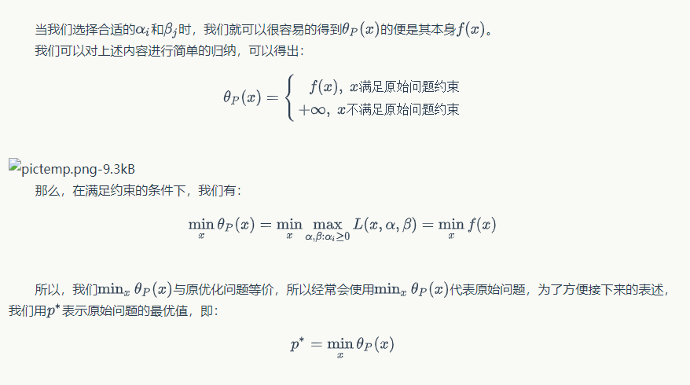
</div>

<div style="text-align: center; width: 80%; margin: auto; ">
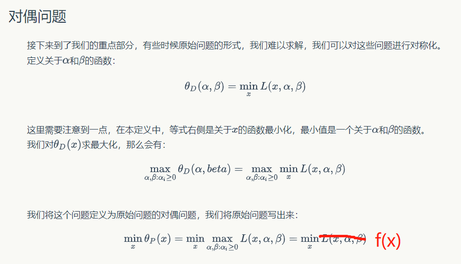
</div>

以上就是我们在 SVM 算法里见到的原始问题的形式.

### 2.5 补充: 拉格朗日对偶方法求解思路

面对一个凸优化问题, 如何使用拉格朗日对偶方法进行求解?:

1. 验证原问题比较难求解, 对偶问题可能会简单一些
   - **要明白, 对偶问题不一定比原问题更简单, 要具体问题具体分析**
2. 如果要求原问题最优解, 首先应该验证强对偶性, 说明原问题最优解与对偶问题最优解一致
   - 通过 Convex+slater 条件验证强对偶性
   - 对于 Convex + 可微 的问题, KKT 条件 $$ \Rightarrow$$ 强对偶 + 最优解
3. 写出对偶问题
4. 首先将$$\lambda,v$$看作常数, 对原始问题关于$$x$$求导置零, 得到 x 关于$$\lambda,v$$的表示, 带入对偶问题, 得到对偶函数.
5. 求解对偶问题的最优解, 得到$$\lambda^*,v^*$$
6. 由 KKT 条件, 倒推出$$x^*$$

### 2.5 补充: 整数规划中的拉格朗日松弛方法

<div style="text-align: center; width: 80%; margin: auto; ">
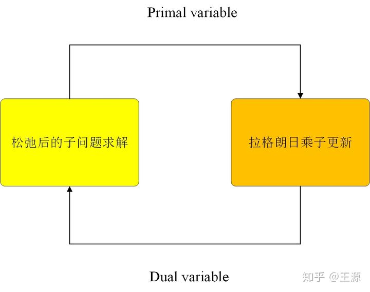
</div>

一般过程为,

- 首先求出松弛后的子问题, 并对其进行快速求解;
- 注意此时对偶问题是一个非光滑(分段)凸优化问题, 可以使用次梯度法求解
- 之后进行迭代优化.

### 2.3 小结

1. 至此, 我们总结一下使用拉格朗日对偶问题带来哪些便利呢?

- 将原始困难的约束转为容易求解的问题.
- 约束减少了，对偶问题只剩 n 个不等式约束
- 基于上下界的方法可以很好地帮助分析原始问题的性质.
- 主问题不一定是凸优化问题, 对偶问题一定是凸优化问题
- 如果强对偶性成立, 则对偶问题的最优解等于原始问题的最优解.
- 原问题是凸优化问题时，强对偶性往往成立 (并不总是); 否则，可以利用求解对偶问题求出原问题最优值的下界。

2. 几种条件和强对偶的关系

- 对于任意问题, 强对偶 + 最优解 $$\Rightarrow$$ KKT 条件
- 对于 Convex + 可微 的问题, KKT 条件 $$ \Rightarrow$$ 强对偶 + 最优解
- Convex + Slater $$\Rightarrow$$ 强对偶

## 3 例子 SVM

可以直接看《统计学习方法》第 7 章的内容

### 总结

1. 通过具体问题， 引出拉格朗日乘子法

   - 使用拉格朗日松弛, 可以把问题进行分解， （整数规划）
   - 作拉格朗日松弛并不是要把所有约束都放到目标函数上去的, 而是有选择性的对约束进行处理.如何区分难的约束主要依靠个人经验判断. 但是, 一般而言, 选择 linked/coupling constraints, 可以让不可分的问题分解为简单的子问题.
   - 针对不同的约束， 如何选择乘子$$\lambda$$, 令松弛后的问题， 在违反约束时给出恰当的惩罚

2. 拉格朗日函数给出了原始问题的一个下界函数。

   - 分析“界”是一种重要的数学分析方法

3. 拉格朗日对偶函数--下确界
4. 之后通过分析对偶问题最优解与原始问题最优解的关系， --强、弱对偶
5. 最后通过 slater 条件和 KKT 条件，讨论最优解与强对偶的关系， 以及通过对偶求解原始问题最优解的过程.

注意， 并不是对偶问题不一定比原始问题容易， 还是需要经验判断的。

## 参考:

- https://www.zhihu.com/question/58584814/answer/159863739
- https://zhuanlan.zhihu.com/p/103961917
- [拉格朗日对偶性](https://www.zybuluo.com/dongxi/note/848084#:~:text=%E6%8B%89%E6%A0%BC%E6%9C%97%E6%97%A5%E5%AF%B9%E5%81%B6%E6%80%A7%E6%98%AF%E4%B8%80%E7%A7%8D%E5%AF%BB%E6%89%BE%E5%A4%9A%E5%85%83%E5%87%BD%E6%95%B0%E5%9C%A8%E5%85%B6%E8%87%AA%E5%8F%98%E9%87%8F%E5%8F%97%E5%88%B0%E4%B8%80%E4%B8%AA%E6%88%96%E8%80%85%E5%A4%9A%E4%B8%AA%E6%9D%A1%E4%BB%B6%E7%BA%A6%E6%9D%9F%E6%97%B6%E7%9A%84%E6%9E%81%E5%80%BC%E7%9A%84%E6%96%B9%E6%B3%95%E3%80%82%20%E8%BF%99%E7%A7%8D%E6%96%B9%E6%B3%95%E5%8F%AF%E4%BB%A5%E5%B0%86%E4%B8%80%E4%B8%AA%E6%9C%89,%E4%B8%AA%E5%8F%98%E9%87%8F%E5%92%8C%20%E4%B8%AA%E7%BA%A6%E6%9D%9F%E6%9D%A1%E4%BB%B6%E7%9A%84%E6%9C%80%E4%BC%98%E5%8C%96%E9%97%AE%E9%A2%98%E8%BD%AC%E6%8D%A2%E4%B8%BA%E4%B8%80%E4%B8%AA%E8%A7%A3%E6%9C%89%20%E4%B8%AA%E5%8F%98%E9%87%8F%E7%9A%84%E6%96%B9%E7%A8%8B%E7%BB%84%E9%97%AE%E9%A2%98%E3%80%82)
- https://zhuanlan.zhihu.com/p/145944142
- 孙小玲-整数规划
- 李航- 统计学习方法

<!-- - https://www.zhihu.com/question/58584814
- https://www.cnblogs.com/massquantity/p/10807311.html
- https://zhuanlan.zhihu.com/p/115745075
- https://zhuanlan.zhihu.com/p/103961917
- https://blog.csdn.net/Mr_KkTian/article/details/53750424

- https://blog.csdn.net/CloudInSky1/article/details/122297915
- https://zhuanlan.zhihu.com/p/522590887
- https://zhuanlan.zhihu.com/p/145944142 -->
