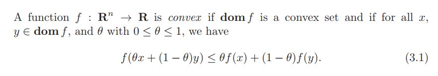

# 7-凸优化

$$
$$

## 1 基础概念

- 优化: 从⼀个可⾏解的集合中, 寻找最优的元素
  - 线性规划/非线性规划
  - 凸优化/非凸优化
  - 光滑/非光滑
  - 单目标优化/多目标优化, (多目标优化往往无法同时使得多个目标函数最小，需要进行折中选择， 或者将多个目标进行加权求和)
- 凸优化: 如果一个问题是凸优化问题, 那么其目标函数是凸函数, 约束为凸集(约束由若干个凸函数组成)
  - 线性规划一定是一个凸规划

|       名称       | 英文 |                                                定义                                                |                                                                                           解释                                                                                           |
| :--------------: | :--: | :------------------------------------------------------------------------------------------------: | :--------------------------------------------------------------------------------------------------------------------------------------------------------------------------------------: |
| 过任意两点的直线 |      |                     $$ f({x}) = \theta x_1 + (1 - \theta) x_2 ,\theta \in R $$                     |                                                                                                                                                                                          |
| 过任意两点的线段 |      |                   $$ f({x}) = \theta x_1 + (1 - \theta) x_2 ,\theta \in [0,1] $$                   |                                                                                                                                                                                          |
| n 维空间的子空间 |      | $$\alpha, \beta\in V, k\in R\Rightarrow \alpha+\beta\in V, k\alpha \in V$$, 则 V 为$$R^n$$的子空间 | 子空间: $$R^n$$的非空子集 V, 且对加法和数乘运算封闭. 对减法肯定也封闭.  n 维空间的子空间一定包含零向量 (过原点).   过原点的平面或直线, 以原点为起点的所有向量为$$R^3$$空间的子空间 |
|     线性函数     |      |                          $$f(\alpha x+\beta y) = \alpha f(x)+\beta f(y)$$                          |                                                                                                                                                                                          |
|      凸函数      |      |                        $$f(\alpha x+\beta y) \leq \alpha f(x)+\beta f(y)$$                         |                                                                                                                                                                                          |

|       名称        |        英文        |                                                                                                定义                                                                                                |                                                                                    解释                                                                                    |
| :---------------: | :----------------: | :------------------------------------------------------------------------------------------------------------------------------------------------------------------------------------------------: | :------------------------------------------------------------------------------------------------------------------------------------------------------------------------: |
|      仿射集       |    Affine Sets     |                                                                  一个集合 C 中，连接任意两点的直线也在该集合中，则该集合为仿射集                                                                   |                                                            直线/二维空间都是仿射集; 线段、闭合图形不是仿射集。                                                             |
|     仿射组合      | affine combination | 设集合 C 中的 k 个点, $$x_{1}, \cdots, x_{k} \in C; \theta_{1}, \cdots, \theta_{k} \in \mathbb{R}, \theta+\cdots+\theta_{k}=1$$, 则$$\theta_{1} x_{1}+\cdots+\theta_{k} x_{k}$$为 k 个点的仿射组合 |                                                          **若集合 C 中 k 个点的仿射组合也在 C 中, 则 C 为仿射集**                                                          |
|      仿射包       |    affine hull     |                            $$\text { aff } C=\left\{\theta_{1} x_{1}+\cdots+\theta_{k} x_{k} \mid x_{1}, \ldots, x_{k} \in C, \theta_{1}+\cdots+\theta_{k}=1\right\}$$                             |                                                   集合 C 中元素的所有仿射组合, (包含集合 C 的最小仿射集)称为 C 的仿射包                                                    |
| 与 C 相关的子空间 |                    |                                                                C 是仿射集,$$ V = C-x_0 = \{x-x_0 \| x \in C\}, \forall x_0 \in C $$                                                                | 该式表示对仿射集 C 的平移, 过原点, 具有更好的性质.   $$\forall V_{1}, V_{2} \in V ,   \forall \alpha, \beta \in \mathbb{R} $$, 使得 $$\alpha V_{1}+\beta V_{2} \in V $$ |
|       凸集        |     Convex Set     |                        $$C \text { is a Convex Set } \Leftrightarrow \forall \theta x_{1}+(1-\theta) x_{2} \in C, x_{1}, x_{2} \in C \forall \theta \quad \theta \in[0,1]$$                        |                                           一个集合是凸集，当属于该集合的任意两点之间的线段仍然在该集合内。  仿射集一定是凸集                                            |
|      凸组合       | convex combination |                                             $$\theta_{1} x_{1}+\cdots+\theta_{k} x_{k},  \theta_{1}+\cdots+\theta_{k}=1, \theta_{i} \ge 0, i=1,...k $$                                             |                                                        $$C$$ 为凸集 $$\Leftrightarrow$$ 任意元素凸组合 $$ \in C $$                                                         |
|       凸包        |    convex hull     |                           $$Conv  C=\left\{\theta_{1} x_{1}+\cdots+\theta_{k} x_{k} \mid x_i \in C, \theta_i \ge 0, i=1,...k,  \theta_{1}+\cdots+\theta_{k}=1\right\}$$                            |                                               集合 C (不一定是凸集) 中元素的所有凸组合, (包含集合 C 的最小凸集)称为 C 的凸包                                               |

|  名称  |       英文        |                                                                       定义                                                                        |         解释         |
| :----: | :---------------: | :-----------------------------------------------------------------------------------------------------------------------------------------------: | :------------------: |
|   锥   |                   |                           $$C$$ 是锥 $$\Leftrightarrow \quad \forall x \in C, \theta \geq 0 $$, 有 $$\theta x \in C $$                            | 锥一定是过原点的集合 |
|  凸锥  |    Convex Cone    | $$C$$ 是凸锥 $$\Leftrightarrow \quad \forall x_{1}, x_{2} \in C, \theta_{1}, \theta_{2} \geq 0 $$, 有 $$\theta_{1} x_{1}+\theta_{2} x_{2} \in C$$ |                      |
| 锥组合 | conic combination |                             $$\theta_{1} x_{1}+\cdots+\theta_{k} x_{k} \quad \theta_{1}, \cdots, \theta_{k} \geq 0 $$                             |                      |
| 凸锥包 |    conic hull     |              $$\{\theta_{1} x_{1}+\cdots+\theta_{k} x_{k} \mid x_{1}, \cdots, x_{k} \in C, \theta_{1}, \cdots, \theta_{k} \geq 0\}$$              |                      |
|        |                   |                                                                                                                                                   |                      |

比较

|   名称   |                                                       比较                                                        |
| :------: | :---------------------------------------------------------------------------------------------------------------: |
| 仿射组合 |                 $$\forall \theta_{1}, \cdots, \theta_{k}, \quad \theta_{1}+\cdots+\theta_{k}=1$$                  |
|  凸组合  | $$\forall \theta_{1}, \cdots, \theta_{k} \quad \theta_{1}+\cdots+\theta_{k}=1, \theta_{1}, \cdots, \theta_{k}>0$$ |
| 凸锥组合 |               $$\forall \theta_{1}, \cdots, \theta_{k} \quad \theta_{1}+\cdots+\theta_{k} \geq 0$$                |

### 几种重要的凸集

- 仿射集
  - 任意线性方程组的解集都是仿射集
  - 任意一个仿射集, 都可以写成一个线性方程组的解集
  - 与 C 相关的子空间, 性质更好的子空间, 一定是过原点的
- 仿射集是凸集的一个特例
- 单个点的集合
  - 一定是仿射集, 凸集
  - 过原点是凸锥, 不过原点不是凸锥集
- 空集, 是仿射集, 凸集, 凸锥集
- 直线
  - 一定是仿射集, 凸集
  - 过原点是凸锥, 不过原点不是凸锥集

|        集合         | 仿射集 | 凸集 |   凸锥集    |                                             定义                                              |
| :-----------------: | :----: | :--: | :---------: | :-------------------------------------------------------------------------------------------: |
|  N 维($$R^n$$)空间  |   √    |  √   |      √      |                                                                                               |
| $$R^n$$空间的子空间 |   √    |  √   |      √      |                                                                                               |
|      任意直线       |   √    |  √   |  (过原点)   |                                                                                               |
|      任意线段       |  (点)  |  √   |   (原点)    |                                                                                               |
|       (射线)        | (v=0)  |  √   | ($$x_0=0$$) |                $$\{x_0+\theta v \| \theta\ge 0\}, x_0, v\in R^n, \theta\in R$$                |
|       超平面        |   √    |  √   |  (过原点)   | $$\left\{x \mid a^{T} x=b\right\} \quad x, a \in \mathbb{R}^{n}, b \in \mathbb{R}, a \neq 0$$ |
|       半空间        |  不是  |  √   |  (过原点)   |                        空间中被超平面分割的($$\ge b , \le b$$)两个部分                        |

|          集合           |    仿射集    | 凸集 | 凸锥集 |                                                                                                                定义                                                                                                                 |
| :---------------------: | :----------: | :--: | :----: | :---------------------------------------------------------------------------------------------------------------------------------------------------------------------------------------------------------------------------------: |
|      球 (欧氏空间)      | (半径等于 0) |  √   | (原点) |                                 $$B\left(x_{c}, r\right)=\left\{x \mid\left\|x-x_{c}\right\|_{2} \leq r\right\}=\left\{x \mid \sqrt{\left(x-x_{c}\right)^{T}\left(x-x_{c}\right)} \leq r\right\}$$                                  |
|     椭球 (欧氏空间)     | (半径等于 0) |  √   | (原点) | $$\varepsilon\left(x_{c}, P\right)=\left\{x \mid\left(x-x_{c}\right)^{T} P^{-1}\left(x-x_{c}\right) \leq 1\right\} \quad P \in S_{++}^{n} $$ (n \* n 对称正定矩阵, 奇异值>=0)   P 矩阵的每个特征值对应着椭球一个维度上半径的长度 |
| (此处考虑有界的) 多面体 |              |  √   |        |                                     $$P=\left\{x \mid a_{j}^{T} x \leq b_{j} j=1, \cdots, m, c_{j}^{T} x=d_{j} j=1, \cdots, r\right\}$$  (本质是一些超平面和半空间的交集)  可能是没有界的                                     |
|    单纯形（Simplex）    |              |  √   |        |                                                                                            单纯形是一种特殊的多面体.   定义看笔记 P8                                                                                             |
|           --            |      --      |  --  |   --   |                                                                                                                 --                                                                                                                  |
|      对称矩阵集合       |              |  √   |   √    |                                                                                   $$S^{n}=\left\{x \in \mathbb{R}^{n * n} \mid x=x^{T}\right\}$$                                                                                    |
|   对称半正定矩阵集合    |              |  √   |   √    |                                                                           $$S_{+}^{n}=\left\{x \in \mathbb{R}^{n * n} \mid x=x^{T}, x \succeq 0\right\}$$                                                                           |
|    对称正定矩阵集合     |              |      |   ×    | $$S_{++}^{n}=\left\{x \in \mathbb{R}^{n * n} \mid x=x^{T}, x \succ 0\right\}$$   如何证明不是凸锥?  令 n=1, 则 $$S_{+}^{n}=\mathbb{R}_{+}, S_{++}^{n}=\mathbb{R}_{++} , S^{n}=\mathbb{R}$$, 正定矩阵不含 0 矩阵, 因此不是凸锥 |

- $$\{x \mid x \leq 0\}$$是凸集，是多面体, 是单纯形
  - 单纯形证明, 取$$x_{0}=0, x_{1}=-\infty$$

### 保凸变换

- (多个)凸集的交集
- 仿射变换
  - 线性变换和仿射函数的区别.(f(x)=Ax // f(x)=Ax+b)
  - **仿射变换逆运算也是保凸变换**
  - **椭球是球的仿射变换**
  - **缩放和移位**
- 凸集的和
- 线性矩阵不等式（LMI）
  - 线性矩阵不等式的解集是凸集
- 透视函数
  - 任意凸集的反透视映射也是凸集
- 线性分数函数
  - 先进行仿射变换, 在进行透视变换, 是一种非线性变换
- 两个随机变量的联合概率 --(映射)--> 条件概率
  - 两个随机变量的联合概率是凸集
  - 其实是贝叶斯公式

## 3 凸函数

f 是凸函数, -f 是凹函数
大于号的时候严格凸

### 定义

##### 定义(1)

##### 定义(2)

f is convex if and only if for all $$x \in \mathbf{dom}  f$$ and all v, the function $$g(t) = f(x + tv)$$ is convex (on its domain, $$\{t | x + tv \in \mathbf{dom} f\}$$).

- 通过把函数限制在一条直线上, 验证是否是凸的

##### 定义(3) 一阶条件

- f 的定义域一定是一个开集, 因为如果是闭集的话在边界上不可微
- 切线在 y 处的值一定小于函数值

##### 定义(4) 二阶条件

一阶偏导单调不减

### 重要的凸函数

- 示性函数 (分情况讨论)
  - 不在定义域的函数值为无穷或无定义时, 是凸的
  - 如果不在定义域的的函数值为具体值时, 不是凸的
- 二次函数
  - 二阶导 $$f''(x) = P$$, 讨论 P 的(半)正(负)定, 得凹凸性
- $$f(x) = 1/(x^2), x\ne 0, x\in R$$
  - 不是凸函数, 定义域不是凸集
- 仿射函数
  - 既是凸的又是凹的
- 指数函数
  - 是凸函数, $$f(x)=e^{ax}, x\in R$$
- 幂函数, 分情况讨论
  - $$f(x)=x^{a}, x \in \mathbb{R}_{++}$$
  - $$
    \nabla^{2} f(x)\left\{\begin{array}{ll}
    \geq 0 & a \geq 1 \text{ or } a \leq 0  \text{ -- convex}\\
    \leq 0 & 0 \leq a \leq 1 \text{ -- concave}\\
    = 0 & a=0 \text{ or } a=1 \text{ -- concave and convex }
    \end{array}\right.
    $$
- 绝对值的幂函数 (分情况讨论, P16)
- 对数函数 -- 严格凹函数
- 负熵 -- 严格凸函数
- $$R^n$$空间的范数 $$P(x), x \in R^n$$
- 空间范数, 是凸函数
- 零范数-不是范数
  - 非零元素数目（不是凸函数）
- 极大值函数, 或者极小极大函数-- 凸函数
  - $$max f(x)$$
  - $$min_x \ \ max_y f(x,y)$$
- 解析逼近(log-sum-exp), 凸函数
  - 因为极大(极小)函数不可微, 所以可以通过解析逼近分析
- 几何平均, (所有元素相乘再开 n 次根) -凹函数
- 对称半正定矩阵的行列式的对数 (分情况讨论) -- 凹函数

#### 保凸运算

- 非负加权和(积分)
- 仿射映射
  - 先对变量仿射变换, 再经过 f, 是凸函数
  - 变量不变, 对 f 进行仿射变换, A 如果非负, 是凸函数
- 两个函数的极⼤值函数
