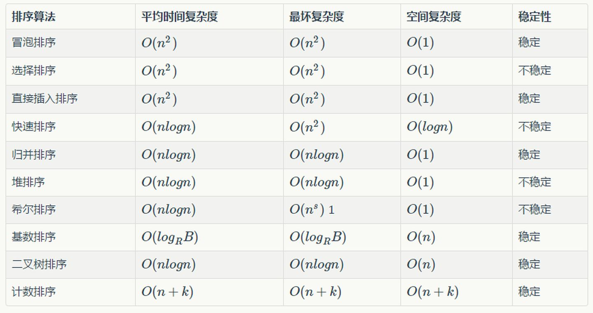
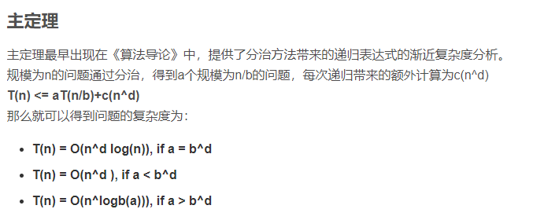
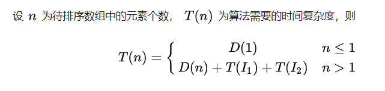
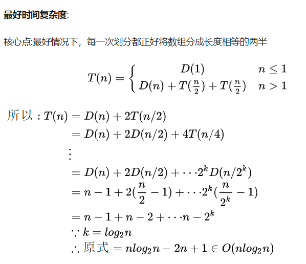
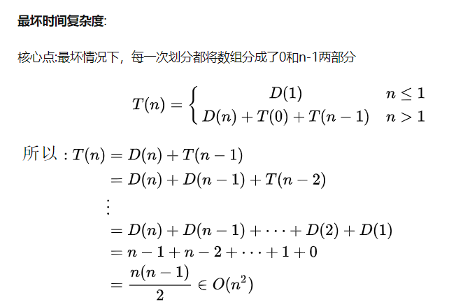
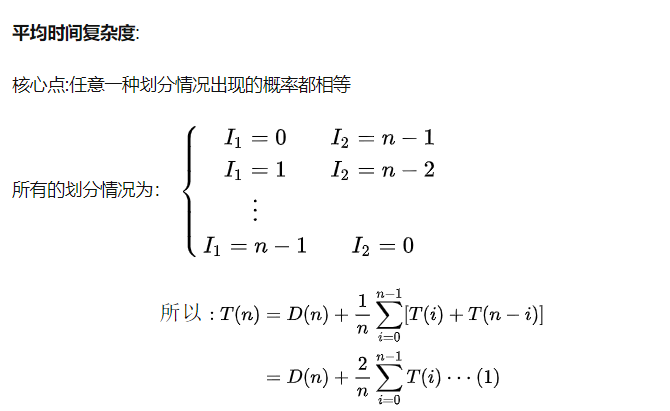

# 0 CS-排序算法

## 1. 排序算复杂度和法稳定性

<div style="text-align: center; width: 80%; margin: auto; ">

</div>

## 2. 主定理

<div style="text-align: center; width: 80%; margin: auto; ">

</div>

## 3. 快排时间复杂度分析

<div style="text-align: center; width: 80%; margin: auto; ">




</div>

## 4. 快排算法

### 4.1. 两重循环方法

```python
def quick_sort(a, i, j):
    if i >= j:
        return a
    piv = a[i]

    l, r = i, j
    while i < j:
        while i < j and a[j] >= piv:
            j -= 1
        a[i] = a[j]
        while i < j and a[i] <= piv:
            i += 1
        a[j] = a[i]
    a[j] = piv
    quick_sort(a, l, i - 1)
    quick_sort(a, i + 1, r)
    return a


arr = [3, 4, 2, 6, 8, 5, 4, 9, 10]
n = len(arr)
ans = quick_sort(arr, 0, n - 1)
print(ans)
```

### 4.2. partition 法

```python
def partition(a, l, r):
    i = l - 1
    pivot = a[r]
    for j in range(l, r):
        if a[j] <= pivot:
            i += 1
            a[i], a[j] = a[j], a[i]
    a[i + 1], a[r] = a[r], a[i + 1]
    return i + 1


def quick_sort(a, l, r):
    if l >= r:
        return a
    piv = partition(a, l, r)
    quick_sort(a, l, piv - 1)
    quick_sort(a, piv + 1, r)


arr = [3, 4, 2, 6, 8, 5, 4, 9, 10]
n = len(arr)
quick_sort(arr, 0, n - 1)
print(arr)
```
