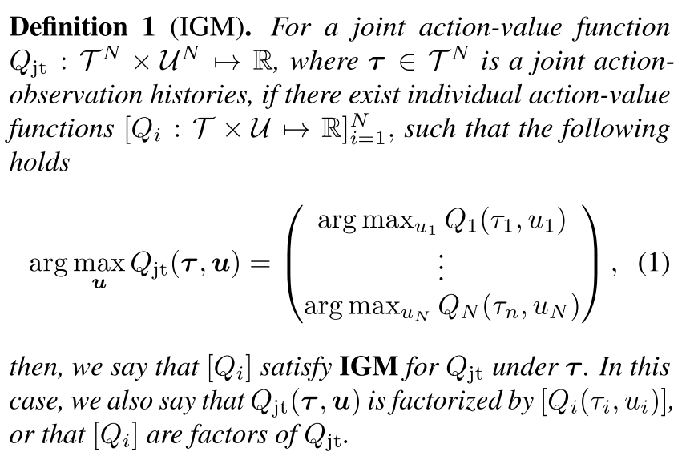
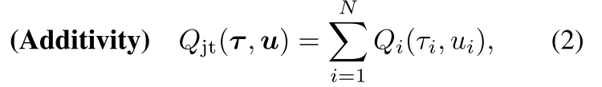
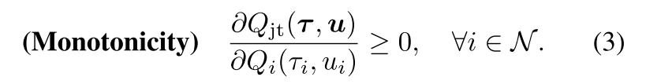
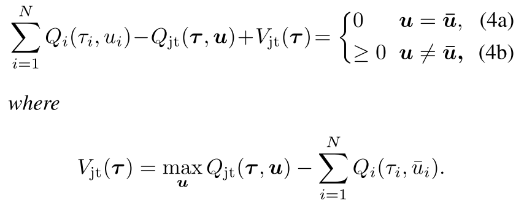
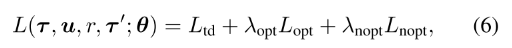
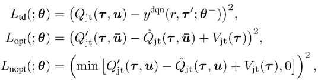
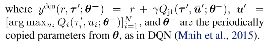

# 4 QTRAN

## 1 概述

**定义：IGM (Individual-Global-Max)**

**算法演变：**
- 去中心化方法，可扩展性好，但是存在不稳定问题；
- 中心化方法：可以解决非稳定问题，但是随智能体增加，复杂性爆炸；
- MADDPG：学习在连续动作空间学习分布式策略；
- COMA：Actors用联合critic估计反事实baseline解决信用（贡献）分配问题；
- 值分解方法：解决联合Q值随着智能体数量增加，复杂性爆炸增加的问题，
  - VDN：加性约束，
  - 
  - QMIX：单调性约束。
  - 

**本文目标**:

可分解任务定义为，联合Q值取得得最优动作也是个体Q值得最优动作。使用加性限制和单调性限制有点过度限制了，限制了智能体的种类;

本文把原始联合Q值函数$$Q_{jt}$$转换为新的$$Q_{jt}'$$，使其与$$Q_{jt}$$具有相同的最优动作，并解除加性/单调性约束。

**本文贡献**:
- 通过学习一个状态值函数（用来更正部分观察带来得偏差），把原始联合动作值函数转化为新的易分解形式,且最优动作保持相同;
- QTRAN算法：联合动作值网络、个体动作值网络、状态网络，定义每个网络得loss函数；
- QTRAN变体：QTRAN-base和QTRAN-alt
  - 不同点：如何构造非最优动作的转换Q函数
  - 收敛速度和稳定性
- 在三个环境测试算法。

## 2 算法原理

### 2.1 因子函数$$[Q_i]$$的条件

定义$$\bar{\mu}_i=argmax_{\mu_i}Q_i(\tau_i, \mu_i)$$表示最优动作，$$\bar{\mathbf{u}}=[\bar{\mu}_i]_{i=1}^{N}$$；令$$\mathbf{Q}=[Q_i]\in \mathbb{R}^N$$，即$$Q_i, i = 1,...,N$$的列向量。

**定理1** 给出$$[Q_i]$$满足**IGM**的条件。

|一个可分的联合Q值函数$$Q_{jt}(\mathbf{t}, \mathbf{u})$$，可以被$$[Q_i(\tau_i, \mu_i)]$$分解，当 |
|:-|
|  |

<!-- 给定联合观察$$\mathbf{t}$$，考虑任意可因式分解函数$$Q_{jt}(\mathbf{t}, \mathbf{u})$$。通过**定义1**我们可以找到个体Q函数$$[Q_i(\tau_i, \mu_i)]$$分解$$Q_{jt}$$。**定义1**说明了$$[Q_imathbf]$$满足**IGM**的条件。 -->

注意，(4)中的条件在仿射变换的情况下是必要的。也就是说，存在一个仿射变换$$\phi(\mathbf{Q}) = A\cdot \mathbf{Q}+B$$（其中$$A=[a_{ii}] \in \mathbb{R}_+^{N\times N}$$是$$a_{ii}>0$$的对称对角矩阵，$$B=[b_i]\in \mathbb{R}^N$$），使得当$$Q_{jt}$$可以被$$[Q_i]$$分解时，把$$Q_i$$替换成$$a_{ii}Q_i+b_i$$时，则(4)成立。这是因为对于所有的i，$$b_i$$都抵消掉，$$a_{ii}$$仅仅作为$$\sum_{i=1}^N Q_i$$的缩放因子，因为**IGM**是不变的。

**变换分解：**首先定义加性的**变换联合Q值函数函数**，

通过加性结构，$$[Q_i]$$满足$$Q'_{jt}$$的IGM，那么它就是$$Q'_{jt}$$的分解个体Q值函数。因为$$argmax_{\mathbf{u}}Q_{jt}(\mathbf{t}, \mathbf{u})= argmax_{\mathbf{u}}Q'_{jt}(\mathbf{t}, \mathbf{u})$$，找到$$[Q_i]$$满足(4)就是$$Q'_{jt}(\mathbf{t}, \mathbf{u})$$的分解。

函数$$V_{jt}(\mathbf{t})$$用来修正中心化联合Q函数$$Q_{jt}$$和$$[Q_i]$$的和的偏差。偏差是智能体部分观察带来的。如果加入了全局观察，$$V_{jt}$$可以设为0。

### 2.2 算法

||
|:-:|
|Figure 1. QTRAN-base and QTRAN-alt Architecture|

QTRAN包含三个独立的估计器：每个智能体i的独立Q值网络，联合Q值网络（可以分解为$$Q_i$$），状态价值网络

在**Individual action-value network**中，每个智能体i的Q值加和得$$Q'_{jt}$$；

**联合Q网络**: 逼近$$Q_{jt}$$，输入为选择的动作，输出为该动作得Q值。
- 首先使用所有个体Q网络采样的动作向量来更新联合Q网络。因为联合动作空间$$\mathcal{U}^N$$，找到最优联合动作复杂度很高，而每个个体的最优动作取argmax就行，是线性的。
- 第二，联合Q网络共享个体网络低层的参数，联合Q网络把个体网络隐层特征加和整合$$\sum_i h_{Q,i}(\tau_i, u_i)$$，其中$$h_i(\tau_i, u_i)=[h_{Q,i}(\tau_i, u_i), h_{V,i}(\tau_i)]$$。（**使用此参数共享样本效率高，可进行可扩展的训练，但会牺牲表达能力。**）

**状态值网络**：计算标量状态价值，类似与dueling网络的$$V(s)$$。
- 用来在计算argmax时匹配$$Q_{jt}$$和$$Q'_{jt}+V_{jt}$$。没有V，部分观察可能限制$$Q'_{jt}$$的表达复杂性；
- 给定$$\mathbf{t}$$，状态值独立于选择的动作，因此对动作选择没有贡献，所以使用公式(4)代替。
- 输入也是个体网络隐特征的组合$$\sum_i h_{V,i}(\tau_i)$$

### 2.3 损失函数

目标：
- 训练联合Q值$$Q_{jt}$$估计真实动作值；
- 变体值函数$$Q'_{jt}$$应该追踪到联合Q值$$Q_{jt}$$，使其最优值相等。
- 使用目标网络和replay buffer
  

其中
- $$r$$是在观察$$\tau$$执行动作$$u$$转移到$$\tau '$$的奖励。
- $$L_{td}$$学习$$Q_{jt}$$，通过最小化TD误差估计真实Q值；
- $$L_{opt}$$和$$L_{nopt}$$为了在把$$Q_{jt}$$分解为$$[Q_i]$$时满足条件(4)。
- $$L_{nopt}$$用来在每一步检查样例中选择的动作是否满足(4b)，$$L_{opt}$$检查最优局部动作是否满足(4a)。
- 根据网络对样本中动作满足（4a）或（4b）的程度定义损失，实现（4）；但是验证(4a)需要太多样本，因为最优动作很少，需要大量采样。
- 因为目标是学习$$Q'_{jt}$$和$$V_{jt}$$分解给定的$$Q_{jt}$$，本文在学习$$L_{opt}$$和$$L_{nopt}$$时通过固定$$Q_{jt}$$稳定学习。
  - 
  - 
