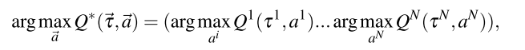
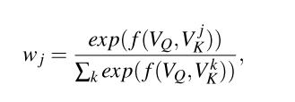

# 3.Qatten 算法

Qatten: A General Framework for Cooperative Multiagent Reinforcement Learning

Qatten：协作多智能体强化学习通用框架

(腾讯量子实验使、华为诺亚方舟实验室)

多智能体协作任务的代表工作是价值分解方法，将全局共享多智能体Q值$$Q_{tot}$$分解为私有Q值$$Q^i$$，来指导智能体行动。
- VDN：采用加性形式，
- QMIX：采用基于隐式混合方法的单调假设
  
以前算法对于$$Q_{tot}$$和$$Q^i$$假设较多，且没有理论背景，并且在$$Q^i$$转换到$$Q_{tot}$$时，没有清晰的描述智能体级别影响。

本文，
- 从理论上用$$Q^i$$推导出$$Q_{tot}$$的通用形式
- 基于此，用多头注意力形式逼近$$Q_{tot}$$
- 用智能体级别的注意力机制重新表示$$Q_{tot}$$
- 最大化去中心化策略算法容易处理
- 在星际benchmark上表现好，超过state-of-the-art算法
- 未来进行注意力分析很有价值。

## 1. 前言

协作MARL，学习协作策略最大化累积全局奖励。

- **中心化方法**： 把任务当成单智能体学习任务，此时用已有的RL技术学习最优的联合策略，基于智能体的联合观察和共同回报。但是通常效果不好，因为联合动作空间巨大，还有通信限制局部动作观察历史也需要去中心化策略。
- **去中心化方法**：智能体基于全局奖励同时学习（独立智能体）方法最简单，表现不好，主要原因全局奖励信号不稳定使得智能体不能区分环境随机性和其他智能体的探索行为。
- **中心化训练去中心化执行（CTDE）**，基于联合动作和状态信息学习一个完全中心化值函数，然后用这个值函数指导最优的去中心化策略。
  - COMA，COMA的中心化critic在从联合状态-动作空间评估全局Q值很难，尤其当智能体数量不多，不能给出正确多智能体baseline的时候。
  - Value Decomposition Network (VDN), 把$$Q_{tot}$$表示为单独Q值(只依赖于独立观察和动作)的和,去中心化策略基于各自地$$Q^i$$贪婪地选择动作。但是他假设了全局Q值和局部Q值地加性关系、忽略额外状态信息。
  - QMIX用来克服VDN地缺陷，使用一个网络估计联合动作值，表示为每个智能体基于局部观察的Q值的非线性组合；另外，QMIX强调$$Q_{tot}$$在$$Q^i$$上是单调的，让最大化off-policy的联合动作值容易。但是QMIX使用隐含混合$$Q^i$$，但是混合过程是黑箱。另外混合$$Q^i$$成$$Q_{tot}$$时使用权重直接从全局特征产生，而不是准确建模个体在智能体级别上对整个系统的影响。
  - QTRAN，继承加性假设同时避免VDN和QMIX的表示限制，可以保证最优去中心化。但是计算复杂度高，作者必须放松条件，使用两个惩罚因子，使算法偏离正确值。
- 本文提出Qatten算法。基于Q-value混合网络的多头注意力，逼近全局Q值。
  - 从理论上推导协作智能体$$Q^i$$对$$Q_{toit}$$的分解形式；
  - 把$$Q^i$$转换为$$Q_{tot}$$时，在多头注意力结构里用键值memory操作显示地测量每个个体对全局系统地重要性

## 2. 背景

介绍马尔可夫游戏和注意力机制

### 多智能体马尔可夫游戏， N个智能体

$$
S, \\
A^1,...,A^N, \\
S\times A^1\times ...\times A^N \rightarrow P(S), \\
R^i: S\times A^1\times ...\times A^N \rightarrow \mathbb{R},\\
o^i: Z(S,i)\rightarrow O^i, \\
\pi^i: O^i\rightarrow P(A^i)
$$

目标：$$J^i(\pi^i)=\mathbb{E}_{a^1\sim \pi^1,...,a^N\sim \pi^N, s\sim T}\left[ \sum_{t=0}^{\infty} \gamma^t r^i_t (s_t, a_t^1,...,a_t^N) \right]$$。

当奖励$$(R^1=,...,=R^N=R)$$，就变成完全合作任务：某个智能体最感兴趣的动作也是其他智能体最感兴趣的动作。

本文考虑完全合作的部分可观察马尔可夫游戏，智能体局部观察使用智能体i的动作-观察$$\tau^i$$表示。智能体局部策略或Q函数加入RNN。

对于VDN和QMIX，多智能体值分解的一个重要概念时去中心化，也叫Individual-Global-Max (IGM)，$$\exists Q$$，使得

### 注意力机制

MAAC算法使用自注意力机制，通过选择对其他智能体信息付出的注意力大小，学习每个智能体的critic；

TarMAC算法允许通过发送者-接收者软注意机制和多轮协作推理，在智能体之间进行有针对性的连续通信。

注意力函数可以描述为一个查询和键值对集合到输出结果的映射，查询($$V_Q$$)、键(V_K^i)、值、结果都是向量。结果作为值的加权和，分配给每个值的权重通过查询和相应键的兼容函数计算。

其中$$f(V_Q, V_K^i)$$由用户定义，衡量相应值的重要性，常用缩放的点积函数。

在实践中，多头注意力可以让模型关注不同表示子空间的信息。

## 3. 背景

阐述协作MARL的局部行为的确切形式，推导$$Q^i$$对$$Q_{toit}$$的理论关系

**马尔可夫游戏**

## 4. 背景

Qatten框架的细节

## 5. 背景

在星际平台测试，给出混合权重分析

## 6. 结论
